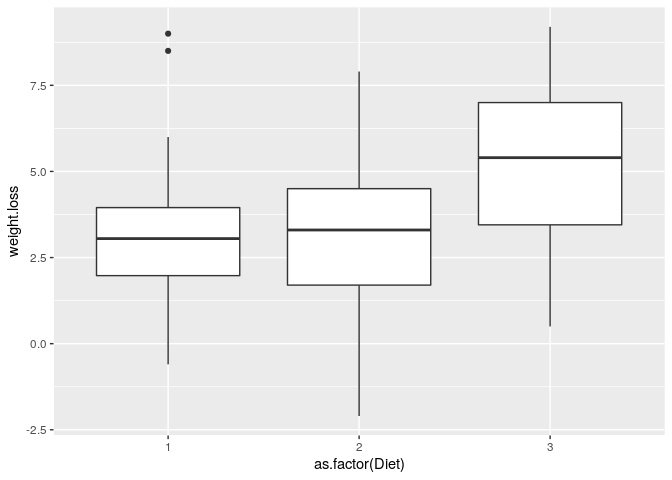
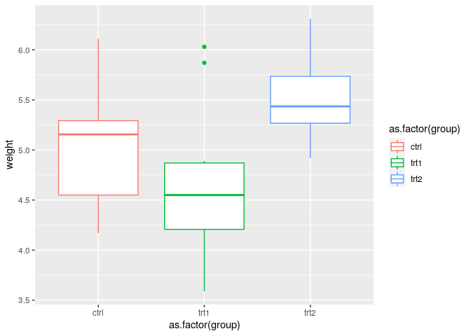

Extension of linear models: ANOVA
================
**Dmitry Kondrashov & Stefano Allesina**
Fundamentals of Biological Data Analysis – BIOS 26318

``` r
library(MASS) # negative binom regression
library(tidyverse) # our friend the tidyverse
library(pscl) # zero-inflated and zero-hurdle models
source("../general_code/read_xls_from_url.R") # function to read excel from URL
```

## Analysis of variance

ANOVA is a method for testing the hypothesis that there is no difference
in means of subsets of measurements grouped by factors. Essetntially,
this is a generalization of linear regression to categorical explanatory
variables instead of numeric variables, and it is based on very similar
assumptions.

### ANOVA assumptions

ANOVA test hypotheses:

  - Null hypothesis: the means of the different groups are the same
  - Alternative hypothesis: At least one sample mean is not equal to the
    others.

Let  indicate the
response variable and 
is the categorical explanatory variable,
 is the mean
of the response, and  is
the difference between the overall mean of the response and the mean
response for the value of , then the model equation is:

  

")  

ANOVA test can be applied only when:

  - The observations are obtained independently and randomly from the
    population defined by the factor levels
  - The measurements for each factor level are normally distributed
  - These normal distributions have the same variance

### How one-way ANOVA works

Assume that we have k groups, defined by the categorical explanatory
variable :

  - Compute the common variance, which is called variance within samples
    () or
    residual variance.
  - Compute the variance between sample means as follows:
      - Compute the mean of each group
      - Compute the variance between sample means
        ()
  - Produce F-statistic as the ratio of
    
  - Calculate a p-value from the F-distribution

ANOVA makes one important assumption, similar to that for linear
regression, that the total squared error (sum of squared differences
from the total mean of all the data) is a sum of the squared errors
within each group and the squared errors between the groups, denoted as
follows:

  
  

Denote the set of means of  different groups to be  and the “grand mean” to be  and the *between group variance* is define to be:
  
^2 ")  
and this is compared to the *within group variance*, which if we denote
the set of measurements in group
 to be
, is defined as   
^2
")  

where  is the total
number of points in all the groups.

To answer this question posed by the hypothesis, one computes the
*F-statistic* defined as follows:   
  

The big idea is that if there is no effect produced by group, the
variation within groups and between groups should be about the same, and
F should be close to 1. The F-distribution is then used to quantify the
likelihood of that hypothesis for a given F score.

### Example of comparing diets

For example, the following data contains measurements of weights of
individuals before starting a diet, after 6 weeks of dieting, the type
of diet (1, 2, 3), and other
variables.

``` r
# Original URL: "https://www.sheffield.ac.uk/polopoly_fs/1.570199!/file/stcp-Rdataset-Diet.csv"
diet <- read_csv("https://tinyurl.com/ydzya2no") 
diet <- diet %>% mutate(weight.loss = pre.weight - weight6weeks) 
glimpse(diet)
```

    # Rows: 78
    # Columns: 8
    # $ Person       <dbl> 25, 26, 1, 2, 3, 4, 5, 6, 7, 8, 9, 10, 11, 12, 13, 14, 2…
    # $ gender       <dbl> NA, NA, 0, 0, 0, 0, 0, 0, 0, 0, 0, 0, 0, 0, 0, 0, 0, 0, …
    # $ Age          <dbl> 41, 32, 22, 46, 55, 33, 50, 50, 37, 28, 28, 45, 60, 48, …
    # $ Height       <dbl> 171, 174, 159, 192, 170, 171, 170, 201, 174, 176, 165, 1…
    # $ pre.weight   <dbl> 60, 103, 58, 60, 64, 64, 65, 66, 67, 69, 70, 70, 72, 72,…
    # $ Diet         <dbl> 2, 2, 1, 1, 1, 1, 1, 1, 1, 1, 1, 1, 1, 1, 1, 1, 2, 2, 2,…
    # $ weight6weeks <dbl> 60.0, 103.0, 54.2, 54.0, 63.3, 61.1, 62.2, 64.0, 65.0, 6…
    # $ weight.loss  <dbl> 0.0, 0.0, 3.8, 6.0, 0.7, 2.9, 2.8, 2.0, 2.0, 8.5, 1.9, 3…

Write a script below using ggplot to generate boxplots for the weights
after three different
diets.

``` r
diet %>% ggplot() + aes(y = weight.loss, x=as.factor(Diet)) + geom_boxplot()
```



We can see that there weight loss outcomes vary for each diet, but diet
3 seems to produce a larger effect on average. But it that a difference
between the means actually due to the diet or could it have been
produced by sampling from the same distribution, since we see
substantial variation within each diet group?

Here is the result of running ANOVA on the given data set:

``` r
diet_anova  <-  aov(weight.loss ~ factor(Diet),data=diet)
summary(diet_anova)
print(diet_anova)
```

    #              Df Sum Sq Mean Sq F value  Pr(>F)   
    # factor(Diet)  2   71.1   35.55   6.197 0.00323 **
    # Residuals    75  430.2    5.74                   
    # ---
    # Signif. codes:  0 '***' 0.001 '**' 0.01 '*' 0.05 '.' 0.1 ' ' 1
    # Call:
    #    aov(formula = weight.loss ~ factor(Diet), data = diet)
    # 
    # Terms:
    #                 factor(Diet) Residuals
    # Sum of Squares       71.0937  430.1793
    # Deg. of Freedom            2        75
    # 
    # Residual standard error: 2.394937
    # Estimated effects may be unbalanced

### Comparison of theory and ANOVA output

Let’s compare this with the calculations from the data set:

``` r
# The "grand mean" 
grand <- diet %>% summarise(mean = mean(weight.loss), var = var(weight.loss))
head(grand)
n <- length(diet$weight.loss)
grand_mean <- grand$mean

by_diet <- diet %>% group_by(Diet)  %>% summarise(mean = mean(weight.loss), var = var(weight.loss), num = n()) 

head(by_diet)
k <- 3
var_between <- sum((by_diet$mean-grand_mean)^2*by_diet$num)/(k-1)
print(paste("The variance between groups is ", var_between))

var_within <- sum(by_diet$var*(by_diet$num-1))/(n-k)
print(paste("The variance within groups is ", var_within))
F_s <- var_between/var_within
print(paste("The F statistic is", F_s))
```

    # # A tibble: 1 x 2
    #    mean   var
    #   <dbl> <dbl>
    # 1  3.84  6.51
    # # A tibble: 3 x 4
    #    Diet  mean   var   num
    #   <dbl> <dbl> <dbl> <int>
    # 1     1  3.3   5.02    24
    # 2     2  3.03  6.37    27
    # 3     3  5.15  5.74    27
    # [1] "The variance between groups is  35.5468447293447"
    # [1] "The variance within groups is  5.73572345679012"
    # [1] "The F statistic is 6.19744745316535"

At first glance, this process is not the same as fitting parameters for
linear regression, but it is based on exactly the same assumptions:
additive noise and additive effect of the factors, with the only
difference being that factors are not numeric, so the effect of each one
is added separately. One can run linear regression and calculate
coefficients that are identical to the mean and the differences between
means computed by ANOVA (and note the p-values too\!)

``` r
diet.lm  = lm(weight.loss ~ factor(Diet),data=diet)
summary(diet.lm)
print(diet.lm$coefficients)
```

    # 
    # Call:
    # lm(formula = weight.loss ~ factor(Diet), data = diet)
    # 
    # Residuals:
    #     Min      1Q  Median      3Q     Max 
    # -5.1259 -1.3815  0.1759  1.6519  5.7000 
    # 
    # Coefficients:
    #               Estimate Std. Error t value Pr(>|t|)    
    # (Intercept)     3.3000     0.4889   6.750 2.72e-09 ***
    # factor(Diet)2  -0.2741     0.6719  -0.408  0.68449    
    # factor(Diet)3   1.8481     0.6719   2.751  0.00745 ** 
    # ---
    # Signif. codes:  0 '***' 0.001 '**' 0.01 '*' 0.05 '.' 0.1 ' ' 1
    # 
    # Residual standard error: 2.395 on 75 degrees of freedom
    # Multiple R-squared:  0.1418,  Adjusted R-squared:  0.1189 
    # F-statistic: 6.197 on 2 and 75 DF,  p-value: 0.003229
    # 
    #   (Intercept) factor(Diet)2 factor(Diet)3 
    #     3.3000000    -0.2740741     1.8481481

## Further steps

### Post-hoc analysis

The ANOVA F-test tells us whether there is any difference in values of
the response variable between the groups, but does not specify which
group(s) are different. For this, a *post-hoc* test is used:

``` r
tuk<- TukeyHSD(diet_anova)

tuk
```

    #   Tukey multiple comparisons of means
    #     95% family-wise confidence level
    # 
    # Fit: aov(formula = weight.loss ~ factor(Diet), data = diet)
    # 
    # $`factor(Diet)`
    #           diff        lwr      upr     p adj
    # 2-1 -0.2740741 -1.8806155 1.332467 0.9124737
    # 3-1  1.8481481  0.2416067 3.454690 0.0201413
    # 3-2  2.1222222  0.5636481 3.680796 0.0047819

This compares the three pairs of groups and reports the p-value for the
hypothesis that this particular pair has no difference in the response
variable.

### Example of plant growth data

Example taken from: [One-Way ANOVA Test in
R](http://www.sthda.com/english/wiki/one-way-anova-test-in-r)

``` r
my_data <- PlantGrowth # import built-in data
(my_data)
# Show the levels
levels(my_data$group)
```

    #    weight group
    # 1    4.17  ctrl
    # 2    5.58  ctrl
    # 3    5.18  ctrl
    # 4    6.11  ctrl
    # 5    4.50  ctrl
    # 6    4.61  ctrl
    # 7    5.17  ctrl
    # 8    4.53  ctrl
    # 9    5.33  ctrl
    # 10   5.14  ctrl
    # 11   4.81  trt1
    # 12   4.17  trt1
    # 13   4.41  trt1
    # 14   3.59  trt1
    # 15   5.87  trt1
    # 16   3.83  trt1
    # 17   6.03  trt1
    # 18   4.89  trt1
    # 19   4.32  trt1
    # 20   4.69  trt1
    # 21   6.31  trt2
    # 22   5.12  trt2
    # 23   5.54  trt2
    # 24   5.50  trt2
    # 25   5.37  trt2
    # 26   5.29  trt2
    # 27   4.92  trt2
    # 28   6.15  trt2
    # 29   5.80  trt2
    # 30   5.26  trt2
    # [1] "ctrl" "trt1" "trt2"

``` r
group_by(my_data, group) %>%
  summarise(
    count = n(),
    mean = mean(weight, na.rm = TRUE),
    sd = sd(weight, na.rm = TRUE)
  )
```

    # # A tibble: 3 x 4
    #   group count  mean    sd
    #   <fct> <int> <dbl> <dbl>
    # 1 ctrl     10  5.03 0.583
    # 2 trt1     10  4.66 0.794
    # 3 trt2     10  5.53 0.443

``` r
my_data %>% ggplot() + aes(y = weight, x=as.factor(group), color = as.factor(group)) + geom_boxplot()
```



### Two-way ANOVA

One can compare the effect of two different factors simultaneously and
see if considering both explains more of the variance than of one. This
is equivalent to the multiple linear regression with two interacting
variables. How would you interpret these results?

``` r
diet.fisher = aov(weight.loss~factor(Diet)*factor(gender),data=diet)
summary(diet.fisher)
```

    #                             Df Sum Sq Mean Sq F value  Pr(>F)   
    # factor(Diet)                 2   60.5  30.264   5.629 0.00541 **
    # factor(gender)               1    0.2   0.169   0.031 0.85991   
    # factor(Diet):factor(gender)  2   33.9  16.952   3.153 0.04884 * 
    # Residuals                   70  376.3   5.376                   
    # ---
    # Signif. codes:  0 '***' 0.001 '**' 0.01 '*' 0.05 '.' 0.1 ' ' 1
    # 2 observations deleted due to missingness

## Investigate the UC salaries dataset

``` r
# read the data
# Original URL
dt <- read_csv("https://raw.githubusercontent.com/dailybruin/uc-salaries/master/data/uc_salaries.csv", 
col_names = c("first_name", "last_name", "title", "a", "pay", "loc", "year", "b", "c", "d")) %>%  select(first_name, last_name, title, loc, pay)
# get only profs
dt <- dt %>% filter(title %in% c("PROF-AY", "ASSOC PROF-AY", "ASST PROF-AY", 
                                 "PROF-AY-B/E/E", "PROF-HCOMP", "ASST PROF-AY-B/E/E", 
                                 "ASSOC PROF-AY-B/E/E", "ASSOC PROF-HCOMP", "ASST PROF-HCOMP"))
# remove those making less than 30k (probably there only for a period)
dt <- dt %>% filter(pay > 30000)
glimpse(dt)
```

    # Rows: 4,915
    # Columns: 5
    # $ first_name <chr> "CHRISTOPHER U", "HENRY DON ISAAC", "ADAM R", "KEVORK N.",…
    # $ last_name  <chr> "ABANI", "ABARBANEL", "ABATE", "ABAZAJIAN", "ABBAS", "ABBA…
    # $ title      <chr> "PROF-AY", "PROF-AY", "ASST PROF-HCOMP", "ASST PROF-AY", "…
    # $ loc        <chr> "Riverside", "San Diego", "San Francisco", "Irvine", "Irvi…
    # $ pay        <dbl> 151200.00, 160450.08, 85305.01, 82400.04, 168699.96, 28682…

1.  Plot the distributions of pay by location and title.

2.  Run ANOVA for pay as dependent on the two factors separately, report
    the variance between means and the variance within groups, and the
    p-value for the null hypothesis.

3.  Run Tukey’s test for multiple comparison of means to report which
    group(s) are substantially different from the rest, if any.

4.  Run a two-way ANOVA for both location and title and provide
    interpretation.
