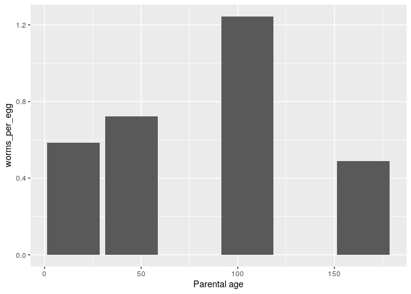

Basic data wrangling
================
**Dmitry Kondrashov & Stefano Allesina**
Fundamentals of Biological Data Analysis – BIOS 26318

# Goal

Learn how to manipulate large data sets by writing efficient,
consistent, and compact code. Introduce the use of `dplyr`, `tidyr`, and
the “pipeline” operator `%>%`. Effortlessly produce statistics for
grouped data. Massage data into “tidy” form.

# What is data wrangling?

As biologists living in the XXI century, we are often faced with tons of
data, possibly replicated over several organisms, treatments, or
locations. We would like to streamline and automate our analysis as much
as possible, writing scripts that are easy to read, fast to run, and
easy to debug. Base `R` can get the job done, but often the code
contains complicated operations, and a lot of `$` signs and brackets.

We’re going to learn about the packages `dplyr` and `tidyr`, which are
part of `tidyverse` and can be used to manipulate large data frames in a
simple and straightforward way. These tools are also much faster than
the corresponding base `R` commands, are very compact, and can be
concatenated into “pipelines”.

To start, we need to import the
libraries:

``` r
library(tidyverse) # this loads both dplyr and tidyr, along with other packages
library(readxl) # to read Excel files
library(maps) # to draw maps
library(ggmap) # to draw maps in ggplot
```

Then, we need a dataset to play with. We take a simple dataset from:

> Lippens C, Faivre B, Lechenault C, Sorci G (2017) [Aging parasites
> produce offspring with poor fitness
> prospects](https://doi.org/10.1098/rsbl.2016.0888). Biology Letters
> 13(2): 20160888.

The authors have found that senescing parasites produce offspring with
lower survival probability and lower fertility. To produce this result,
they have infected mice with the parasite nematode *Heligmosomoides
polygyrus*. They collected the eggs found in the faeces at different
times, corresponding to the age of the worm (in days). Then they used
the hatched larvae to infect mice, and counted the eggs shed by the
newly infected mice for 28 days. At that point, the mice were sacrificed
and adult worms in the intestine counted.

``` r
# original URL:
# https://datadryad.org/stash/dataset/doi:10.5061/dryad.2k11f
dt <- read_xlsx("data/Lippens_2017.xlsx") 
```

# A new data type, `tibble`

This is now a :

``` r
class(dt)
```

    # [1] "tbl_df"     "tbl"        "data.frame"

`dplyr` ships with a new data type, called a `tibble`. To convert a
`data.frame` into a tibble, use `as_tibble`:

``` r
# load a data frame
data("trees")
class(trees)
trees <- as_tibble(trees)
class(trees)
```

The nice feature of `tbl` objects is that they will print only what fits
on the screen, and also give you useful information on the size of the
data, as well as the type of data in each column. Other than that, a
`tbl` object behaves very much like a `data.frame`. In some rare cases,
you want to transform the `tbl` back into a `data.frame`. For this, use
the function `as.data.frame(tbl_object)`.

We can take a look at the data using one of several functions:

  - `head(dt)` shows the first few rows
  - `tail(dt)` shows the last few rows
  - `glimpse(dt)` a summary of the data (similar to `str` in base R)
  - `View(dt)` open in spreadsheet-like window

# Selecting rows and columns

There are many ways to subset the data, either by row (subsetting the
*observations*), or by column (subsetting the *variables*). For example,
suppose we want to count how many rows contain data for `time
post-infection` 28. When reading data using `tidyverse`, the column
names are not altered (contrary to what happens using `read.csv`). As
such, they might be difficult to type. No problem: simply enclose the
names with back tickmarks (“\`”):

``` r
filter(dt, `time post-infection` == 28)
```

    # # A tibble: 20 x 5
    #    `Parental age` id     `time post-infect… `fecal egg coun… `number of adult w…
    #             <dbl> <chr>               <dbl>            <dbl>               <dbl>
    #  1             15 ES11/A                 28            19.2                   39
    #  2             15 ES12/B                 28            21.9                   54
    #  3             15 ES13/C                 28            16.4                   44
    #  4             15 ES14/D                 28            28.6                   49
    #  5             15 ES15/E                 28            14.9                   38
    #  6             45 ES21/A                 28            17.6                   26
    #  7             45 ES22/B                 28            35.4                   49
    #  8             45 ES23/C                 28            17.9                   51
    #  9             45 ES24/D                 28            30.5                   43
    # 10             45 ES25/E                 28            20.3                   43
    # 11            105 ES31/A                 28             5.31                  21
    # 12            105 ES32/B                 28            23.6                   39
    # 13            105 ES33/C                 28             9.66                  24
    # 14            105 ES34/D                 28            12.0                   27
    # 15            105 ES35/E                 28            39.8                   32
    # 16            165 ES41/A                 28             4.33                  12
    # 17            165 ES42/B                 28             9.27                  26
    # 18            165 ES43/C                 28            10.0                   25
    # 19            165 ES44/D                 28            11.6                   28
    # 20            165 ES45/E                 28            13.7                   28

We have 20 observations. We have used the command `filter(tbl,
conditions)` to select certain observations. We can combine several
conditions, by listing them side by side, possibly using logical
operators.

> **Exercise:** what does this do? ``filter(dt, `Parental age` > 20,
> `number of adult worms` > 20, `fecal egg count` < 10)``

We can also select particular variables (columns) using the function
`select(tbl, cols to select)`. For example, select `id` and `number of
adult worms`:

``` r
select(dt, id, `number of adult worms`)
```

    # # A tibble: 120 x 2
    #    id     `number of adult worms`
    #    <chr>                    <dbl>
    #  1 ES11/A                      NA
    #  2 ES11/A                      NA
    #  3 ES11/A                      NA
    #  4 ES11/A                      NA
    #  5 ES11/A                      NA
    #  6 ES11/A                      39
    #  7 ES12/B                      NA
    #  8 ES12/B                      NA
    #  9 ES12/B                      NA
    # 10 ES12/B                      NA
    # # … with 110 more rows

How many `id`s are represented in the data set? We can use the function
`distinct(tbl, cols to select)` to retain only the rows that differ from
each other:

``` r
distinct(select(dt, id))
```

    # # A tibble: 20 x 1
    #    id    
    #    <chr> 
    #  1 ES11/A
    #  2 ES12/B
    #  3 ES13/C
    #  4 ES14/D
    #  5 ES15/E
    #  6 ES21/A
    #  7 ES22/B
    #  8 ES23/C
    #  9 ES24/D
    # 10 ES25/E
    # 11 ES31/A
    # 12 ES32/B
    # 13 ES33/C
    # 14 ES34/D
    # 15 ES35/E
    # 16 ES41/A
    # 17 ES42/B
    # 18 ES43/C
    # 19 ES44/D
    # 20 ES45/E

Showing that there are 20 replicates, once we removed the duplicates.
There are many other ways to subset observations:

  - `sample_n(tbl, howmany, replace = TRUE)` sample `howmany` rows at
    random (with replacement)
  - `sample_frac(tbl, proportion, replace = FALSE)` sample a certain
    proportion (e.g. `0.2` for 20%) of rows at random without
    replacement
  - `slice(tbl, 5:20)` extract the rows `5` to `20`
  - ``top_n(tbl, 10, `number of adult worms`)`` extract the first `10`
    rows, once ordered by `number of adult worms`

More ways to select columns:

  - `select(dt, contains("time"))` select all columns containing the
    word `time`
  - ``select(dt, -id, -`Parental age`)`` exclude the columns `id` and
    `Parental age`
  - `select(dt, matches("count|time"))` select all columns whose names
    match a regular expression

# Creating pipelines using `%>%`

We’ve been calling nested functions, such as `distinct(select(dt, id))`.
If you have to add another layer or two, the code would become
unreadable. `dplyr` allows you to “un-nest” these functions and create a
“pipeline” in which you concatenate commands separated by a special
operator, `%>%`. For example:

``` r
dt %>% # take a data table
  select(id) %>% # select a column
  distinct() # remove duplicates
```

    # # A tibble: 20 x 1
    #    id    
    #    <chr> 
    #  1 ES11/A
    #  2 ES12/B
    #  3 ES13/C
    #  4 ES14/D
    #  5 ES15/E
    #  6 ES21/A
    #  7 ES22/B
    #  8 ES23/C
    #  9 ES24/D
    # 10 ES25/E
    # 11 ES31/A
    # 12 ES32/B
    # 13 ES33/C
    # 14 ES34/D
    # 15 ES35/E
    # 16 ES41/A
    # 17 ES42/B
    # 18 ES43/C
    # 19 ES44/D
    # 20 ES45/E

does exactly the same operations as the command above, but is much more
readable. By concatenating many commands, you can create incredibly
complex pipelines while retaining readability. It is also quite easy to
add another piece of the pipeline in between commands, or to comment
some of the pipeline out.

Another advantage of pipelines is that they help with name completion.
In fact, `RStudio` is running in the background your pipeline while you
type it. Try typing `dt %>% filter(` and then start typing `time` and
press `Tab`: you will see the options to complete the column name;
choose it with your arrows and hit `Return`. The back tickmarks will be
added automatically.

# Producing summaries

Sometimes we need to calculate statistics on certain columns. For
example, calculate the average number of eggs shedded by the infected
mice. We can do this using `summarise` (you can use British or American
spelling):

``` r
dt %>% summarise(avg = mean(`fecal egg count`, na.rm = TRUE))
```

    # # A tibble: 1 x 1
    #     avg
    #   <dbl>
    # 1  18.4

where we used `na.rm = TRUE` to ignore missing values. This command
returns a `tbl` object with just the average egg count. You can combine
multiple statistics (use `first`, `last`, `min`, `max`, `n` \[count the
number of rows\], `n_distinct` \[count the number of distinct rows\],
`mean`, `median`, `var`, `sd`, etc.):

``` r
dt %>% summarise(avg = mean(`fecal egg count`, na.rm = TRUE), 
                 sd = sd(`fecal egg count`, na.rm = TRUE), 
                 median = median(`fecal egg count`, na.rm = TRUE))
```

    # # A tibble: 1 x 3
    #     avg    sd median
    #   <dbl> <dbl>  <dbl>
    # 1  18.4  10.0   16.2

# Summaries by group

One of the most useful features of `dplyr` is the ability to produce
statistics for the data once subsetted by *groups*. For example, we
would like to measure whether older worms produce less virulent
offspring. We can then group the data by `Parental age`, and calculate
the mean `fecal egg count` once the data are split into groups:

``` r
dt %>% group_by(`Parental age`) %>% 
  summarise(mean = mean(`fecal egg count`, na.rm = TRUE))
```

    # # A tibble: 4 x 2
    #   `Parental age`  mean
    #            <dbl> <dbl>
    # 1             15  26.1
    # 2             45  16.8
    # 3            105  16.3
    # 4            165  14.8

showing that younger worms produce highly virulent offspring.

> **Exercise:** find the average `number of adult worms` by `Parental
> age`. Filter the data to consider only 28 days for `time
> post-infection`.

# Ordering the data

To order the data according to one or more variables, use `arrange()`:

``` r
dt %>% arrange(`number of adult worms`)
dt %>% arrange(desc(`number of adult worms`))
```

    # # A tibble: 120 x 5
    #    `Parental age` id     `time post-infect… `fecal egg coun… `number of adult w…
    #             <dbl> <chr>               <dbl>            <dbl>               <dbl>
    #  1            165 ES41/A                 28             4.33                  12
    #  2            105 ES31/A                 28             5.31                  21
    #  3            105 ES33/C                 28             9.66                  24
    #  4            165 ES43/C                 28            10.0                   25
    #  5             45 ES21/A                 28            17.6                   26
    #  6            165 ES42/B                 28             9.27                  26
    #  7            105 ES34/D                 28            12.0                   27
    #  8            165 ES44/D                 28            11.6                   28
    #  9            165 ES45/E                 28            13.7                   28
    # 10            105 ES35/E                 28            39.8                   32
    # # … with 110 more rows
    # # A tibble: 120 x 5
    #    `Parental age` id     `time post-infect… `fecal egg coun… `number of adult w…
    #             <dbl> <chr>               <dbl>            <dbl>               <dbl>
    #  1             15 ES12/B                 28             21.9                  54
    #  2             45 ES23/C                 28             17.9                  51
    #  3             15 ES14/D                 28             28.6                  49
    #  4             45 ES22/B                 28             35.4                  49
    #  5             15 ES13/C                 28             16.4                  44
    #  6             45 ES24/D                 28             30.5                  43
    #  7             45 ES25/E                 28             20.3                  43
    #  8             15 ES11/A                 28             19.2                  39
    #  9            105 ES32/B                 28             23.6                  39
    # 10             15 ES15/E                 28             14.9                  38
    # # … with 110 more rows

# Renaming columns

To rename one or more columns, use `rename()`:

``` r
dt %>% rename(pa = `Parental age`)
```

    # # A tibble: 120 x 5
    #       pa id     `time post-infection` `fecal egg count` `number of adult worms`
    #    <dbl> <chr>                  <dbl>             <dbl>                   <dbl>
    #  1    15 ES11/A                    11              14.6                      NA
    #  2    15 ES11/A                    14              21.1                      NA
    #  3    15 ES11/A                    18              16.8                      NA
    #  4    15 ES11/A                    21              31.0                      NA
    #  5    15 ES11/A                    25              21.8                      NA
    #  6    15 ES11/A                    28              19.2                      39
    #  7    15 ES12/B                    11              25.9                      NA
    #  8    15 ES12/B                    14              19.4                      NA
    #  9    15 ES12/B                    18              22.4                      NA
    # 10    15 ES12/B                    21              61.4                      NA
    # # … with 110 more rows

# Adding new variables using mutate

If you want to add one or more new columns, with the content being a
function of other columns, use the function `mutate`. For example, we
are going to take the samples at `time post-infection` 28, and add a
column containing the ratio between `fecal egg count` and `number of
adult worms` , calling the new column `worms_per_egg`:

``` r
dt %>% 
  filter(`time post-infection` == 28) %>% 
  mutate(worms_per_egg = `fecal egg count` / `number of adult worms`)
```

    # # A tibble: 20 x 6
    #    `Parental age` id    `time post-infe… `fecal egg coun… `number of adul…
    #             <dbl> <chr>            <dbl>            <dbl>            <dbl>
    #  1             15 ES11…               28            19.2                39
    #  2             15 ES12…               28            21.9                54
    #  3             15 ES13…               28            16.4                44
    #  4             15 ES14…               28            28.6                49
    #  5             15 ES15…               28            14.9                38
    #  6             45 ES21…               28            17.6                26
    #  7             45 ES22…               28            35.4                49
    #  8             45 ES23…               28            17.9                51
    #  9             45 ES24…               28            30.5                43
    # 10             45 ES25…               28            20.3                43
    # 11            105 ES31…               28             5.31               21
    # 12            105 ES32…               28            23.6                39
    # 13            105 ES33…               28             9.66               24
    # 14            105 ES34…               28            12.0                27
    # 15            105 ES35…               28            39.8                32
    # 16            165 ES41…               28             4.33               12
    # 17            165 ES42…               28             9.27               26
    # 18            165 ES43…               28            10.0                25
    # 19            165 ES44…               28            11.6                28
    # 20            165 ES45…               28            13.7                28
    # # … with 1 more variable: worms_per_egg <dbl>

We can pipe the results to `ggplot` for plotting\!

``` r
dt %>% 
  filter(`time post-infection` == 28) %>% 
  mutate(worms_per_egg = `fecal egg count` / `number of adult worms`) %>% 
  ggplot() + aes(x = `Parental age`, y = worms_per_egg) + geom_col(position = "dodge")
```



You can use the function `transmute()` to create a new column and drop
the original columns.

Most importantly, you can use `mutate` and `transmute` on grouped data.
For example, let’s compute a z-score of the `fecal egg count` once the
data is grouped by parental
age:

``` r
dt %>% select(`Parental age`, `time post-infection`, `fecal egg count`) %>% 
  group_by(`Parental age`) %>% 
  mutate(zscore = scale(`fecal egg count`)) %>% 
  arrange(`time post-infection`)
```

# Data wrangling

Data is rarely in a format that is good for computing, and much effort
goes into reading the data and wrestling with it to make it into a good
format. As the name implies, `tidyverse` strongly advocates for the use
of data in *tidy* form. What does this mean?

  - Each variable forms a column
  - Each observation forms a row
  - Each type of observational unit forms a table

This is often called *narrow table* format. Any other form of data
(e.g., *wide table* format) is considered *messy*. However, often data
are not organized in tidy form, or we want to produce tables for human
consumption rather than computer consumption. The package `tidyr` allows
to accomplish just that. It contains only a few, very powerful
functions:

## Gather: from columns to rows

``` r
test <- tibble("individual" = c("ind1", "ind2"), 
               "Task A" = c(1, 3), 
               "Task B" = c(4, 1))
test
```

    # # A tibble: 2 x 3
    #   individual `Task A` `Task B`
    #   <chr>         <dbl>    <dbl>
    # 1 ind1              1        4
    # 2 ind2              3        1

Make it into tidy form:

``` r
test %>% gather(Task, Score, 2:3)
```

    # # A tibble: 4 x 3
    #   individual Task   Score
    #   <chr>      <chr>  <dbl>
    # 1 ind1       Task A     1
    # 2 ind2       Task A     3
    # 3 ind1       Task B     4
    # 4 ind2       Task B     1

## Spread: turn rows into columns

``` r
test <- tibble(location = c("one", "one", "two", "two"), 
               month = c("June", "July", "June", "July"), 
               rainfall = c(12, 14, 6, 8))
test
```

    # # A tibble: 4 x 3
    #   location month rainfall
    #   <chr>    <chr>    <dbl>
    # 1 one      June        12
    # 2 one      July        14
    # 3 two      June         6
    # 4 two      July         8

Make it into wide-table (messy) format:

``` r
test %>% spread(month, rainfall)
```

    # # A tibble: 2 x 3
    #   location  July  June
    #   <chr>    <dbl> <dbl>
    # 1 one         14    12
    # 2 two          8     6

## Separate: split a column into two or more

``` r
test <- tibble(name = c("Allesina, Stefano", "Kondrashov, Dmitry", "Smith, Julia"))
test
```

    # # A tibble: 3 x 1
    #   name              
    #   <chr>             
    # 1 Allesina, Stefano 
    # 2 Kondrashov, Dmitry
    # 3 Smith, Julia

``` r
test %>% separate(name, into = c("last_name", "first_name"), sep = ", ")
```

    # # A tibble: 3 x 2
    #   last_name  first_name
    #   <chr>      <chr>     
    # 1 Allesina   Stefano   
    # 2 Kondrashov Dmitry    
    # 3 Smith      Julia

The complement of `separate` is called
`unite`.

## Separate rows: from one row to many

``` r
test <- tibble(id = c(1, 2, 3, 4), records = c("a;b;c", "c;d", "a;e", "f"))
test
```

    # # A tibble: 4 x 2
    #      id records
    #   <dbl> <chr>  
    # 1     1 a;b;c  
    # 2     2 c;d    
    # 3     3 a;e    
    # 4     4 f

To make it into tidy form, only one record per row:

``` r
test %>% separate_rows(records, sep = ";")
```

    # # A tibble: 8 x 2
    #      id records
    #   <dbl> <chr>  
    # 1     1 a      
    # 2     1 b      
    # 3     1 c      
    # 4     2 c      
    # 5     2 d      
    # 6     3 a      
    # 7     3 e      
    # 8     4 f

# An example: from tidy to messy

The data we are using are in tidy format, but suppose you want to
produce a table for your paper. For each parental age, you want to show
the mean number of eggs by `time post-infection`. We know how to compute
the statistics:

``` r
for_table <- dt %>% 
  group_by(`Parental age`, `time post-infection`) %>% 
  summarise(eggs = mean(`fecal egg count`))
for_table
```

    # # A tibble: 24 x 3
    # # Groups:   Parental age [4]
    #    `Parental age` `time post-infection`  eggs
    #             <dbl>                 <dbl> <dbl>
    #  1             15                    11  22.4
    #  2             15                    14  NA  
    #  3             15                    18  19.0
    #  4             15                    21  40.5
    #  5             15                    25  29.6
    #  6             15                    28  20.2
    #  7             45                    11  13.1
    #  8             45                    14  16.0
    #  9             45                    18  14.2
    # 10             45                    21  15.6
    # # … with 14 more rows

Now the data is in narrow (tidy) format, and we would like to produce a
wide table that is better for human consumption. All we need to do is to
`spread` the column `time post-infection` so that each time becomes a
different column. For each combination of `Parental age` and `time
post-infection`, we report the mean number of eggs:

``` r
for_table %>% spread(`time post-infection`, eggs)
```

    # # A tibble: 4 x 7
    # # Groups:   Parental age [4]
    #   `Parental age`  `11`  `14`  `18`  `21`  `25`  `28`
    #            <dbl> <dbl> <dbl> <dbl> <dbl> <dbl> <dbl>
    # 1             15  22.4  NA    19.0  40.5  29.6 20.2 
    # 2             45  13.1  16.0  14.2  15.6  17.8 24.3 
    # 3            105  12.4  11.5  17.0  18.2  20.6 18.1 
    # 4            165  18.0  16.8  11.8  18.7  13.9  9.78

> **Exercise**: how do we produce a table in which the `time
> post-infection` is in the rows, and `Parental age` in the columns?

# Example: brown bear, brown bear, what do you see?

This exercise uses a dataset from [GBIF](https://www.gbif.org/en/), the
Global Biodiversity Information Facility. You can download the latest
version yourself by doing the following:

1.  Go to [GBIF](https://www.gbif.org/en/) and click on Occurrences.
2.  Under Scientific Name type in *Ursus arctos* (brown bear), and hit
    enter.
3.  To download the data, create an account on GBIF
4.  Then click on Download, and select Simple (which should have a
    tab-delimited .csv file)
5.  Save to the data folder in your working folder.

If you don’t want to go through all this, you can use the downloaded
file called `0010873-190813142620410.csv` that should be in the data
folder for this week. The following command loads and displays the
contents of the tibble:

``` r
Ursus_data <- read_tsv("data/0010873-190813142620410.csv")
glimpse(Ursus_data)
```

    # Rows: 23,498
    # Columns: 50
    # $ gbifID                           <dbl> 2382421192, 2382420986, 2382420916, …
    # $ datasetKey                       <chr> "88d8974c-f762-11e1-a439-00145eb45e9…
    # $ occurrenceID                     <chr> "http://arctos.database.museum/guid/…
    # $ kingdom                          <chr> "Animalia", "Animalia", "Animalia", …
    # $ phylum                           <chr> "Chordata", "Chordata", "Chordata", …
    # $ class                            <chr> "Mammalia", "Mammalia", "Mammalia", …
    # $ order                            <chr> "Carnivora", "Carnivora", "Carnivora…
    # $ family                           <chr> "Ursidae", "Ursidae", "Ursidae", "Ur…
    # $ genus                            <chr> "Ursus", "Ursus", "Ursus", "Ursus", …
    # $ species                          <chr> "Ursus arctos", "Ursus arctos", "Urs…
    # $ infraspecificEpithet             <chr> NA, NA, NA, "horribilis", NA, NA, NA…
    # $ taxonRank                        <chr> "SPECIES", "SPECIES", "SPECIES", "SU…
    # $ scientificName                   <chr> "Ursus arctos Linnaeus, 1758", "Ursu…
    # $ verbatimScientificName           <chr> "Ursus arctos", "Ursus arctos", "Urs…
    # $ verbatimScientificNameAuthorship <chr> NA, NA, NA, NA, NA, NA, NA, NA, NA, …
    # $ countryCode                      <chr> NA, "US", NA, NA, "US", NA, NA, "US"…
    # $ locality                         <chr> "no specific locality recorded", "no…
    # $ stateProvince                    <chr> NA, "Alaska", NA, NA, "Colorado", NA…
    # $ occurrenceStatus                 <chr> NA, NA, NA, NA, NA, NA, NA, NA, NA, …
    # $ individualCount                  <dbl> 1, 1, 1, 1, 1, 1, 1, 1, 1, 1, 1, 1, …
    # $ publishingOrgKey                 <chr> "4cadac10-3e7b-11d9-8439-b8a03c50a86…
    # $ decimalLatitude                  <dbl> NA, NA, NA, NA, NA, NA, NA, NA, NA, …
    # $ decimalLongitude                 <dbl> NA, NA, NA, NA, NA, NA, NA, NA, NA, …
    # $ coordinateUncertaintyInMeters    <dbl> NA, NA, NA, NA, NA, NA, NA, NA, NA, …
    # $ coordinatePrecision              <dbl> NA, NA, NA, NA, NA, NA, NA, NA, NA, …
    # $ elevation                        <dbl> NA, NA, NA, NA, NA, NA, NA, NA, NA, …
    # $ elevationAccuracy                <dbl> NA, NA, NA, NA, NA, NA, NA, NA, NA, …
    # $ depth                            <lgl> NA, NA, NA, NA, NA, NA, NA, NA, NA, …
    # $ depthAccuracy                    <lgl> NA, NA, NA, NA, NA, NA, NA, NA, NA, …
    # $ eventDate                        <dttm> 1800-01-01, 1800-01-01, 1800-01-01,…
    # $ day                              <dbl> 1, 1, 1, 1, 1, 1, 1, 1, 1, 1, 1, 1, …
    # $ month                            <dbl> 1, 1, 1, 1, 1, 3, 1, 1, 1, 1, 1, 1, …
    # $ year                             <dbl> 1800, 1800, 1800, 1800, 1914, 1938, …
    # $ taxonKey                         <dbl> 2433433, 2433433, 2433433, 6163845, …
    # $ speciesKey                       <dbl> 2433433, 2433433, 2433433, 2433433, …
    # $ basisOfRecord                    <chr> "PRESERVED_SPECIMEN", "PRESERVED_SPE…
    # $ institutionCode                  <chr> "UCM", "UCM", "UCM", "UCM", "UCM", "…
    # $ collectionCode                   <chr> "Mammal specimens", "Mammal specimen…
    # $ catalogNumber                    <chr> "UCM:Mamm:5003", "UCM:Mamm:3329", "U…
    # $ recordNumber                     <lgl> NA, NA, NA, NA, NA, NA, NA, NA, NA, …
    # $ identifiedBy                     <chr> "T. C. Hart", "unknown", "unknown", …
    # $ dateIdentified                   <dttm> 2013-01-01, 1936-01-01, NA, 2015-10…
    # $ license                          <chr> "CC0_1_0", "CC0_1_0", "CC0_1_0", "CC…
    # $ rightsHolder                     <chr> NA, NA, NA, NA, NA, NA, NA, NA, NA, …
    # $ recordedBy                       <chr> "Collector(s): T. C. Hart", "Collect…
    # $ typeStatus                       <lgl> NA, NA, NA, NA, NA, NA, NA, NA, NA, …
    # $ establishmentMeans               <chr> NA, NA, NA, NA, NA, NA, "MANAGED", N…
    # $ lastInterpreted                  <dttm> 2019-09-03 22:11:14, 2019-09-03 22:…
    # $ mediaType                        <chr> NA, NA, NA, NA, NA, NA, NA, NA, NA, …
    # $ issue                            <chr> NA, NA, NA, NA, "TAXON_MATCH_HIGHERR…

You see there are 50 variables in the data set, so it may be useful to
remove the ones we don’t need. For this exercise, our objective is to
plot the occurrences of this species on the world map, so we need two
variables for certain: `decimalLatitude` and `decimalLongitude`, as well
as the `BasisofRecord` for additional information. Use your `tidyverse`
skills to create a new tibble with only those variables. In addition,
remove duplicate records from the tibble.

Now we can plot this data set on the world map, using the useful package
maps. To plot, use the `ggplot()` syntax with the following
addition:

``` r
mapWorld <- borders("world", colour="gray50", fill="gray50") # create a layer of borders
# now you can call 
# ggplot() + mapWorld + ...
```

Note the warning message generated by `ggplot`. Then consider the map
with the locations of the brown bear specimens. Do any of them seem
strange to you? What may be the explanation behind these strange data
point? Now filter out the points that you identified as suspicious and
print out their BasisofRecord. Does this suggest an explanation for the
strangeness?

# A more difficult case: from (very) messy to tidy

We now are going to turn a data set that is almost impossible to use.
You can read the data using:

``` r
# Original URL
# https://datadryad.org/stash/dataset/doi:10.5061/dryad.80vd7q6
a <- read_xlsx("data/Derocles et al Networks.xlsx")
```

These data are taken from:

> Derocles SAP, Lunt DH, Berthe SCF, Nichols PC, Moss ED, Evans DM
> (2018) Climate-warming alters the structure of farmland tri-trophic
> ecological networks and reduces crop yield. Molecular Ecology

The data is composed of 24 matrices (one for each experimental plot)
showing the frequency of interaction between plants, aphids and
parasitoids. Take a look using `View(a)`: you can see that there are
several matrices in the same sheet. We would like to produce the tidy
data: `plot` (number of the plot), `from` (species from), `to` (species
to), `frequency` (what is reported in the matrix). First, we need to
find where plot 2, 3, etc. start:

``` r
starting <- a %>% transmute(plot = `plot 1`, 
                            start = ifelse(grepl("plot", `plot 1`), 
                                           row_number(), NA)) %>% 
  filter(!is.na(start))
```

Now let’s add 1 to the starting point (because that is the row
containing the names), and add at the front a new row for plot 1:

``` r
starting <- rbind(tibble(plot = "plot 1", start = 1), 
                  starting %>% mutate(start = start + 1))
starting
```

    # # A tibble: 24 x 2
    #    plot    start
    #    <chr>   <dbl>
    #  1 plot 1      1
    #  2 plot 2     17
    #  3 plot 3     33
    #  4 plot 4     49
    #  5 plot 5     65
    #  6 plot 6     81
    #  7 plot 7     97
    #  8 plot 8    113
    #  9 plot 9    129
    # 10 plot 10   145
    # # … with 14 more rows

Now we want to find where each data set ends. It will be the starting
point of the next one minus 3:

``` r
starting <- starting %>% mutate(end = lead(start) - 3)
starting
```

    # # A tibble: 24 x 3
    #    plot    start   end
    #    <chr>   <dbl> <dbl>
    #  1 plot 1      1    14
    #  2 plot 2     17    30
    #  3 plot 3     33    46
    #  4 plot 4     49    62
    #  5 plot 5     65    78
    #  6 plot 6     81    94
    #  7 plot 7     97   110
    #  8 plot 8    113   126
    #  9 plot 9    129   142
    # 10 plot 10   145   158
    # # … with 14 more rows

Note that we’re missing the end for the last plot:

``` r
tail(starting)
```

    # # A tibble: 6 x 3
    #   plot    start   end
    #   <chr>   <dbl> <dbl>
    # 1 plot 19   289   302
    # 2 plot 20   305   318
    # 3 plot 21   321   334
    # 4 plot 22   337   350
    # 5 plot 23   353   366
    # 6 plot 24   369    NA

We can fix this easily:

``` r
starting[starting$plot == "plot 24", "end"] <- nrow(a)
tail(starting)
```

    # # A tibble: 6 x 3
    #   plot    start   end
    #   <chr>   <dbl> <dbl>
    # 1 plot 19   289   302
    # 2 plot 20   305   318
    # 3 plot 21   321   334
    # 4 plot 22   337   350
    # 5 plot 23   353   366
    # 6 plot 24   369   382

Wonderful\! Now let’s try to transform the first plot:

``` r
my_plot <- "plot 1"
my_start  <- 1
my_end <- 14
# build this line by line!
a %>% slice(my_start:my_end) %>% 
  gather(to, frequency, -`plot 1`) %>% 
  rename(from = `plot 1`) %>% 
  add_column(plot = my_plot) %>% 
  mutate(frequency = as.numeric(frequency)) %>% 
  filter(frequency > 0) %>% 
  select(plot, from, to, frequency)
```

    # # A tibble: 20 x 4
    #    plot   from                   to                     frequency
    #    <chr>  <chr>                  <chr>                      <dbl>
    #  1 plot 1 Sonchus_oleracerus     Uroleucon_sonchi              20
    #  2 plot 1 Sonchus_oleracerus     Hyperomyzus_lactucae           8
    #  3 plot 1 Triticum_aestivum      Sitobion_avenae               29
    #  4 plot 1 Triticum_aestivum      Metopolophium_dirhodum        10
    #  5 plot 1 Sitobion_avenae        Dendrocerus_carpenteri         3
    #  6 plot 1 Sitobion_avenae        Alloxysta_victrix              1
    #  7 plot 1 Sitobion_avenae        Aphidius_rhopalosiphi          5
    #  8 plot 1 Metopolophium_dirhodum Aphidius_rhopalosiphi          1
    #  9 plot 1 Sitobion_avenae        Aphidius_avenae                2
    # 10 plot 1 Hyperomyzus_lactucae   Aphidius_ervi                  2
    # 11 plot 1 Sitobion_avenae        Aphidius_ervi                  1
    # 12 plot 1 Metopolophium_dirhodum Aphidius_ervi                  1
    # 13 plot 1 Sitobion_avenae        Aphidus_uzbekistanicus         1
    # 14 plot 1 Sitobion_avenae        Ephedrus_plagiator             1
    # 15 plot 1 Metopolophium_dirhodum Ephedrus_plagiator             1
    # 16 plot 1 Uroleucon_sonchi       Praon_volucre                  2
    # 17 plot 1 Sitobion_avenae        Praon_volucre                  1
    # 18 plot 1 Sitobion_avenae        Toxares_deltiger               1
    # 19 plot 1 Sitobion_avenae        Praon_gallicum                 1
    # 20 plot 1 Uroleucon_sonchi       Aphidius_funebris              6

Now let’s put this all together\!

``` r
my_data <- tibble()
for (i in 1:nrow(starting)){
  my_plot <- starting$plot[i]
  my_start  <- starting$start[i]
  my_end <- starting$end[i]
  # build this line by line!
  my_data <- rbind(my_data,
    a %>% slice(my_start:my_end) %>% 
    gather(to, frequency, -`plot 1`) %>% 
    rename(from = `plot 1`) %>% 
    add_column(plot = my_plot) %>% 
    mutate(frequency = as.numeric(frequency)) %>% 
    filter(frequency > 0) %>% 
    select(plot, from, to, frequency))
}
```

Now it is easy to compute statistics on the data set. For example:

``` r
my_data %>% 
  group_by(from, to) %>% 
  summarise(num = n(), 
            mean = mean(frequency), 
            sd = sd(frequency)) %>% 
  arrange(desc(mean))
```

    # # A tibble: 37 x 5
    # # Groups:   from [14]
    #    from               to                       num  mean    sd
    #    <chr>              <chr>                  <int> <dbl> <dbl>
    #  1 Triticum_aestivum  Sitobion_avenae           24  50.4 39.0 
    #  2 Cirsium_arvense    Uroleucon_sp               4  41.2 48.7 
    #  3 Sonchus_oleracerus Uroleucon_sonchi           2  37   24.0 
    #  4 Chenopodium_album  Aphis_fabae                5  26   19.5 
    #  5 Rumex_sp           Aphis_fabae                1  21   NA   
    #  6 Uroleucon_sp       Aphidius_funebris          4  15.5 22.4 
    #  7 Triticum_aestivum  Metopolophium_dirhodum    21  11.5  7.48
    #  8 Sitobion_avenae    Aphidius_rhopalosiphi     24  10.0  7.87
    #  9 Galium_aparine     Aphis_fabae                1  10   NA   
    # 10 Uroleucon_sp       Binodoxys_centaureae       2   9.5  7.78
    # # … with 27 more rows

This was a lot of work\! Now you should appreciate why you need to think
about how to organize your data such that they are easy to use\!\!

> **Exercise**: write code to build a matrix for each plot (i.e., that
> takes the tidy data and builds the tables such as in the original).

# Resources

  - [R for Data Science](https://hackr.io/tutorial/r-for-data-science)
  - A [cool class](https://cfss.uchicago.edu/syllabus.html) at U of C in
    Social Sciences
  - [Data
    transformation](https://github.com/rstudio/cheatsheets/raw/master/data-transformation.pdf)
    cheat sheet
  - [Dealing with
    dates](https://github.com/rstudio/cheatsheets/raw/master/lubridate.pdf)
    cheat sheet
  - [Data
    import](https://github.com/rstudio/cheatsheets/raw/master/data-import.pdf)
    cheat sheet
