Basic data visualization
================
**Dmitry Kondrashov & Stefano Allesina**
Fundamentals of Biological Data Analysis – BIOS 26318

# Goal

Introduce the package `ggplot2`, which is part of the `tidyverse`
bundle. Learn how to use `ggplot2` to produce publication-quality
figures. Discuss the philosophical underpinnings of the “Grammar of
Graphics”, showcase the `ggplot2` syntax, produce examples of the
different types of graphs. Learn how to change colors, legends, scales.
Visualize histograms, barplots, scatterplots, etc.

# Introduction to the Grammar of Graphics

The most salient feature of scientific graphs should be clarity. Each
figure should make crystal-clear a) what is being plotted; b) what are
the axes; c) what do colors, shapes, and sizes represent; d) the message
the figure wants to convey. Each figure is accompanied by a (sometimes
long) caption, where the details can be explained further, but the main
message should be clear from glancing at the figure (often, figures are
the first thing editors and referees look at).

Many scientific publications contain very poor graphics: labels are
missing, scales are unintelligible, there is no explanation of some
graphical elements. Moreover, some color graphs are impossible to
understand if printed in black and white, or difficult to discern for
color-blind people.

Given the effort that you put into your science, you want to ensure that
it is well presented and accessible. The investment to master some
plotting software will be rewarded by pleasing graphics that convey a
clear message.

In this section, we introduce `ggplot2`, a plotting package for `R` This
package was developed by Hadley Wickham who contributed many important
packages to `R` (all included in the `tidyverse` bundle we’re going to
use for the reminder of the class). Unlike many other plotting systems,
`ggplot2` is deeply rooted in a “philosophical” vision. The goal is to
conceive a grammar for all graphical representation of data. Leland
Wilkinson and collaborators proposed The Grammar of Graphics. It follows
the idea of a well-formed sentence that is composed of a subject, a
predicate, and an object. The Grammar of Graphics likewise aims at
describing a well-formed graph by a grammar that captures a very wide
range of statistical and scientific graphics. This might be more clear
with an example – Take a simple two-dimensional scatterplot. How can we
describe it? We have:

  - **Data** The data we want to plot.

  - **Mapping** What part of the data is associated with a particular
    visual feature? For example: Which column is associated with the
    x-axis? Which with the y-axis? Which column corresponds to the shape
    or the color of the points? In `ggplot2` lingo, these are called
    *aesthetic mappings* (`aes`).

  - **Geometry** Do we want to draw points? Lines? In `ggplot2` we speak
    of *geometries* (`geom`).

  - **Scale** Do we want the sizes and shapes of the points to scale
    according to some value? Linearly? Logarithmically? Which palette of
    colors do we want to use?

  - **Coordinate** We need to choose a coordinate system (e.g.,
    Cartesian, polar).

  - **Faceting** Do we want to produce different panels, partitioning
    the data according to one (or more) of the variables?

This basic grammar can be extended by adding statistical transformations
of the data (e.g., regression, smoothing), multiple layers, adjustment
of position (e.g., stack bars instead of plotting them side-by-side),
annotations, and so on.

Exactly like in the grammar of a natural language, we can easily change
the meaning of a “sentence” by adding or removing parts. Also, it is
very easy to completely change the type of geometry if we are moving
from say a histogram to a boxplot or a violin plot, as these types of
plots are meant to describe one-dimensional distributions. Similarly, we
can go from points to lines, changing one “word” in our code. Finally,
the look and feel of the graphs is controlled by a theming system,
separating the content from the presentation.

# Basic `ggplot2`

`ggplot2` ships with a simplified graphing function, called `qplot`. In
this introduction we are not going to use it, and we concentrate instead
on the function `ggplot`, which gives you complete control over your
plotting. First, we need to load the package:

``` r
library(tidyverse)
```

To explore the features of `ggplot2`, we are going to use a data set
detailing how behavior in macaques changes with age and social status.
The data are taken from:

> Brent LJN, Ruiz Lambides A, Platt ML (2017) [Family network size and
> survival across the lifespan of female
> macaques](https://doi.org/10.1098/rspb.2017.0515). Proceedings of the
> Royal Society B 284(1854): 20170515.

``` r
# read the data
# original URL:
# https://datadryad.org/stash/dataset/doi:10.5061/dryad.013d5
dt <- read.csv("data/Brent_et_al_Behaviour_vs_Age.csv", stringsAsFactors = FALSE)
head(dt)
```

    #     ID year age Afrels_0.063 OrdRank2 z.Groom.Get z.Groom.Give   z.Agg.Get
    # 1 0_E1 2015   8            0        L  -0.7810929   -0.7668961  0.46819331
    # 2 0_E2 2015   8            0        L  -0.7832200   -0.6130033  0.80005076
    # 3 1_E2 2015   8            0        H  -1.1956885    0.4189310 -0.19359019
    # 4 1_E6 2015   8            0        H  -0.5871623   -0.8333341 -1.13587779
    # 5 1_E7 2015   8            0        H  -0.7313444    0.7012897  0.01682335
    # 6 2_E4 2015   8            0        H   1.4164565    0.8175821 -0.28771170
    #    z.Agg.Give
    # 1 -0.16370312
    # 2 -0.28569532
    # 3  0.90605681
    # 4  0.52444390
    # 5  0.02344048
    # 6 -0.12970552

where: `ID` is the identifier of the macaque; `year` is the year in
which the observation was made; `age` is the age of the individual;
`Afrels_0.063` is the number of adult female relatives; `OrdRank2`
dominance rank in year (L = low ranking, H = high ranking); the rest are
Z-scores detailing how much more (or less) than the average the
individual gets/gives grooming and aggression. To remind you, a Z-score
is a normalized scoring statistic, measuring the distance of an
observation from the mean of a distribution in units of the standard
deviation of the distribution (hence, if an observation has a Z-score of
-2, it is two standard deviations lower than the mean). You can compute
it for a set of observations as:

  
  
where 
is the mean for the observations  and
 the standard deviation ^2 /(n - 1)}").

Because we want to consider each individual only once, we can choose the
most represented year:

``` r
table(dt$year)
```

    # 
    # 2010 2011 2012 2013 2014 2015 
    #   58   85   57   65  101  197

Let’s select year 2015:

``` r
dt <- dt[dt$year == 2015, ]
```

A particularity of `ggplot2` is that it accepts exclusively data
organized in tables (a `data.frame` or a `tibble` object—more on tibbles
later). Thus, all of your data needs to be converted into a data frame
format for plotting.

# Building a well-formed graph

For our first plot, we’re going to produce a barplot detailing how many
individuals are ranked High or Low in the social hierarchy. We start by
specifying the
data:

``` r
ggplot(data = dt)
```

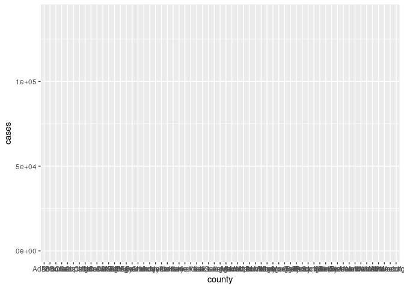

As you can see, nothing is drawn: we need to specify what we would like
to associate to the *x* axis, and what to the *y* axis, etc. (i.e., we
want to set as the *aesthetic mappings*). A barplot typically has
classes on the *x* axis, while the *y* axis reports the counts in each
class. Because `ggplot2` does the counting for us, all we need to
specify is which column is associated with the classes we want to
plot:

``` r
ggplot(data = dt) + aes(x = OrdRank2)
```

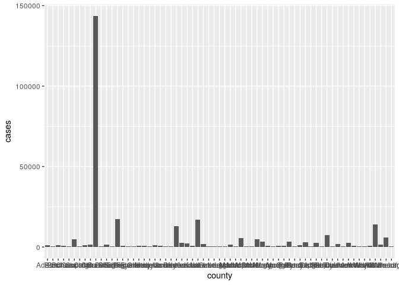

Note that we concatenate pieces of our “sentence” using the `+` sign\!
We’ve got the aestethic mappings figured out, but still no graph… we
need to specify a geometry, i.e., the type of graph we want to produce.
In this case, a
barplot:

``` r
ggplot(data = dt) + aes(x = OrdRank2) + geom_bar()
```

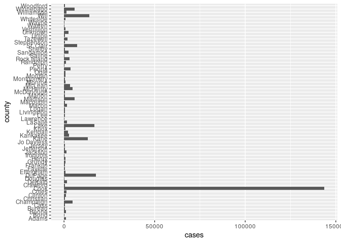

The graph shows that the vast majority of individuals have low social
status. We have written a “well-formed sentence”, composed of **data** +
**mapping** + **geometry**, and this is sufficient to produce a graph.
We can add “adjectives” and “adverbs” to our graph, to make it clearer:

``` r
ggplot(data = dt) + 
  aes(x = OrdRank2) + 
  geom_bar() +
  xlab("Social Rank") + # x label
  ylab("Number of individuals") + # y label
  ggtitle("Social Rank in 2015") # main title
```

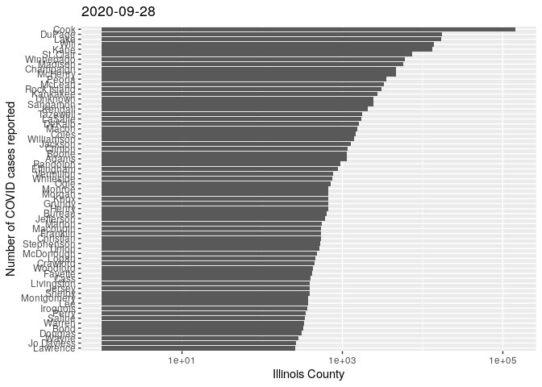

# Scatterplots

Using `ggplot2`, one can produce very many types of graphs. The package
works very well for 2D graphs (or 3D rendered in two dimensions), while
it lack capabilities to draw proper 3D graphs, or networks.

The main feature of `ggplot2` is that you can tinker with your graph
fairly easily, and with a common grammar. You don’t have to settle on a
certain presentation of the data until you’re ready, and it is very easy
to switch from one type of graph to another.

For example, let’s plot the Z-score of “get aggression” vs. the Z-score
of “give aggression”:

``` r
# you can store the graph in a variable
pl <- ggplot(data = dt)
pl <- pl + aes(x = z.Agg.Get, y = z.Agg.Give) # for a scatter plot, we need two aes mappings!
pl <- pl + geom_point() # draw points in a scatterplot
pl # or show(pl)
```

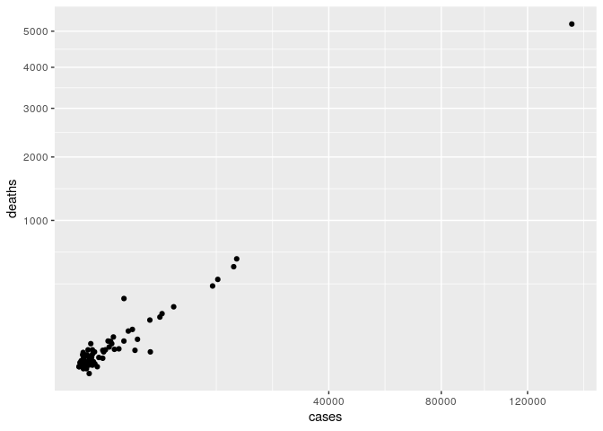

It would be nice to see where the high-ranking individuals are found in
the scatterplot. To do so, just add another aesthetic mapping:

``` r
pl <- ggplot(data = dt)
pl <- pl + aes(x = z.Agg.Get, y = z.Agg.Give, color = OrdRank2) # color by ranking
pl <- pl + geom_point() 
pl 
```

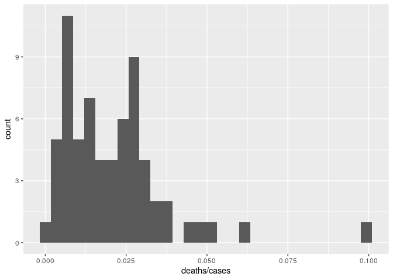

The graph shows that high-ranking individuals are more likely to give
than to get aggression.

# Histograms, density and boxplots

Let’s look at the aggressive behavior in more detail. First, we want to
have an idea of the distribution of `z.Agg.Give`. To do so, we can draw
a
histogram:

``` r
ggplot(data = dt) + aes(x = z.Agg.Give) + geom_histogram()
```


We can control the width of the bins by
specifying:

``` r
ggplot(data = dt) + aes(x = z.Agg.Give) + geom_histogram(bins = 20) # specify the number of bins
```

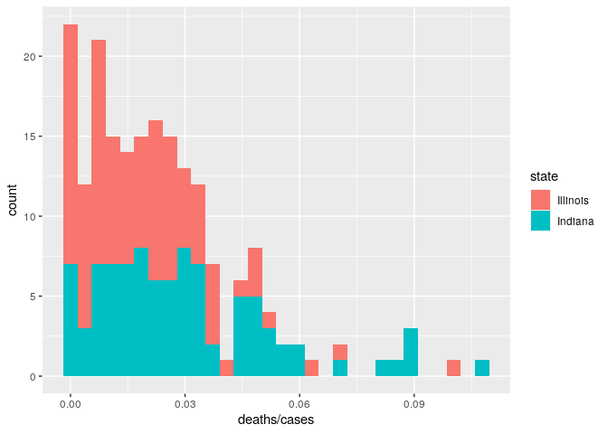

``` r
ggplot(data = dt) + aes(x = z.Agg.Give) + geom_histogram(binwidth = 0.25) # specify the bin width
```

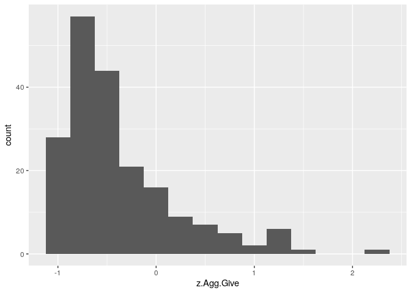

Let’s see whether the histograms differ between ranks:

``` r
ggplot(data = dt) + 
  aes(x = z.Agg.Give, fill = OrdRank2) + # color by rank
  geom_histogram()
```

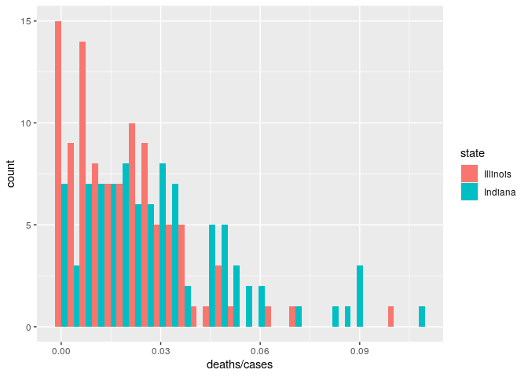

To plot the histogram side by side, use

``` r
ggplot(data = dt) + 
  aes(x = z.Agg.Give, fill = OrdRank2) + # color by rank
  geom_histogram(position = "dodge")
```

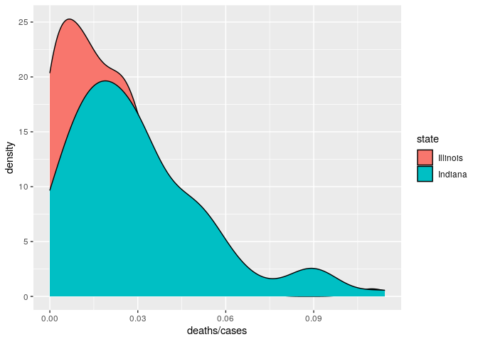

Similarly, we can approximate the histogram using a density plot, which
interpolates the bin height to create a smooth distribution:

``` r
ggplot(data = dt) + 
  aes(x = z.Agg.Give, fill = OrdRank2) + # color by rank
  geom_density()
```

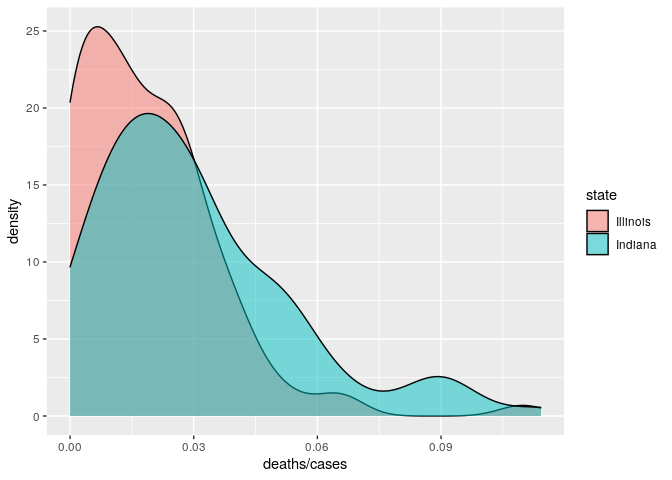

To see the graph better, let’s make the coloring semi-transparent:

``` r
ggplot(data = dt) + 
  aes(x = z.Agg.Give, fill = OrdRank2) +
  geom_density(alpha = 0.5) # 50% saturation
```

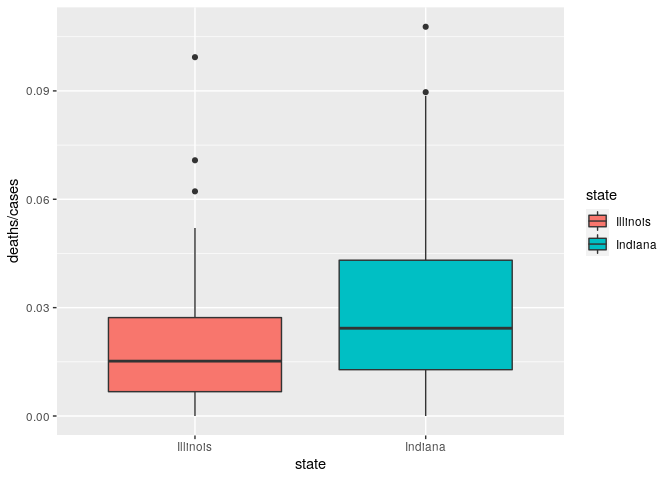

For this type of comparison, the ideal graph to show is maybe a box-plot
or a violin plot:

``` r
ggplot(data = dt) + 
  aes(x = OrdRank2, y = z.Agg.Give, fill = OrdRank2) + # we need both x and y
  geom_boxplot()
```

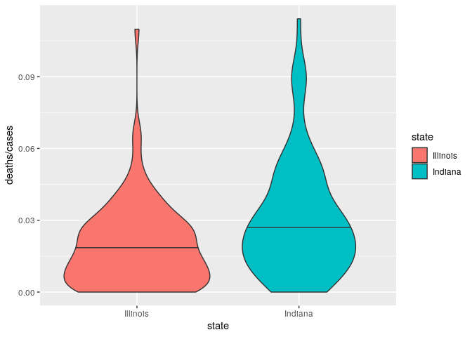

A boxplot shows the median (horizontal bar) as well as the
inter-quartile range (box size goes from 25th to 75th percentile), as
well as the typical range of the data (whiskers). The dots represent
“outliers”. To show the full distribution, you can use a violin plot:

``` r
ggplot(data = dt) + 
  aes(x = OrdRank2, y = z.Agg.Give, fill = OrdRank2) + # we need both x and y
  geom_violin()
```

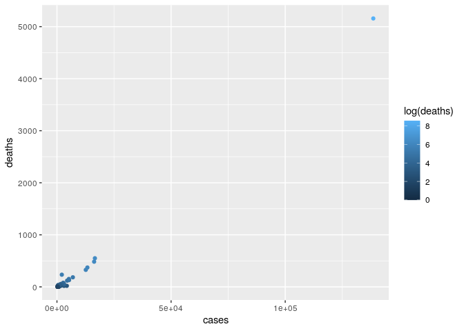

Note that when we’re producing “similar” plots (e.g., histogram
vs. density, box vs. violin, or any other plot sharing the same
aesthetic mappings) changing a single word, we have changed the
structure of the graph considerably\!

# Scales

We can use scales to determine how the aesthetic mappings are displayed.
For example, we could set the *x* axis to be in logarithmic scale, or we
can choose how the colors, shapes and sizes are used. `ggplot2` uses two
types of scales: `continuous` scales are used for continuos variables
(e.g., real numbers); `discrete` scales for variables that can only take
a certain number of values (e.g., colors, shapes, sizes).

For example, let’s plot aggression vs. age:

``` r
ggplot(data = dt) + aes(x = age, y = z.Agg.Give, color = OrdRank2) +
  geom_point() 
```

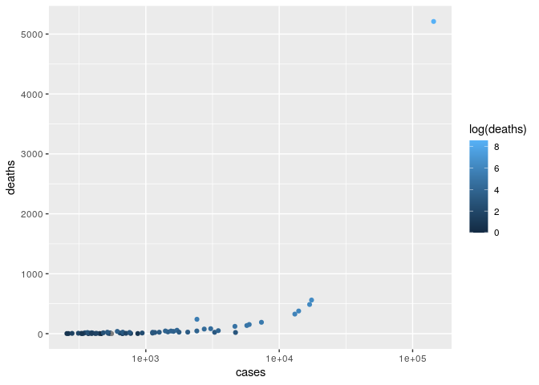

We can change the scale of the *x* axis by
calling:

``` r
pl <- ggplot(data = dt) + aes(x = age, y = z.Agg.Give, color = OrdRank2) +
    geom_point() 
pl + scale_x_log10() # log of age
```

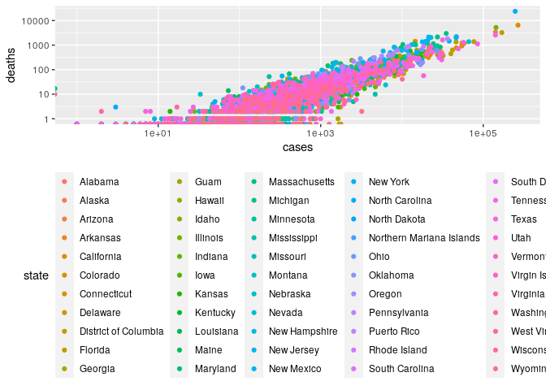

``` r
pl + scale_x_sqrt() # sqrt of age
```

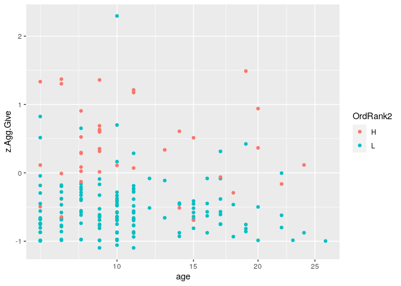

``` r
pl + scale_x_reverse() # from oldest to youngest
```

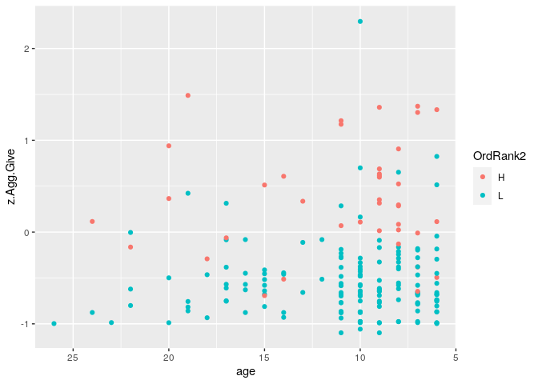

Similarly, we can change the use of colors. Because colors represent
classes, we use a discrete
scale:

``` r
pl + scale_color_brewer(palette = "Set1") # change colors
```

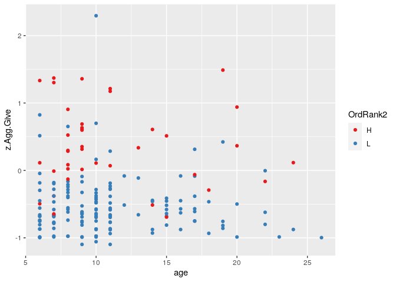

``` r
pl + scale_color_brewer(palette = "Accent") # many palettes: see ?scale_color_brewer
```

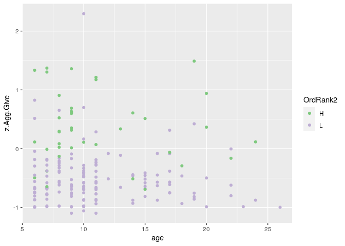

``` r
pl + scale_color_manual(values = c("green", "red"))
```

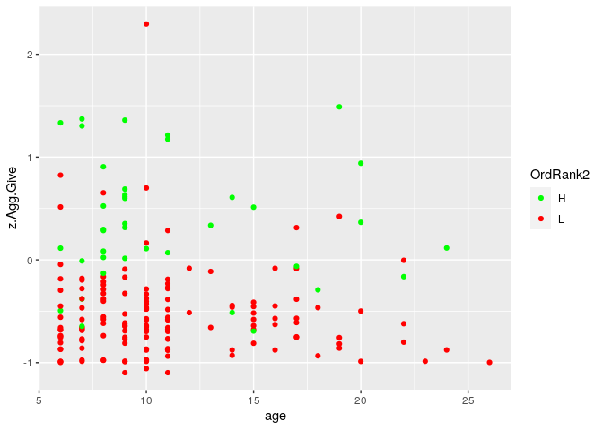

# List of aesthetic mappings

We’ve seen some of the aesthetic mappings. Here’s a list of the main
`aes`:

  - `x` what to use for *x* axis
  - `y` what to use for *y* axis
  - `color` the color of points and lines
  - `fill` the color of shapes (e.g., boxes, bars, etc.)
  - `size` the size of points, lines, etc.
  - `shape` the shape of points
  - `alpha` the level of transparency of the object
  - `linetype` the type of line (e.g., solid, dashed, etc.)

<!-- end list -->

``` r
# a more complex example
ggplot(data = dt) + aes(x = z.Agg.Get, y = z.Agg.Give, 
                        color = OrdRank2, size = age, 
                        alpha = z.Groom.Give) +
  geom_point()
```

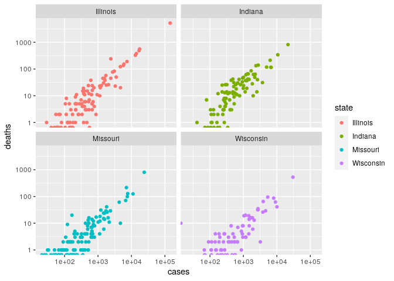

# List of geometries

There are very many geometries; here are a few of the most useful ones:

  - Lines: `geom_abline` (line given slope and intercept); `geom_hline`,
    `geom_vline` (horizontal, vertical line); `geom_line` (connect
    observation in scatterplot).
  - Bars: `geom_bar` (bar height is the count/sum); `geom_col` (bar
    heigts are provided by the data).
  - Boxes: `geom_boxplot`.
  - Distributions: `geom_violin` (like boxplots, but showing the density
    of the distribution); `geom_density` (density of 1D distribution),
    `geom_density2d` (density of bivariate distribution);
    `geom_histogram`, `geom_bin2d` (histograms).
  - Text: `geom_text`.
  - Smoothing function: `geom_smooth` (interpolates the points of a
    scatterplot).
  - Error bars: `geom_errorbar`.
  - Maps: `geom_map` (polygons from a reference map).

# List of scales

There are also very many scales. Here are a few:

  - `xlab`, `ylab`, `xlim`, `ylim` control labels and ranges of the
    axes.
  - `scale_alpha` transparency of the points/shapes.
  - `scale_color` (many options) colors of points and lines.
  - `scale_fill` (many options) colors of boxes, bars and shapes.
  - `scale_shape` shape of the points.
  - `scale_linetype` type of lines.
  - `scale_size` size of points and lines.
  - `scale_x`, `scale_y` (many options) transformations of the axes.

# Exercise

  - Plot the Z-score for “get” aggression and “get” grooming: are they
    correlated?
  - Repeat for “give” aggression and “give” grooming.
  - Are individuals with a higher proportion of female relatives (i.e.,
    higher `Afrels_0.063`) less aggressive?

# Themes

Themes allow you to manipulate the look and feel of a graph with just
one command. The package `ggthemes` extends the themes collection of
`ggplot2` considerably. For example:

``` r
# to install, type install.packages("ggthemes") in the console
library(ggthemes)
pl <- ggplot(data = dt) + aes(x = age, y = z.Agg.Give, color = OrdRank2) +
    geom_point() 
pl + theme_bw() # white background
pl + theme_economist() # like in the magazine "The Economist"
pl + theme_wsj() # like "The Wall Street Journal"
```

# Faceting

In many cases, we would like to produce a multi-panel graph, in which
each panel shows the data for a certain combination of parameters. In
`ggplot2` this is called *faceting*: the command `facet_grid` is used
when you want to produce a grid of panels, in which all the panels in
the same row (or column) have axes-ranges in common; `facet_wrap` is
used when the different panels do not necessarily have axes-ranges in
common.

For example:

``` r
pl <- ggplot(data = dt) + aes(x = OrdRank2) + geom_bar()
pl <- pl + facet_wrap(~age)
pl
```

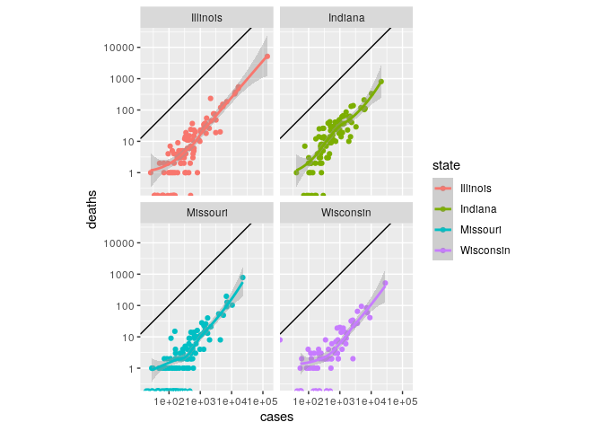

Or producing a
grid:

``` r
pl <- ggplot(data = dt[dt$age < 12,]) + aes(x = z.Agg.Get, y = z.Agg.Give) + geom_point()
pl <- pl + facet_grid(age~OrdRank2)
pl
```

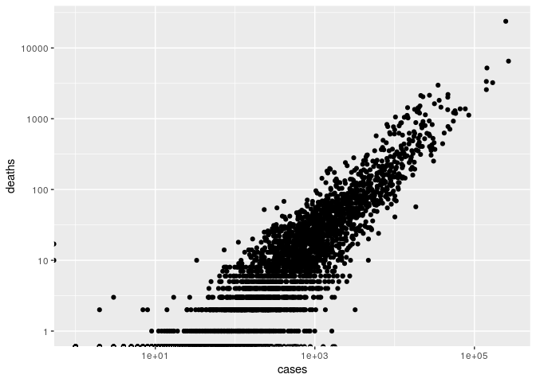

Let’s add a line separating those that “get” more from those that “give”
more:

``` r
pl <- pl + geom_abline(slope = 1, intercept = 0)
pl
```

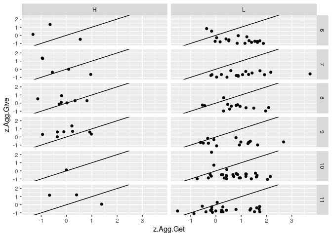

Make ranges on *x* and *y* axes equal:

``` r
pl <- pl + coord_equal()
pl
```

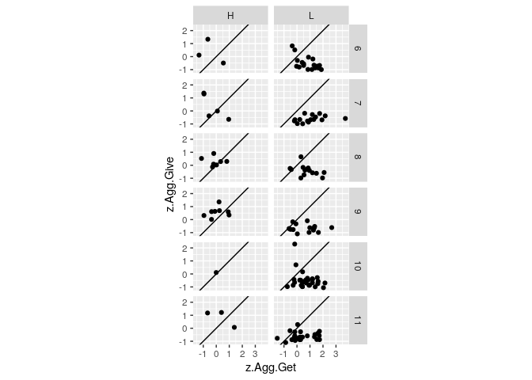

# Setting features

Often, you want to simply set a feature (e.g., the color of the points,
or their shape), rather than using it to display information (i.e.,
mapping some aestethic). In such cases, simply declare the feature
outside the `aes`:

``` r
pl <- ggplot(data = dt) + aes(x = age, y = z.Agg.Give)
pl + geom_point()
```

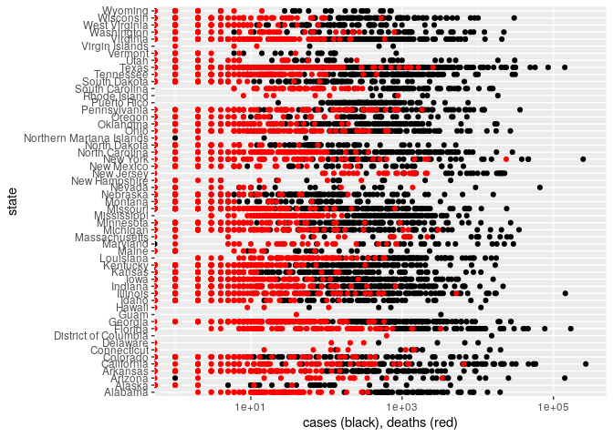

``` r
pl + geom_point(colour = "red")
```

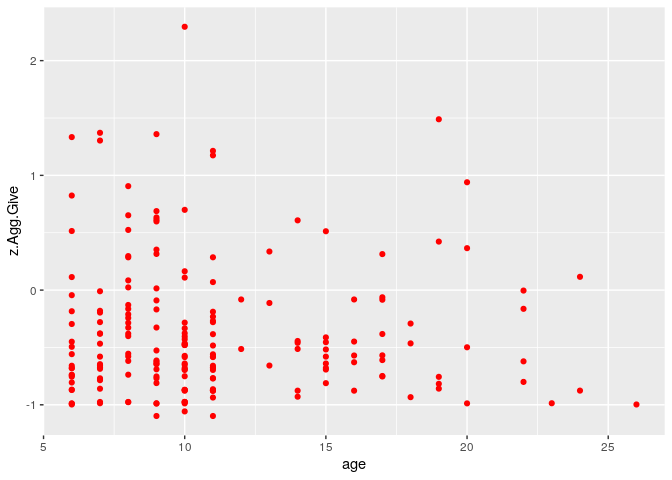

``` r
pl + geom_point(shape = 3)
```

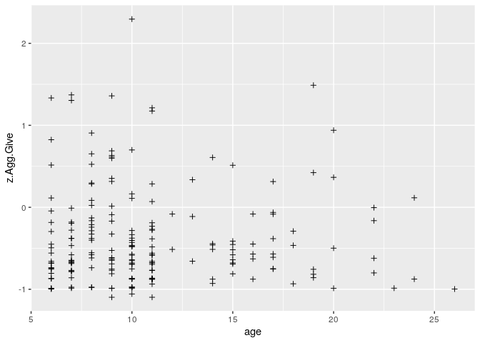

``` r
pl + geom_point(alpha = 0.5)
```

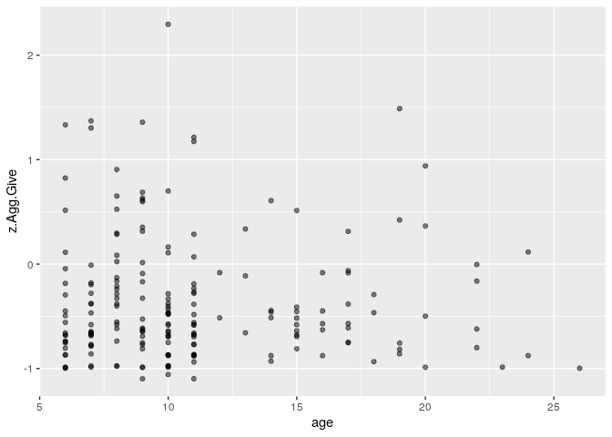

# Saving graphs

You can either save graphs as done normally in `R`:

``` r
# save to pdf format
pdf("my_output.pdf", width = 6, height = 4)
print(my_plot)
dev.off()
# save to svg format
svg("my_output.svg", width = 6, height = 4)
print(my_plot)
dev.off()
```

or use the function `ggsave`

``` r
# save current graph
ggsave("my_output.pdf")
# save a graph stored in ggplot object
ggsave(plot = my_plot, filename = "my_output.svg")
```

# Multiple layers

You can overlay different plots. To do so, however, they must share some
of the aesthetic mappings. The simplest case is that in which you have
only one dataset:

``` r
ggplot(data = dt) + 
  geom_point(aes(x = z.Groom.Get, y = z.Groom.Give), color = "black") + 
  geom_point(aes(x = z.Agg.Get, y = z.Agg.Give), color = "red") +
  geom_abline(slope = 1, intercept = 0) + 
  xlab("Get: Groom (black), Agg (red)") + 
  ylab("Give: Groom (black), Agg (red)")
```

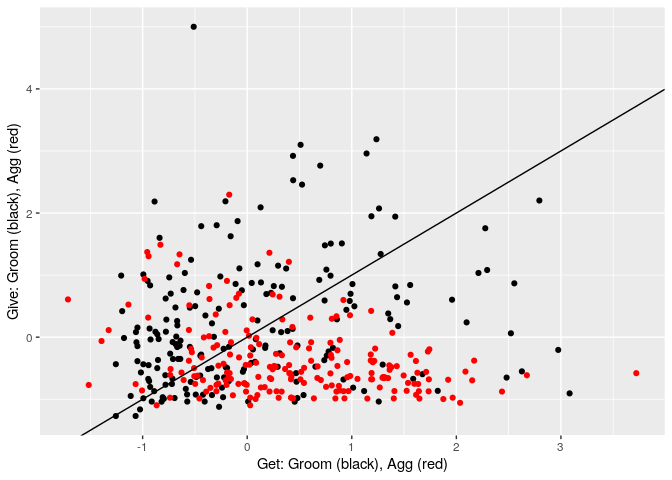

# Try on your own data\!

Now that you’re familiar with `ggplot2`, try producing some meaningful
plots for your own data.

# Resources

  - [R for Data Science](https://hackr.io/tutorial/r-for-data-science)
  - [Tidyverse reference website](https://www.tidyverse.org/)
  - [Data Visualization Cheat
    Sheet](https://github.com/rstudio/cheatsheets/raw/master/data-visualization-2.1.pdf)
