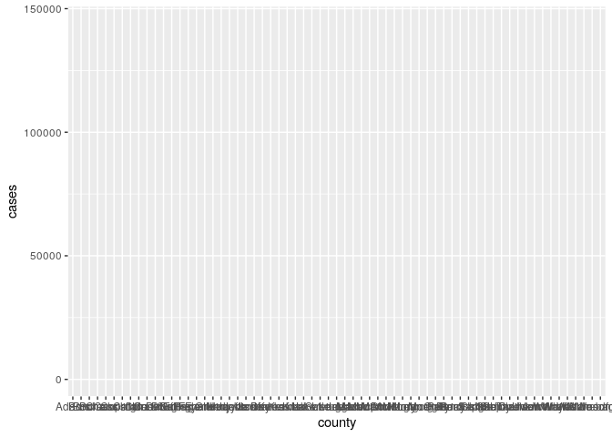
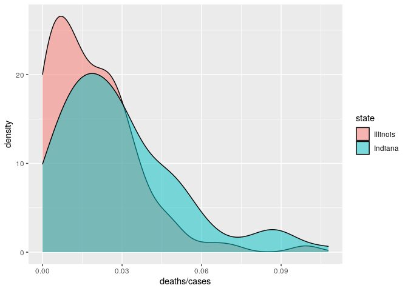
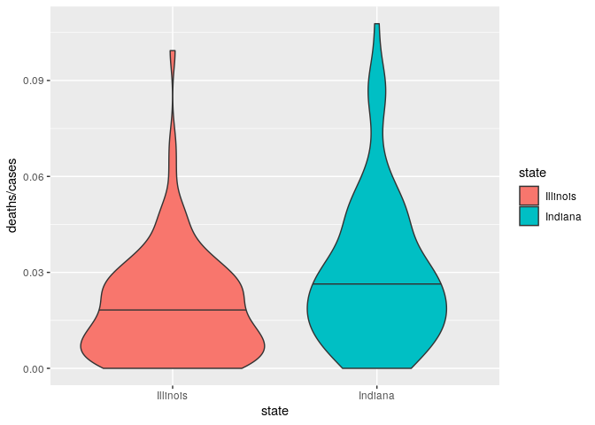
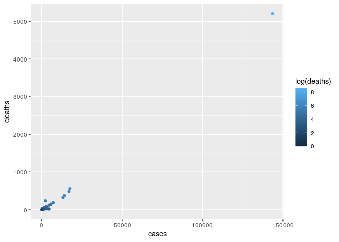
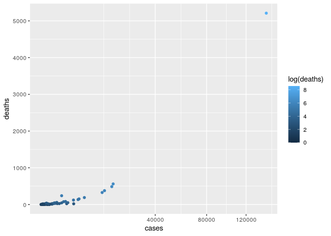
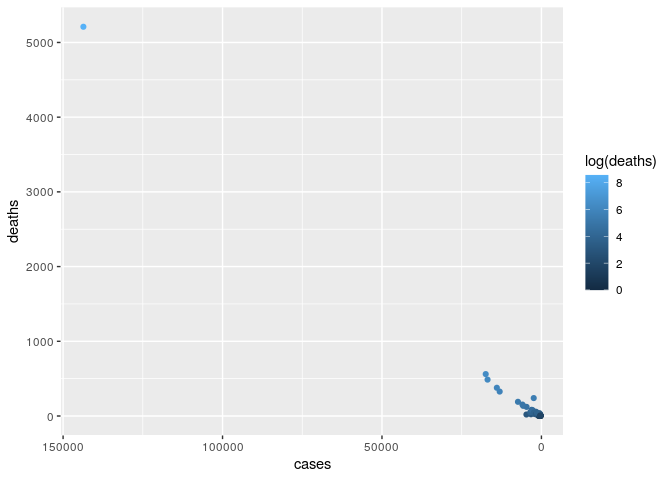
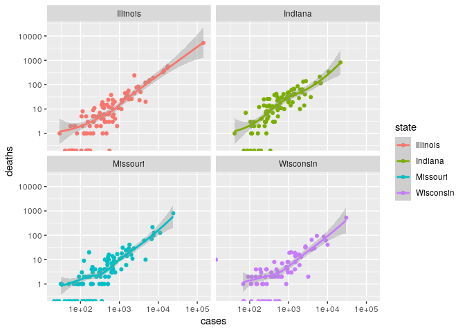
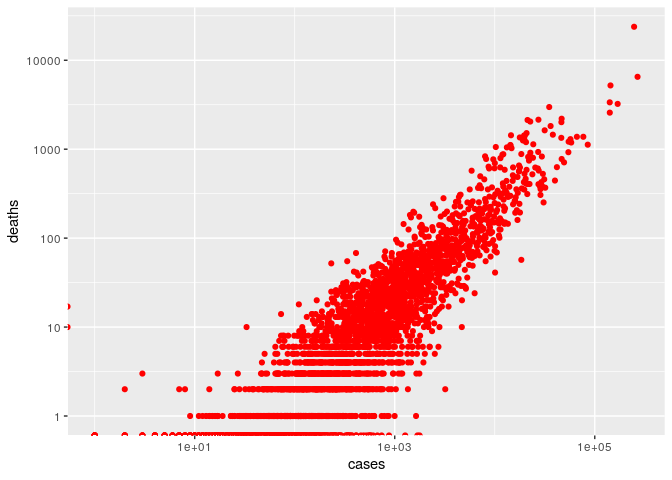

Basic data visualization
================
**Dmitry Kondrashov & Stefano Allesina**
Fundamentals of Biological Data Analysis – BIOS 26318

# Goal

Introduce the package `ggplot2`, which is part of the `tidyverse`
bundle. Learn how to use `ggplot2` to produce publication-quality
figures. Discuss the philosophical underpinnings of the “Grammar of
Graphics”, showcase the `ggplot2` syntax, produce examples of the
different types of graphs. Learn how to change colors, legends, scales.
Visualize histograms, barplots, scatterplots, etc.

# Introduction to the Grammar of Graphics

The most salient feature of scientific graphs should be clarity. Each
figure should make crystal-clear a) what is being plotted; b) what are
the axes; c) what do colors, shapes, and sizes represent; d) the message
the figure wants to convey. Each figure is accompanied by a (sometimes
long) caption, where the details can be explained further, but the main
message should be clear from glancing at the figure (often, figures are
the first thing editors and referees look at).

Many scientific publications contain very poor graphics: labels are
missing, scales are unintelligible, there is no explanation of some
graphical elements. Moreover, some color graphs are impossible to
understand if printed in black and white, or difficult to discern for
color-blind people.

Given the effort that you put into your science, you want to ensure that
it is well presented and accessible. The investment to master some
plotting software will be rewarded by pleasing graphics that convey a
clear message.

In this section, we introduce `ggplot2`, a plotting package for `R` This
package was developed by Hadley Wickham who contributed many important
packages to `R` (all included in the `tidyverse` bundle we’re going to
use for the reminder of the class). Unlike many other plotting systems,
`ggplot2` is deeply rooted in a “philosophical” vision. The goal is to
conceive a grammar for all graphical representation of data. Leland
Wilkinson and collaborators proposed The Grammar of Graphics. It follows
the idea of a well-formed sentence that is composed of a subject, a
predicate, and an object. The Grammar of Graphics likewise aims at
describing a well-formed graph by a grammar that captures a very wide
range of statistical and scientific graphics. This might be more clear
with an example – Take a simple two-dimensional scatterplot. How can we
describe it? We have:

  - **Data** The data we want to plot.

  - **Mapping** What part of the data is associated with a particular
    visual feature? For example: Which column is associated with the
    x-axis? Which with the y-axis? Which column corresponds to the shape
    or the color of the points? In `ggplot2` lingo, these are called
    *aesthetic mappings* (`aes`).

  - **Geometry** Do we want to draw points? Lines? In `ggplot2` we speak
    of *geometries* (`geom`).

  - **Scale** Do we want the sizes and shapes of the points to scale
    according to some value? Linearly? Logarithmically? Which palette of
    colors do we want to use?

  - **Coordinate** We need to choose a coordinate system (e.g.,
    Cartesian, polar).

  - **Faceting** Do we want to produce different panels, partitioning
    the data according to one (or more) of the variables?

This basic grammar can be extended by adding statistical transformations
of the data (e.g., regression, smoothing), multiple layers, adjustment
of position (e.g., stack bars instead of plotting them side-by-side),
annotations, and so on.

Exactly like in the grammar of a natural language, we can easily change
the meaning of a “sentence” by adding or removing parts. Also, it is
very easy to completely change the type of geometry if we are moving
from say a histogram to a boxplot or a violin plot, as these types of
plots are meant to describe one-dimensional distributions. Similarly, we
can go from points to lines, changing one “word” in our code. Finally,
the look and feel of the graphs is controlled by a theming system,
separating the content from the presentation.

# Basic `ggplot2`

`ggplot2` ships with a simplified graphing function, called `qplot`. In
this introduction we are not going to use it, and we concentrate instead
on the function `ggplot`, which gives you complete control over your
plotting. First, we need to load the package:

``` r
library(tidyverse)
```

To explore the features of `ggplot2`, we are going to use a data set
detailing the number of daily COVID cases and deaths in US counties. The
data are provided by the [New York
Times](https://github.com/nytimes/covid-19-data/blob/master/live/us-counties.csv).

``` r
# read the data
# original URL https://github.com/nytimes/covid-19-data/raw/master/live/us-counties.csv
dt <- read_csv("https://rb.gy/zr65gg")
head(dt)
```

    # # A tibble: 6 x 10
    #   date       county state fips  cases deaths confirmed_cases confirmed_deaths
    #   <date>     <chr>  <chr> <chr> <dbl>  <dbl>           <dbl>            <dbl>
    # 1 2020-09-28 Autau… Alab… 01001  1773     25            1589               24
    # 2 2020-09-28 Baldw… Alab… 01003  5526     50            5078               46
    # 3 2020-09-28 Barbo… Alab… 01005   885      7             667                7
    # 4 2020-09-28 Bibb   Alab… 01007   656     10             622                6
    # 5 2020-09-28 Blount Alab… 01009  1617     15            1255               15
    # 6 2020-09-28 Bullo… Alab… 01011   606     14             581               13
    # # … with 2 more variables: probable_cases <dbl>, probable_deaths <dbl>

we are going to work with `date`, `county`, `state`, `cases` and
`deaths`.

Let’s select Illnois, and take only the counties with more than 250
cases (to have a less crowded graph):

``` r
dti <- dt[(dt$state == "Illinois") & (dt$cases > 250), ]
```

A particularity of `ggplot2` is that it accepts exclusively data
organized in tables (a `data.frame` or a `tibble` object—more on tibbles
later). Thus, all of your data needs to be converted into a data frame
format for plotting.

# Building a well-formed graph

For our first plot, we’re going to produce a barplot detailing how many
cases have been reported in each
County:

``` r
ggplot(data = dti)
```


As you can see, nothing is drawn: we need to specify what we would like
to associate to the *x* axis, and what to the *y* axis, etc. (i.e., we
want to set as the *aesthetic mappings*). A barplot typically has
classes on the *x* axis, while the *y* axis reports the counts in each
class.

``` r
ggplot(data = dti) + aes(x = county, y = cases)
```



Note that we concatenate pieces of our “sentence” using the `+` sign\!
We’ve got the aestethic mappings figured out, but still no graph… we
need to specify a geometry, i.e., the type of graph we want to produce.
In this case, a barplot where the height of the bars is specified by the
`y`
value:

``` r
ggplot(data = dti) + aes(x = county, y = cases) + geom_col()
```


Because it is very difficult to see the labels, let’s swap the axes:

``` r
ggplot(data = dti) + 
  aes(x = county, y = cases) + 
  geom_col() + 
  coord_flip()
```


The graph shows that, naturally, the vast majority of cases was reported
in Cook county. We have written a “well-formed sentence”, composed of
**data** + **mapping** + **geometry**, and this is sufficient to produce
a graph. We can add “adjectives” and “adverbs” to our graph, to make it
clearer:

``` r
ggplot(data = dti) + 
  aes(x = reorder(county, cases), y = cases) + # order labels according to cases
  geom_col() +
  xlab("Number of COVID cases reported") + # x label
  ylab("Illinois County") + # y label
  scale_y_log10() + # transform the counts to logs
  coord_flip()+
  ggtitle(dti$date[1]) # main title (use current date)
```


# Scatterplots

Using `ggplot2`, one can produce very many types of graphs. The package
works very well for 2D graphs (or 3D rendered in two dimensions), while
it lack capabilities to draw proper 3D graphs, or networks.

The main feature of `ggplot2` is that you can tinker with your graph
fairly easily, and with a common grammar. You don’t have to settle on a
certain presentation of the data until you’re ready, and it is very easy
to switch from one type of graph to another.

For example, let’s plot the number of cases vs. number of deaths:

``` r
# you can store the graph in a variable
pl <- ggplot(data = dti)
pl <- pl + aes(x = cases, y = deaths) # for a scatter plot, we need two aes mappings!
pl <- pl + geom_point() # draw points in a scatterplot
pl <- pl + scale_x_sqrt() + scale_y_sqrt() # transform axes
pl # or show(pl)
```


Showing that number of daily cases and number of daily deaths are highly
correlated (but it would be a stronger correlation if we were to plot
past cases vs. current deaths).

# Histograms, density and boxplots

It would be nice to see the distribution of the ratio deaths/cases. To
do so, we can produce a histogram:

``` r
pl <- ggplot(data = dti)
pl <- pl + aes(x = deaths / cases)  
pl + geom_histogram() 
```


We can control the width of the bins by
specifying:

``` r
pl + geom_histogram(bins = 30) # specify the number of bins
```


``` r
pl + geom_histogram(binwidth = 0.0025) # specify the bin width
```


Let’s see whether the histograms differ between Illinois and Indiana:

``` r
ggplot(data = dt[dt$state %in% c("Illinois", "Indiana"),]) + 
  aes(x = deaths / cases, fill = state) + # fill the bar colors by state
  geom_histogram()
```


To plot the histogram side by side, use

``` r
ggplot(data = dt[dt$state %in% c("Illinois", "Indiana"),]) + 
  aes(x = deaths / cases, fill = state) + # fill the bar colors by state
  geom_histogram(position = "dodge")
```


Similarly, we can approximate the histogram using a density plot, which
interpolates the bin height to create a smooth distribution:

``` r
ggplot(data = dt[dt$state %in% c("Illinois", "Indiana"),]) + 
  aes(x = deaths / cases, fill = state) + # fill by state
  geom_density()
```


To see the graph better, let’s make the coloring semi-transparent:

``` r
ggplot(data = dt[dt$state %in% c("Illinois", "Indiana"),]) + 
  aes(x = deaths / cases, fill = state) + # fill by state
  geom_density(alpha = 0.5)
```



Again showing that Indiana tends to have a higher mortality for the same
number of cases.

For this type of comparison, the ideal graph to show is maybe a box-plot
or a violin plot:

``` r
ggplot(data = dt[dt$state %in% c("Illinois", "Indiana"),]) + 
  aes(x = state, y = deaths / cases, fill = state) + # we need both x and y
  geom_boxplot()
```


A boxplot shows the median (horizontal bar) as well as the
inter-quartile range (box size goes from 25th to 75th percentile), as
well as the typical range of the data (whiskers). The dots represent
“outliers”. To show the full distribution, you can use a violin plot:

``` r
ggplot(data = dt[dt$state %in% c("Illinois", "Indiana"),]) + 
  aes(x = state, y = deaths / cases, fill = state) + # we need both x and y
  geom_violin(draw_quantiles = 0.5)
```



Note that when we’re producing “similar” plots (e.g., histogram
vs. density, box vs. violin, or any other plot sharing the same
aesthetic mappings) changing a single word, we have changed the
structure of the graph considerably\!

# Scales

We can use scales to determine how the aesthetic mappings are displayed.
For example, we could set the *x* axis to be in logarithmic scale, or we
can choose how the colors, shapes and sizes are used. `ggplot2` uses two
types of scales: `continuous` scales are used for continuos variables
(e.g., real numbers); `discrete` scales for variables that can only take
a certain number of values (e.g., colors, shapes, sizes).

For example, let’s plot deaths vs. cases in our `dti` data set:

``` r
pl <- ggplot(data = dti) + 
  aes(x = cases, y = deaths, colour = log(deaths)) +
    geom_point() 
pl
```



We can change the scale of the *x* axis by
calling:

``` r
pl + scale_x_log10() # log of number of cases
```


``` r
pl + scale_x_sqrt() # sqrt of number of cases
```



``` r
pl + scale_x_reverse() # from large to small
```



Similarly, we can change the use of colors, points, etc.

# List of aesthetic mappings

We’ve seen some of the aesthetic mappings. Here’s a list of the main
`aes`:

  - `x` what to use for *x* axis
  - `y` what to use for *y* axis
  - `color` the color of points and lines
  - `fill` the color of shapes (e.g., boxes, bars, etc.)
  - `size` the size of points, lines, etc.
  - `shape` the shape of points
  - `alpha` the level of transparency of the object
  - `linetype` the type of line (e.g., solid, dashed, etc.)

<!-- end list -->

``` r
# a more complex example
ggplot(data = dt) + 
  aes(x = cases, y = deaths, 
          color = state) +
  geom_point() + 
  scale_x_log10() + # note that the points with 0 cases or deaths will not work
  scale_y_log10() +
  theme(legend.position = "bottom")
```


# List of geometries

There are very many geometries; here are a few of the most useful ones:

  - Lines: `geom_abline` (line given slope and intercept); `geom_hline`,
    `geom_vline` (horizontal, vertical line); `geom_line` (connect
    observation in scatterplot).
  - Bars: `geom_bar` (bar height is the count/sum); `geom_col` (bar
    heigts are provided by the data).
  - Boxes: `geom_boxplot`.
  - Distributions: `geom_violin` (like boxplots, but showing the density
    of the distribution); `geom_density` (density of 1D distribution),
    `geom_density2d` (density of bivariate distribution);
    `geom_histogram`, `geom_bin2d` (histograms).
  - Text: `geom_text`.
  - Smoothing function: `geom_smooth` (interpolates the points of a
    scatterplot).
  - Error bars: `geom_errorbar`.
  - Maps: `geom_map` (polygons from a reference map).

# List of scales

There are also very many scales. Here are a few:

  - `xlab`, `ylab`, `xlim`, `ylim` control labels and ranges of the
    axes.
  - `scale_alpha` transparency of the points/shapes.
  - `scale_color` (many options) colors of points and lines.
  - `scale_fill` (many options) colors of boxes, bars and shapes.
  - `scale_shape` shape of the points.
  - `scale_linetype` type of lines.
  - `scale_size` size of points and lines.
  - `scale_x`, `scale_y` (many options) transformations of the axes.

# Themes

Themes allow you to manipulate the look and feel of a graph with just
one command. The package `ggthemes` extends the themes collection of
`ggplot2` considerably. For example:

``` r
# to install, type install.packages("ggthemes") in the console
library(ggthemes)
pl <- ggplot(data = dti) + aes(x = cases, y = deaths) +
    geom_point() + scale_x_log10() + scale_y_log10()
pl + theme_bw() # white background
pl + theme_economist() # like in the magazine "The Economist"
pl + theme_wsj() # like "The Wall Street Journal"
```

# Faceting

In many cases, we would like to produce a multi-panel graph, in which
each panel shows the data for a certain combination of parameters. In
`ggplot2` this is called *faceting*: the command `facet_grid` is used
when you want to produce a grid of panels, in which all the panels in
the same row (or column) have axes-ranges in common; `facet_wrap` is
used when the different panels do not necessarily have axes-ranges in
common.

For
example:

``` r
pl <- ggplot(data = dt[dt$state %in% c("Illinois", "Missouri", "Wisconsin", "Indiana"), ]) + 
  aes(x = cases, y = deaths, colour = state) + geom_point() + scale_x_log10() + scale_y_log10()
pl <- pl + facet_wrap(~state)
pl
```


Let’s add a line separating showing the best-fit line:

``` r
pl <- pl + geom_smooth()
pl
```



Make ranges on *x* and *y* axes equal, and add the 1:1 line:

``` r
pl <- pl + coord_equal() + geom_abline(slope = 1, intercept = 0)
pl
```


# Setting features

Often, you want to simply set a feature (e.g., the color of the points,
or their shape), rather than using it to display information (i.e.,
mapping some aestethic). In such cases, simply declare the feature
outside the `aes`:

``` r
pl <- ggplot(data = dt) + 
  aes(x = cases, y = deaths) + 
  scale_x_log10() + 
  scale_y_log10()
pl + geom_point()
```


``` r
pl + geom_point(colour = "red")
```



``` r
pl + geom_point(shape = 3)
```


``` r
pl + geom_point(alpha = 0.5)
```


# Saving graphs

You can either save graphs as done normally in `R`:

``` r
# save to pdf format
pdf("my_output.pdf", width = 6, height = 4)
print(my_plot)
dev.off()
# save to svg format
svg("my_output.svg", width = 6, height = 4)
print(my_plot)
dev.off()
```

or use the function `ggsave`

``` r
# save current graph
ggsave("my_output.pdf")
# save a graph stored in ggplot object
ggsave(plot = my_plot, filename = "my_output.svg")
```

# Multiple layers

You can overlay different plots. To do so, however, they must share some
of the aesthetic mappings. The simplest case is that in which you have
only one dataset:

``` r
ggplot(data = dt) + 
  geom_point(aes(y = state, x = cases), color = "black") + 
  geom_point(aes(y = state, x = deaths), color = "red") +
  scale_x_log10() + 
  xlab("cases (black), deaths (red)")
```


# Try on your own data\!

Now that you’re familiar with `ggplot2`, try producing some meaningful
plots for your own data.

# Resources

  - [R for Data Science](https://hackr.io/tutorial/r-for-data-science)
  - [Tidyverse reference website](https://www.tidyverse.org/)
  - [Data Visualization Cheat
    Sheet](https://github.com/rstudio/cheatsheets/raw/master/data-visualization-2.1.pdf)
