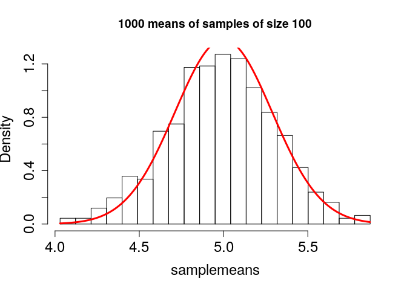

Distributions and their properties
================
**Dmitry Kondrashov & Stefano Allesina**
Fundamentals of Biological Data Analysis -- BIOS 26318

-   [Objectives:](#objectives)
-   [Independence](#independence)
    -   [Conditional probability](#conditional-probability)
    -   [Independence](#independence-1)
    -   [Usefulness of independence](#usefulness-of-independence)
-   [Probability distribution examples (discrete)](#probability-distribution-examples-discrete)
    -   [Uniform](#uniform)
    -   [Binomial](#binomial)
    -   [Geometric](#geometric)
    -   [Poisson](#poisson)
-   [Probability distribution examples (continuous)](#probability-distribution-examples-continuous)
    -   [Uniform](#uniform-1)
    -   [Exponential](#exponential)
    -   [Normal distribution](#normal-distribution)
-   [Application of normal distribution: confidence intervals:](#application-of-normal-distribution-confidence-intervals)

Objectives:
===========

-   Apply concepts of conditional probability to practical scenarios and questions
-   Describe independence as a concept and apply to data sets
-   Use random number generators to simulate various distributions
-   Be familiar with the shape of several common distributions and describe the role of their parameters

Independence
============

Conditional probability
-----------------------

In the basic definitions of probability, we considered the probabilities of each outcome and events separately. Let us consider how information about one event affects the probability of another event. The concept is that if one event (let's call it *B*) is true, unless the event is the entire space, it rules out some other outcomes. This may affect the probability of other events (e.g., *A*) in the sample space, because knowledge of *B* may rule out some of the outcomes in *A* as well. Here is the formal definition:

> **Definition**: For two events *A* and *B* in a sample space *Ω* with a probability measure *P*, the probability of *A* given *B*, called the **conditional probability**, defined as:

$P(A|B) = \\frac{P(A \\cap B)}{P(B)}$

> where *A* ∩ *B* or *A*, *B* is the intersection of events *A* and *B*, also known as "*A* and *B*"---the event consisting of all outcomes that are in both *A* and *B*.

In words, given the knowledge that an event *B* occurs, the sample space is restricted to the subset *B*, which is why the denominator in the definition is *P*(*B*). The numerator encompasses all the outcomes we are interested in, (i.e., *A*), but since we are now restricted to *B*, the numerator consists of all the outcomes of *A* which are also in *B*, or *A* ∩ *B*. The definition makes sense in two extreme cases: if *A* = *B* and if *A* and *B* are mutually exclusive:

*P*(*B*|*B*)=*P*(*B* ∩ *B*)/*P*(*B*)=*P*(*B*)/*P*(*B*)=1

If *P*(*A* ∩ *B*)=0, then *P*(*A*|*B*)=0/*P*(*B*)=0

**Important note:** one common source of confusion about conditional probability is the difference between the probability of *A* and *B* and the probability of *A* given *B*. This is a result of the discrepancy between everyday word usage and mathematical terminology, because the statement "what are the odds of finding a tall person who also likes tea?" is hard to distinguish from "what are the odds that a person who is tall likes tea?" The critical difference between these two statements is that in the former you start out with no information and are picking out a person from the entire population, while is in the latter you start out with the knowledge that a person is tall.

**Example:** In the classic Mendelian pea experiment, each diploid organism carries two alleles. The allele *A* is dominant and results in pink flowers, while *a* is recessive and results in white flowers. There are three possible genotypes (*A**A*, *A**a*, *a**a*) and two phenotypes (Pink or White). For the questions below, assume that two heterozygous pea plants (each having genotype *A**a*) are crossed, producing the following table of genotypes with equal probabilites in each cell:

| parent | A         | a          |
|--------|-----------|------------|
| A      | AA (pink) | Aa (pink)  |
| a      | Aa (pink) | aa (white) |

1.  What is the probability that a plant with pink flowers has genotype *A**A*? Write this down in terms of conditional probability and explain how it's different from the probability of a plant having both pink flower and genotype *A**A*.

2.  What is the probability that a plant with genotype *A**A* has pink flowers? Again, write down the conditional probability and explain how it's different from the probability of a plant having both pink flower and genotype *A**A*.

**Lesson:** in general,
*P*(*X*|*Y*)≠*P*(*Y*|*X*)

Independence
------------

Independence is a fundamental concept in probability that may be misinterpreted without careful thinking. Intuitively, two events (or random variables) are independent if one does not influence the other. More precisely, it means that the probability of one event is the same regarless of whether the other one happens or not. This is expressed precisely using conditional probabilities:

> **Definition**: Two events *A* and *B* in a sample space *Ω* with a probability measure *P* are **independent** if *P*(*A*|*B*)=*P*(*A*), or equivalently if *P*(*B*|*A*)=*P*(*B*).

Independence is not a straightforward concept. It may be confused with mutual exclusivity, as one might surmise that if *A* and *B* have no overlap, then they are independent. That however, is false by definition, since *P*(*A*|*B*) is 0 for two mutually exclusive events. The confusion stems from thinking that if *A* and *B* are non-overlapping, then they do not influence each other. But the notion of influence in this definition is about information; so if *A* and *B* are mutually exclusive, the knowledge that one of them occurs has an influence of the probability of the other one occurring, specifically it rules the other one out.

**Example:** In the sample space of weather phenomena, are the events of snowing and hot weather independent?

**Example:** A slighly more subtle example, the lifetime risk of breast cancer is about 1 in 8 for women and about 1 in 1000 for men. Are sex and breast cancer independent?

Usefulness of independence
--------------------------

Independence is a mathematical abstraction, and reality rarely provides us with perfectly independent variables. But it's a very useful abstraction in that it enables calculations that would be difficult or impossible to carry out without this assumption.

First, independence allows for calculating the probability of two events or two random variables simultaneously. This is a straightforward consequence of the definition conditional probability (first equality) and independence (second equality):

$$\\frac{P(A \\cap B)}{P(B)}= P(A|B) = P(A)$$
 Multiplying both sides by *P*(*B*), we get the **product rule** of independence, perhaps the most widely used formula in applied probability:

*P*(*A* ∩ *B*)=*P*(*A*)*P*(*B*)

**Example:** The probability that two randomly selected individuals have red hair--assuming that the occurence of this trait is independent--is the square of the probability of red hair in one individual. (Note that this is never exactly the case for a finite population---why?)

**Example:** The probability of two alleles of two separate genes (call them A and B) occurring on the same gamete may be independent or may be linked. In population genetics, the concept of *linkage disequilibrium* describes the extent of such linkage; for example, alleles that are located on separate chromosomes (in eukaryotes) are usually not linked and their occurrence is independent. The *coefficient of linkage disequilibrium* is defined as the difference between what is expected from independence and the actual probability of both alleles being present:
*D*<sub>*A**B*</sub> = *P*(*A* ∩ *B*)−*P*(*A*)*P*(*B*)
 *P*(*A*) and *P*(*B*) are the frequencies of the two respective alleles (haplotypes) in the population, while *P*(*A* ∩ *B*) is the frequency of the haplotypes occurring together in the same copy of the genome (that is, on the same gamete). For two independent loci, *D*<sub>*A**B*</sub> = 0, while for loci that usually occur together the coefficient will be positive, and its magnitude is influenced both by physical proximity of the loci on a chromosome, the evolutionary history of the species, and other factors.

Another important consequence of independence has to do with the sum of two independent random variables. The expectation of the sum of any random variables is linear, which can be demonstrated using some work with sums, starting from the definition of expectation (the same can be shown for continuous random variables, using integrals instead of sums):

*E*(*X* + *Y*)=∑<sub>*i*</sub>∑<sub>*j*</sub>(*x*<sub>*i*</sub> + *y*<sub>*j*</sub>)*P*(*x*<sub>*i*</sub>, *y*<sub>*j*</sub>)=

=∑<sub>*i*</sub>∑<sub>*j*</sub>*x*<sub>*i*</sub>*P*(*x*<sub>*i*</sub>, *y*<sub>*j*</sub>)+∑<sub>*i*</sub>∑<sub>*j*</sub>*y*<sub>*j*</sub>*P*(*x*<sub>*i*</sub>, *y*<sub>*j*</sub>)=∑<sub>*i*</sub>*x*<sub>*i*</sub>∑<sub>*j*</sub>*P*(*x*<sub>*i*</sub>, *y*<sub>*j*</sub>)+∑<sub>*j*</sub>*y*<sub>*j*</sub>∑<sub>*i*</sub>*P*(*x*<sub>*i*</sub>, *y*<sub>*j*</sub>)=
 Summing up a joint probability distribution over all values of one variable removes that variable, ∑<sub>*j*</sub>*P*(*x*<sub>*i*</sub>, *y*<sub>*j*</sub>)=*P*(*x*<sub>*i*</sub>) ∑<sub>*i*</sub>*P*(*x*<sub>*i*</sub>, *y*<sub>*j*</sub>)=*P*(*y*<sub>*j*</sub>), so this leave us with the two separate expected values:

=∑<sub>*i*</sub>*x*<sub>*i*</sub>*P*(*x*<sub>*i*</sub>)+∑<sub>*j*</sub>*y*<sub>*j*</sub>*P*(*y*<sub>*j*</sub>)=*E*(*X*)+*E*(*Y*)
 However, this is not the case for the variance in general (using *E*<sub>*X*</sub> and *E*<sub>*Y*</sub> to indicate the expected values of *X* and *Y* to reduce the number of parentheses):

Var(*X* + *Y*)=*E*\[(*X*+*Y*)−(*E*<sub>*X*</sub>+*E*<sub>*Y*</sub>)\]<sup>2</sup>=
=*E*\[(*X* − *E*<sub>*X*</sub>)<sup>2</sup> + (*Y* − *E*<sub>*Y*</sub>)<sup>2</sup> − 2(*X* − *E*<sub>*X*</sub>)(*Y* − *E*<sub>*Y*</sub>)\]=
=*E*(*X* − *E*<sub>*X*</sub>)<sup>2</sup> + *E*(*Y* − *E*<sub>*Y*</sub>)<sup>2</sup> − 2*E*\[(*X* − *E*<sub>*X*</sub>)(*Y* − *E*<sub>*Y*</sub>)\]=
 The first two terms are the respective variances, while the third term is called the *covariance* of *X* and *Y*:

=Var(*X*)+Var(*Y*)−2Cov(*X*, *Y*)
 Covariance describes how much two random variables vary together, or more precisely, how much they deviate from their respective means in the same direction. Thus it should be reasonable to think that two indepdendent random variables have covariance 0, which is demonstrated as follows:

*E*\[(*X* − *E*<sub>*X*</sub>)(*Y* − *E*<sub>*Y*</sub>)\] = *E*(*X**Y*)−*E*<sub>*Y*</sub>*E*<sub>*X*</sub> − *E*<sub>*Y*</sub>*E*<sub>*X*</sub> + *E*<sub>*X*</sub>*E*<sub>*Y*</sub> = *E*(*X**Y*)−*E*<sub>*X*</sub>*E*<sub>*Y*</sub>

We can write the expression for the expectation of the random variable comprised of all pairs of values of *X* and *Y*, using the fact that for two independent random variables, *P*(*x*<sub>*i*</sub>, *y*<sub>*j*</sub>)=*P*(*x*<sub>*i*</sub>)*P*(*y*<sub>*j*</sub>) for all values *x*<sub>*i*</sub> and *y*<sub>*j*</sub>:

*E*(*X**Y*)=∑<sub>*i*</sub>∑<sub>*j*</sub>*x*<sub>*i*</sub>*y*<sub>*j*</sub>*P*(*x*<sub>*i*</sub>, *y*<sub>*j*</sub>)=∑<sub>*i*</sub>*x*<sub>*i*</sub>*P*(*x*<sub>*i*</sub>)∑<sub>*j*</sub>*y*<sub>*j*</sub>*P*(*y*<sub>*j*</sub>)=*E*<sub>*X*</sub>*E*<sub>*Y*</sub>
 The calculation for two continuous random variables is analogous, only with integrals instead of sums.

This demonstrates that the covariance of two independent random variables is 0, and thus that the variance of a sum of two independent random variables is the sum of the two separate variables.

**Example:** This property of variance is often used in analysis of noise or error in data. It is commonly assumed in least squares fitting that noise in data is independent of the signal or model underlying the data. This is the foundation for statements like "this linear regression explains 80% of the variance in the data."

Probability distribution examples (discrete)
============================================

The following are examples of distributions of random variables with discrete values. The first two have finite support (finitely many values) while the second two have infinite support.

Uniform
-------

The simplest probability distribution in which every value has the same probability (and one which is sometimes called "purely random" even though any random variable with any distribution is just as random). The probability distribution for a uniform random variable with *n* values is *P*(*x*)=1/*n* for any value *x*.

``` r
low <- 0 # minimum value
high <- 10 # maximum value
values <- low:high # vector of discrete values of the RV
num <- length(values)
probs <- rep(1 / num, num) # uniform mass function vector
barplot(probs, names.arg = values, xlab = 'values', ylab = 'probability',
        main = paste("uniform  distribution on integers from ", low, "to ", high))
```


``` r
unif.exp <- sum(values*probs)
paste("The expected value of uniform distribution is", unif.exp)
unif.var <- sum((unif.exp - values)^2*probs)
paste("The variance of uniform distribution is", unif.var)
```

    # [1] "The expected value of uniform distribution is 5"
    # [1] "The variance of uniform distribution is 10"

*Exercise:* experiment with the low and high values to see how the expectation and variance depend on them. Can you postulate a relationship without looking it up?

Binomial
--------

Binary or Bernoulli trials have two discrete outcomes (mutant/wildtype, win/lose, etc.). The number of "successes" out of a sequence of *n* independent binary trials with probability of success *p* is described by the binomial distribution.

``` r
n <- 10 # the number of trials
p <- 0.3 # the probability of success in one trial
values <- 0:n # vector of discrete values of the binomial
probs <- dbinom(values, n, p)
barplot(probs, names.arg = values, xlab = 'values', ylab = 'probability',
        main = paste("binomial distribution with n=", n, "and p=", p))
```


``` r
bin.exp <- sum(values*probs)
paste("The expected value of binomial distribution is", bin.exp)
bin.var <- sum((bin.exp - values)^2*probs)
paste("The variance of binomial distribution is", bin.var)
```

    # [1] "The expected value of binomial distribution is 3"
    # [1] "The variance of binomial distribution is 2.1"

*Exercise:* Try different values of *n* and *p* and postulate a relationship with the expectation and variance.

Geometric
---------

The reandom variable is the first "success" in a string of independent binary trials and the distribution describes the probability of any nonnegative value. It may be pretty intuitive that since all the trials have the same probability of success, the distribution with have a geometric (exponential) form---try to figure out the exact formula for the probability density without looking it up!

``` r
p <- 0.3 # the probability of success
low <- 0 # minimum value
high <- 20 # maximum value
values <- low:high # vector of discrete values of the RV
probs <- dgeom(values, p)
barplot(probs, names.arg = values, xlab = 'values', ylab = 'probability',
        main = paste("geometric distribution with p=", p))
```


``` r
geom.exp <- sum(values*probs)
paste("The expected value of geometric distribution is", geom.exp)
geom.var <- sum((geom.exp - values)^2*probs)
paste("The variance of geometric distribution is", geom.var)
```

    # [1] "The expected value of geometric distribution is 2.32030059650472"
    # [1] "The variance of geometric distribution is 7.52697882945385"

*Exercise:* Calculate the expectations and variances for different values of *p* and report how they are related.

Poisson
-------

Suppose that there is a discrete process that occurs with some average rate *λ*, which describes the expected number of occurrences of these events in a unit of time. The Poisson random variable is the number of such occurrences, and the distribution describes the probability of any nonnegative value.

``` r
low <- 0 # minimum value
high <- 20 # maximum value
lambda <- 2 # Poisson rate
values <- low:high # vector of discrete values of the RV
probs <- dpois(values, lambda)
barplot(probs, names.arg = values, xlab = 'values', ylab = 'probability',
        main = paste("Poisson distribution with lambda=", lambda))
```


``` r
pois.exp <- sum(values*probs)
paste("The expected value of Poisson distribution is", pois.exp)
pois.var <- sum((pois.exp - values)^2*probs)
paste("The variance of Poisson distribution is", pois.var)
```

    # [1] "The expected value of Poisson distribution is 1.99999999999987"
    # [1] "The variance of Poisson distribution is 1.99999999999777"

*Exercise:* Calculate the expectations and variances for different values of *λ* and report how they are related.

Probability distribution examples (continuous)
==============================================

In the following examples with continuous variables we cannot calculate the means and variances directly from the density function. One way to do it is to produce a sample using the random number generator and calculate the mean and variance of that sample.

Uniform
-------

The continuous equivalent of the discrete uniform distribution.

``` r
low <- 0 # minimum value
high <- 10 # maximum values
number <- 100
values <- seq(low, high, length.out = number) # vector of discrete values of the RV
probs <- dunif(values, min=low, max = high)
plot(values, probs, t='l', xlab = 'values', ylab = 'density',
        main = paste("Uniform distribution on interval from ", low, "to ", high))
```


``` r
n <- 1000 # sample size
unif.sample <- runif(n, low, high) # generate sample
unif.exp <- mean(unif.sample)
paste("The expected value of uniform distribution is", unif.exp)
unif.var <- var(unif.sample)
paste("The variance of uniform distribution is", unif.var)
```

    # [1] "The expected value of uniform distribution is 4.92192666496616"
    # [1] "The variance of uniform distribution is 8.1850957374597"

*Exercise:* experiment with the width of the interval to see how it affects the expectation and variance.

Exponential
-----------

The random variable describes the length of time between independent discrete events occurring with a certain rate, like we saw in the Poisson distribution.

``` r
low <- 0 # minimum value
high <- 20 # maximum values
number <- 100
r <- 0.5
values <- seq(low,high,length.out = number) # vactor of discrete values of the RV
probs <- dexp(values, r)
plot(values, probs, t='l', xlab = 'values', ylab = 'density',
        main = paste("Exponential distribution with rate=", r))
```


``` r
n <- 1000 # sample size
exp.sample <- rexp(n, r) # generate sample
exp.exp <- mean(exp.sample)
paste("The expected value of exponential distribution is", exp.exp)
exp.var <- var(exp.sample)
paste("The variance of exponential distribution is", exp.var)
```

    # [1] "The expected value of exponential distribution is 2.02441228090068"
    # [1] "The variance of exponential distribution is 4.14074854764163"

*Exercise:* What is the relationship between the rate and the expectation and variance?

Normal distribution
-------------------

The normal distribution, sometimes written *N*(*μ*, *σ*) comes up everywhere (e.g., in the limit of the Poisson distribution for large *n*). The two parameters are simply the mean and the standard deviation. The reason for its ubiquity is that it is that any sum of a large number of independent random variables converges to the normal, formalized by the Central Limit Theorem:

> For a set of *n* IID random variables {*X*<sub>*i*</sub>} with mean *μ* and standard deviation *σ*, the sample mean $\\bar X\_n$ has the property:
> $$\\lim\_{n \\to \\infty} = \\frac{\\bar X\_n - \\mu}{\\sigma} = N(0,1)  $$
>  where *N*(0, 1) stands for the normal distribution with mean 0 and standard deviation 1.

``` r
low <- 0 # minimum value
high <- 10 # maximum values
number <- 100
mu <- 5
sigma <- 0.5 
values <- seq(low,high,length.out = number) # vactor of discrete values of the RV
probs <- dnorm(values, mu, sigma)
plot(values, probs, t='l',xlab = 'values', ylab = 'density',
        main = paste("Normal distribution with mean=", mu, "and sigma=", sigma))
```


``` r
n <- 1000 # sample size
norm.sample <- rnorm(n, mu, sigma) # generate sample
norm.exp <- mean(norm.sample)
paste("The expected value of normal distribution is", norm.exp)
norm.var <- var(norm.sample)
paste("The variance of normal distribution is", norm.var)
```

    # [1] "The expected value of normal distribution is 5.00219382787674"
    # [1] "The variance of normal distribution is 0.245129609589752"

Application of normal distribution: confidence intervals:
=========================================================

The most important use of the normal distribution has to do with estimation of means, because the normal distribution describes the *sampling distributions* of means of IID samples. The mean of that sampling distribution is the mean of the population distribution that is being sampled, and the standard deviation is called the *standard error* and is related to the standard deviation of the population *σ*<sub>*X*</sub> as follows: *σ*<sub>*S**E*</sub> = *σ*/*n*, where *n* is the sample size.

``` r
numsamples <- 1000
size <- 100
# compute mean for different samples
samplemeans <- replicate(n = numsamples, mean(sample(0:10, size, replace = TRUE)))
break_points <- seq(min(samplemeans), max(samplemeans), 
                    (max(samplemeans) - min(samplemeans)) / 20)
hist(samplemeans, breaks = break_points, freq = FALSE, 
     cex.axis = 1.5, cex.lab = 1.5,
     main= '1000 means of samples of size 100')
sigma <- 10 / sqrt(12) / sqrt(size)
mu <- 5
range <- seq(min(samplemeans), max(samplemeans), sigma / 100)
lines(range, 
      dnorm(range, mu, sigma),
      t = 'l', lwd = 3, col = 2, lty = 1, cex.axis = 1.5, cex.lab = 1.5)
```



*Exercise:* Try using different distributions from above and see if the sample means still converge to the normal distribution.

The following script calculates a confidence interval based on a sample.

``` r
# Computing confidence intervals
qnorm(0.5) # the value that divides the density function in two
qnorm(0.95) # the value such that 95% of density is to its left 
size <- 100 # sample size
alpha <- 0.95 # significance level
sample <- runif(size)
s <- sd(sample) / sqrt(size) # standard error
z <- qnorm((1 - alpha) / 2) # z-value
left <- mean(sample) + s * z
right <- mean(sample) - s * z
print(right)
print(left)
```

    # [1] 0
    # [1] 1.644854
    # [1] 0.5139314
    # [1] 0.405281

*Exercise:* Modify that script to report whether the confidence interval captures the true mean. Use a loop structure (as in the script above) to generate 1000 sample means and report how many of them are within the theoretical confidence interval. Does this match the fraction you expect from the significance level? Try different significance levels and sample sizes and report what you discover.
