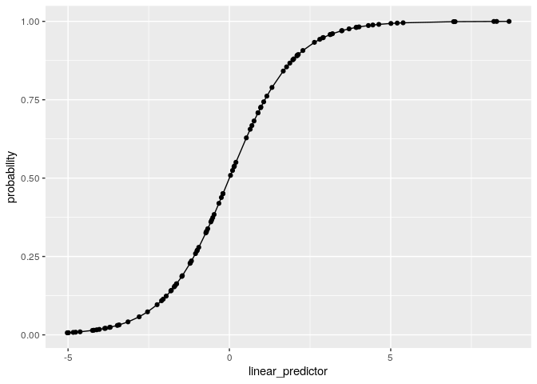

Generalized Linear models
================
**Dmitry Kondrashov & Stefano Allesina**
Fundamentals of Biological Data Analysis – BIOS 26318

# Goal

Learn about Generalized Linear Models (GLMs), and be able to decide
which model is most appropriate for the problem at hand.

Let’s load some packages:

``` r
library(tidyverse) # our friend the tidyverse
library(MASS) # negative binom regression
```

# Generalized linear models

The linear regression we’ve explored during the past weeks attempts to
estimate the expected value for **response** (dependent) variable
 given the
**predictors** . It
assumes that the response variable changes continuously, and that errors
are normally distributed around the mean. In many cases, however:

  - the response variable does not have support in the whole real line
    (e.g., binary, count, only positive values)
  - the errors are not normally distributed (e.g., the response variable
    can take only positive values)
  - the variance changes with the mean (heteroscedasticity)

In these cases, you can use **Generalized Linear Models** (GLMs) to fit
the data. In the simplest form of GLMs,

  - The response variable is modeled by a single-parameter distribution
    from the exponential family (Gaussian, Gamma, Binomial, Poisson,
    etc.)
  - A **link function** linearizes the relationship between the fitted
    values and the predictors.
  - Parameters are estimated through a least squares algorithm.

## Model structure

In practice, we need to determine three parts of the model:

  - **Random component** the entries of the response variable
    () are assumed to be
    independently drawn from a certain distribution (e.g., Binomial),
    typically a distribution that can be modeled using a single
    parameter.
  - **Systematic component** the explanatory variables
    (,
    ,
    )
    are combined linearly to form a **linear predictor** (e.g.,
    ). The
    explanatory variables can be continuous, categorical, or mixed.
  - **Link function**
    ")
    specifies how the random and systematic components are connected.

# Binary data

The most extreme case of departure from normality is when the response
variable can assume only values 0 or 1 (no/yes, survived/deceased,
lost/won, etc.). A Bernoulli random variable can take values 0 or 1, and
therefore provides the **Random component** of the model:

  
 = \\pi_i^{y_i} (1 - \\pi_i)^{1 - y_i}
")  

Saying that the probability  = \\pi_i"), and  = 1 - \\pi_i"). Now we want to relate the parameter
 to the
**linear predictor** (i.e., choose a link function). This can be
accomplished in a number of ways.

## Logistic regression

The most popular choice is to use the **Logit** function as the **link
function**:

  
 = \\beta_0 + \\beta_1 x_i 
")  

where the function can be written as:

  
 = \\log\\left( \\frac{\\pi_i}{1 - \\pi_i} \\right) = \\log(\\pi_i) - \\log(1 - \\pi_i)
")  

Practically, this means that

  
  

For example:

``` r
# some random data
X <- rnorm(100)
beta_0 <- 0.35
beta_1 <- -3.2
linear_predictor <- beta_0 + beta_1 * X
predicted_pi_i <- exp(linear_predictor) / (1 + exp(linear_predictor))
ggplot(data = tibble(linear_predictor = linear_predictor, probability = predicted_pi_i)) + 
  aes(x = linear_predictor, y = probability) + 
  geom_point() + geom_line()
```



As you can see, this is a logistic curve, hence the name. The parameters

and  control the location of the inflection point and the
steepness of the curve, allowing you to model binary response variables
(and, with some abuse of the error structure, proportions or
probabilities).

Other choices of link functions are possible. For example, in economics
the *probit* function is preferred:

  
 = \\beta_0 + \\beta_1 x_i
")  

where

  
 = \\Phi(\\pi_i)
")  
and
") is the cumulative distribution function of the standard
normal normal distribution:

  
 = \\frac{1}{\\sqrt{2 \\pi}}\\int_{-\\infty}^z e^{\\frac{-t^2}{2}} dt
")  
Clearly, you could alternatively use the cumulative distribution
function of any distribution that has support on the real line.

## A simple example

We want to know whether being in first, second and third class, as well
as gender (women and women first\!) influenced the probability of
survival in the Titanic disaster. We start with a null model (all
passengers have the same probability of survival):

``` r
library(titanic)
# model 0: probability of survival in general
# regress against an intercept
model0 <- glm(Survived ~ 1, # only intercept
              data = titanic_train, 
              family = "binomial") # logistic regression
summary(model0)
# the best fitting (alpha) intercept should lead to 
# e^alpha / (1 + e^alpha) = mean(Survived)
mean(titanic_train$Survived)
exp(model0$coefficients) / (1 + exp(model0$coefficients))
```

    # 
    # Call:
    # glm(formula = Survived ~ 1, family = "binomial", data = titanic_train)
    # 
    # Deviance Residuals: 
    #     Min       1Q   Median       3Q      Max  
    # -0.9841  -0.9841  -0.9841   1.3839   1.3839  
    # 
    # Coefficients:
    #             Estimate Std. Error z value Pr(>|z|)    
    # (Intercept) -0.47329    0.06889   -6.87  6.4e-12 ***
    # ---
    # Signif. codes:  0 '***' 0.001 '**' 0.01 '*' 0.05 '.' 0.1 ' ' 1
    # 
    # (Dispersion parameter for binomial family taken to be 1)
    # 
    #     Null deviance: 1186.7  on 890  degrees of freedom
    # Residual deviance: 1186.7  on 890  degrees of freedom
    # AIC: 1188.7
    # 
    # Number of Fisher Scoring iterations: 4
    # 
    # [1] 0.3838384
    # (Intercept) 
    #   0.3838384

Now let’s include
gender:

``` r
model1 <- glm(Survived ~ Sex, # one sex as baseline, the other modifies intercept
              data = titanic_train,
              family = "binomial")
summary(model1)
```

    # 
    # Call:
    # glm(formula = Survived ~ Sex, family = "binomial", data = titanic_train)
    # 
    # Deviance Residuals: 
    #     Min       1Q   Median       3Q      Max  
    # -1.6462  -0.6471  -0.6471   0.7725   1.8256  
    # 
    # Coefficients:
    #             Estimate Std. Error z value Pr(>|z|)    
    # (Intercept)   1.0566     0.1290   8.191 2.58e-16 ***
    # Sexmale      -2.5137     0.1672 -15.036  < 2e-16 ***
    # ---
    # Signif. codes:  0 '***' 0.001 '**' 0.01 '*' 0.05 '.' 0.1 ' ' 1
    # 
    # (Dispersion parameter for binomial family taken to be 1)
    # 
    #     Null deviance: 1186.7  on 890  degrees of freedom
    # Residual deviance:  917.8  on 889  degrees of freedom
    # AIC: 921.8
    # 
    # Number of Fisher Scoring iterations: 4

What is the best-fitting probability of survival for male/female?

``` r
coeffs <- model1$coefficients
# prob women
exp(coeffs[1]) / (1 + exp(coeffs[1]))
# prob men
exp(coeffs[1] + coeffs[2]) / (1 + exp(coeffs[1] + coeffs[2]))
```

    # (Intercept) 
    #   0.7420382 
    # (Intercept) 
    #   0.1889081

Now let’s see whether we can explain better the data using the class:

``` r
model2 <- glm(Survived ~ Sex + factor(Pclass), # combine Sex and Pclass
              data = titanic_train,
              family = "binomial")
summary(model2)
```

    # 
    # Call:
    # glm(formula = Survived ~ Sex + factor(Pclass), family = "binomial", 
    #     data = titanic_train)
    # 
    # Deviance Residuals: 
    #     Min       1Q   Median       3Q      Max  
    # -2.1877  -0.7312  -0.4476   0.6465   2.1681  
    # 
    # Coefficients:
    #                 Estimate Std. Error z value Pr(>|z|)    
    # (Intercept)       2.2971     0.2190  10.490  < 2e-16 ***
    # Sexmale          -2.6419     0.1841 -14.351  < 2e-16 ***
    # factor(Pclass)2  -0.8380     0.2447  -3.424 0.000618 ***
    # factor(Pclass)3  -1.9055     0.2141  -8.898  < 2e-16 ***
    # ---
    # Signif. codes:  0 '***' 0.001 '**' 0.01 '*' 0.05 '.' 0.1 ' ' 1
    # 
    # (Dispersion parameter for binomial family taken to be 1)
    # 
    #     Null deviance: 1186.66  on 890  degrees of freedom
    # Residual deviance:  826.89  on 887  degrees of freedom
    # AIC: 834.89
    # 
    # Number of Fisher Scoring iterations: 4

Consider the alternative models `Survived ~ Sex * factor(Pclass)`,
`Survived ~ Sex + Pclass`, `Survived ~ Sex * Pclass`, `Survived ~
Sex:factor(Pclass)`, `Survived ~ Sex:Pclass`. Explain what each model is
doing in English.

## Exercise in class: College admissions

With slight abuse of notation, you can fit probabilities using the
logistic regression (the only problem is that you don’t know how many
values contributed to the calculations of the probabilities). Read in
the file `admission_rates.csv`, containing data on admissions to several
universities. Your goal is to find a good prediction (or a good
combination of predictors) for the `Admission_rate`. You can use
`State`, `Ownership` (public/private), `Citytype` (town, suburb, city),
`SAT` (typical SAT score of admits), `AvgCost` (tuitions). Fit the
models using:

``` r
dt <- read_csv("data/admission_rates.csv")
# example
logit_1 <- glm(Admission_rate ~ AvgCost, data = dt, family = "binomial")
```

(do not worry about the warning `non-integer #successes in a binomial
glm!`).

  - Plot fitted vs. observed admission rates, when using different
    combinations of predictors.
  - Score the models using `AIC`: which is the single best predictor of
    acceptance rate?
  - Which the best combination of two predictors?

# Count data

## Poisson regression

Suppose your response variables are nonnegative integers. For example,
we are counting the number of eggs females lay as a function of their
age, body size, etc. A possible model for this case is to think of the
response variable as being sampled from a Poisson distribution:

  

")  

and that the logarithm of the parameter
 depends linearly on the predictors:

  
![
\\mathbb E\[\\lambda\_i\] = \\mathbb E\[\\log(Y\_i|X\_i)\] = \\beta\_0 +
\\beta\_1 X\_i
](https://latex.codecogs.com/png.latex?%0A%5Cmathbb%20E%5B%5Clambda_i%5D%20%3D%20%5Cmathbb%20E%5B%5Clog%28Y_i%7CX_i%29%5D%20%3D%20%5Cbeta_0%20%2B%20%5Cbeta_1%20X_i%0A
"
\\mathbb E[\\lambda_i] = \\mathbb E[\\log(Y_i|X_i)] = \\beta_0 + \\beta_1 X_i
")  

In this case, our *link function* is the logarithm, transforming the
relationship between the fitted values and the predictors into a linear
regression.

## Exercise in class: Number of genomes

The file `data/genomes.csv` contains the year in which the genome of a
given animal was published. The file `sequence_cost.csv` the estimated
cost per sequencing a Mb in a given year.

  - Count the number of genomes published per year (store the value as
    `n`) and store it in the tibble `num_genomes` along with the values
    `Year` and `Dollars_per_Mb` (note: you need to use `inner_join` to
    pull this off);
  - Fit the number of genomes published in a given year:
      - using only an intercept (your predictions should match the mean)
        (Code: `pois_1 <- glm(n ~ 1, data = num_genomes, family =
        "poisson")`)
      - using the year as a predictor
      - using the cost of sequencing as a predictor
  - For each model, plot the observed `n` vs its predicted value, and
    compute AIC. Is the fit superior when we use `Year` or
    `Dollars_per_Mb`?

## Underdispersed and Overdispersed data

The main feature of the Poisson distribution is that the mean and the
variance are both equal to
.
You might remember (Taylor expansion) that:

  
  

Then, for  sampled from
a Poisson distribution:

  
![
\\begin{aligned}
\\mathbb E\[X\] &= \\sum\_{x = 0}^{\\infty} x P(X = x) \\\\
&= \\sum\_{x = 0}^{\\infty} x e^{-\\lambda} \\frac{\\lambda^x}{x\!} \\\\
&= \\lambda e^{-\\lambda} \\sum\_{(x - 1) = 0}^{\\infty}
\\frac{\\lambda^{(x-1)}}{(x-1)\!} \\\\
&= \\lambda e^{-\\lambda}e^{\\lambda} \\\\
&= \\lambda
\\end{aligned}
](https://latex.codecogs.com/png.latex?%0A%5Cbegin%7Baligned%7D%0A%5Cmathbb%20E%5BX%5D%20%26%3D%20%5Csum_%7Bx%20%3D%200%7D%5E%7B%5Cinfty%7D%20x%20P%28X%20%3D%20x%29%20%5C%5C%0A%26%3D%20%5Csum_%7Bx%20%3D%200%7D%5E%7B%5Cinfty%7D%20x%20e%5E%7B-%5Clambda%7D%20%5Cfrac%7B%5Clambda%5Ex%7D%7Bx%21%7D%20%5C%5C%0A%26%3D%20%5Clambda%20e%5E%7B-%5Clambda%7D%20%5Csum_%7B%28x%20-%201%29%20%3D%200%7D%5E%7B%5Cinfty%7D%20%5Cfrac%7B%5Clambda%5E%7B%28x-1%29%7D%7D%7B%28x-1%29%21%7D%20%5C%5C%0A%26%3D%20%5Clambda%20e%5E%7B-%5Clambda%7De%5E%7B%5Clambda%7D%20%5C%5C%0A%26%3D%20%5Clambda%0A%5Cend%7Baligned%7D%0A
"
\\begin{aligned}
\\mathbb E[X] &= \\sum_{x = 0}^{\\infty} x P(X = x) \\\\
&= \\sum_{x = 0}^{\\infty} x e^{-\\lambda} \\frac{\\lambda^x}{x!} \\\\
&= \\lambda e^{-\\lambda} \\sum_{(x - 1) = 0}^{\\infty} \\frac{\\lambda^{(x-1)}}{(x-1)!} \\\\
&= \\lambda e^{-\\lambda}e^{\\lambda} \\\\
&= \\lambda
\\end{aligned}
")  

Similarly, using

  
![
\\begin{aligned}
\\mathbb V\[X\] &= \\mathbb E\[X^2\]-\\mathbb E\[X\]^2\\\\
&= \\left(\\sum\_{x = 0}^{\\infty} x^2 e^{-\\lambda}
\\frac{\\lambda^x}{x\!} \\right) - \\lambda^2 \\\\
&= \\ldots\\\\
&= \\lambda
\\end{aligned}
](https://latex.codecogs.com/png.latex?%0A%5Cbegin%7Baligned%7D%0A%5Cmathbb%20V%5BX%5D%20%26%3D%20%5Cmathbb%20E%5BX%5E2%5D-%5Cmathbb%20E%5BX%5D%5E2%5C%5C%0A%26%3D%20%5Cleft%28%5Csum_%7Bx%20%3D%200%7D%5E%7B%5Cinfty%7D%20x%5E2%20e%5E%7B-%5Clambda%7D%20%5Cfrac%7B%5Clambda%5Ex%7D%7Bx%21%7D%20%5Cright%29%20-%20%5Clambda%5E2%20%5C%5C%0A%26%3D%20%5Cldots%5C%5C%0A%26%3D%20%5Clambda%0A%5Cend%7Baligned%7D%0A
"
\\begin{aligned}
\\mathbb V[X] &= \\mathbb E[X^2]-\\mathbb E[X]^2\\\\
&= \\left(\\sum_{x = 0}^{\\infty} x^2 e^{-\\lambda} \\frac{\\lambda^x}{x!} \\right) - \\lambda^2 \\\\
&= \\ldots\\\\
&= \\lambda
\\end{aligned}
")  

The fact that the variance equals the mean is a hard constraint, rarely
found in data. When you encounter **overdispersion** (i.e., the variance
in the data is much larger than what assumed by Poisson), you need to
choose a different model. This happens very often, and the main solution
to use is a **Negative Binomial Regression** (a negative binomial
distribution can be thought of as a Poisson with a scaled variance). In
practice, this amounts to fitting:

  
![
\\mathbb E\[\\lambda\_i\] = \\beta\_0 + \\beta\_1 X\_i
](https://latex.codecogs.com/png.latex?%0A%5Cmathbb%20E%5B%5Clambda_i%5D%20%3D%20%5Cbeta_0%20%2B%20%5Cbeta_1%20X_i%0A
"
\\mathbb E[\\lambda_i] = \\beta_0 + \\beta_1 X_i
")  
and

  
![
\\mathbb E\[\\lambda\_i^2\] - \\mathbb E\[\\lambda\_i\]^2 = \\mathbb
V\[\\lambda\_i\] = \\phi \\lambda\_i
](https://latex.codecogs.com/png.latex?%0A%5Cmathbb%20E%5B%5Clambda_i%5E2%5D%20-%20%5Cmathbb%20E%5B%5Clambda_i%5D%5E2%20%3D%20%5Cmathbb%20V%5B%5Clambda_i%5D%20%3D%20%5Cphi%20%5Clambda_i%0A
"
\\mathbb E[\\lambda_i^2] - \\mathbb E[\\lambda_i]^2 = \\mathbb V[\\lambda_i] = \\phi \\lambda_i
")  
Where 
controls the dispersion of the data. A value  signals overdispersion, while (the very rare case of)
 underdispersion. The Poisson regression is appropriate
only when . A simple way to test for dispersion in to fit a
`quasipoisson` model, which returns a dispersion parameter (anything
larger than 1 means overdispersion).

## Exercise in class: Number of genomes

  - For the models above, change the family to `quasipoisson` to check
    the dispersion (e.g., `qpois_1 <- glm(n ~ 1, data = num_genomes,
    family = "quasipoisson")`).
  - Do you have overdispersion?
  - If the data are overdispersed, fit them again using `glm.nb` (a
    negative binomial regression model provided by the package `MASS`).

## Separate distribution for the zeros

In several biologically-relevant cases, we have an excess of zeros. For
example, you might have animals, that, if they reach the age of 1, will
go on to a live a number of years—say well-described by a Poisson
distribution. However, mortality immediately after birth is high. In
such cases, you can use zero-inflated or zero-hurdle models.

In zero-inflated models, you can think of having a conditional
branching: with probability
 your count is
zero; if not (prob. ) it is sampled from a given distribution. As such a count of
zero can stem from two different processes: either because you got a
zero at the first step, or because you have sampled a zero from the
distribution.

Zero-hurdle models are slightly different: you first decide whether
you’re going to have a zero; if not, you sample your data from a
truncated distribution, such that you cannot sample a zero from this
second source.

Zero-inflated and zero-hurdle models are examples of [**mixture
models**](https://en.wikipedia.org/wiki/Mixture_model).

# Other GLMs

Historically, GLMs have been defined for the canonical families:

  - Gaussian: linear regression
  - Gamma and Inverse Gaussian: Positive, continuous
  - Poisson: count data
  - Negative Binomial: count data (fit an ancillary parameter for
    overdispersion)
  - Binary/Binomial (logistic): binary responses; number of successes;
    probabilities/proportions (with slight abuse).

However, the same basic idea led to the development of “non-canonical”
GLMs:

  - Lognormal: Positive, continuous
  - Log-gamma: survival models
  - Probit: binary

and many others. Fitting the models can be done using Maximum
Likelihoods, or in a Bayesian framework (typically, through MCMC).

# Readings and homework

  - There are two useful swirls in the corse `Regression Models`:
    `Binary Outcomes` and `Count Outcomes`
  - [An excellent book on GLMs in
    R](https://link.springer.com/book/10.1007/978-1-4419-0118-7)
  - [Regression Models for Count Data in
    R](https://cran.r-project.org/web/packages/pscl/vignettes/countreg.pdf)
