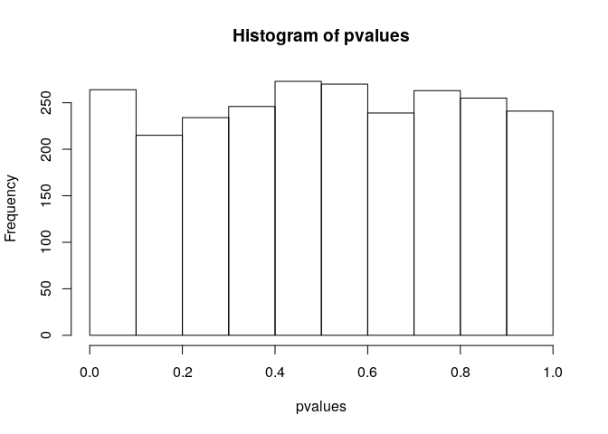
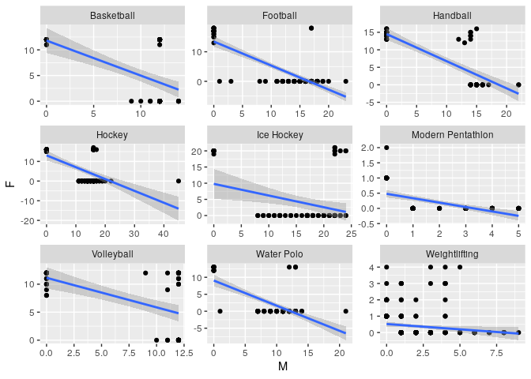
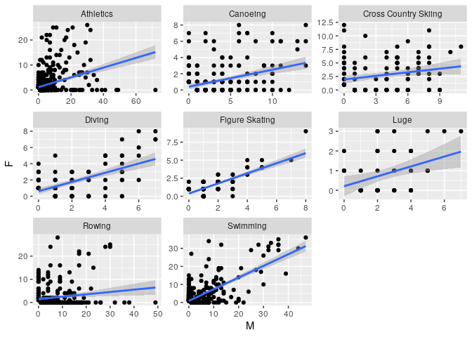

Hypothesis testing
================
**Dmitry Kondrashov & Stefano Allesina**
Fundamentals of Biological Data Analysis – BIOS 26318

# Hypothesis testing

A large number of scientific questions can be expressed as an hypothesis
test—essentially a yes/no question, such as “are two samples drawn from
distributions with the same mean?”, or “Is the frequency of an allele in
a population greater than 0.1?”. Several tests have been developed, each
with a specific type of question in mind. There is a dangerous tendency
to view statistics as a collection of tests, and to practice it by
plugging in your data set into the correct test, expecting that the test
will spit out the correct decision. The purpose of this lesson is to
demonstrate that using and interpreting statistical tests requires
careful thinking to avoid serious errors.

## Test results vs. the truth

A statistical test begins by stating the **null hypothesis**, usually
one that is expected, or that shows no effect: for example, that two
samples come from a distribution with the same mean, or that a rare
allele has frequency of less than 0.1. One may state the **alternative
hypothesis explicitly**, although it’s usually the logical converse of
the null, i.e., the two samples have different population means, or the
allele has frequency greater than 0.1.

After the hypothesis is stated, the data are collected and are used to
test the hypothesis. By default, the null hypothesis is assumed to be
true, and the test assesses whether the data provide sufficient evidence
against the null hypothesis—in which case the **null hypothesis is
rejected**. There is an adversarial relationship: either the data knock
off the hypothesis, or else they fail to do so. Standard terminology
reflects this somewhat counterintuitive setup: rejecting the null
hypothesis is called a **positive test result**, while not rejecting it
is called a **negative result**.

**The fundamental assumption of this process is that the truth value of
the hypothesis is set prior to the collection of data.** For example, if
one could observe all of the genomes, the frequency of the allele would
be known exactly, so this truth exists prior to the hypothesis testing.
Because we typically can only observe a sample (and not the entire
universe of data), we might end up erroneously rejecting the null
hypothesis when it is in fact true, or not rejecting it when it is in
fact false. The possible outcomes of a test can be organized in the
table:

| H0             | True           | False          |
| -------------- | -------------- | -------------- |
| **Reject**     | False Positive | True Positive  |
| **Not Reject** | True Negative  | False Negative |

The values at the top describe the truth status of the hypothesis, while
the decisions in the left column are the result of using data to test
the hypothesis. Note: the words false and true in describing the test
result do not refer to the hypothesis, but to whether the result is
correct\! For example, if the frequency of the allele were 0.09 but the
test for the hypothesis that the frequency is less than 0.1 resulted in
rejecting that hypothesis, that would be a false positive result (the
null hypothesis is true but the test rejected it.)

## Types of errors

As mentioned above, sometimes a hypothesis test makes the wrong
decision, which is called an error. There are two different kinds of
errors: rejecting a true null hypothesis, called a Type I error, and not
rejecting a false null hypothesis, called a Type II error.

**Example:** In the case above of testing for the same mean: if the
samples are taken from distributions with the same mean, but the
hypothesis is rejected, this is called a false positive (Type I error).
If the samples come from distributions with different means, but the
hypothesis is not rejected, this is called a false negative (Type II
error.)

As a scientist, would you rather make a Type I error (make an erroneous
discovery), or a Type II error (fail to make a discovery)?

## Test parameters and p-values

The **sensitivity** of a test is the probability of obtaining the
positive result, given a false hypothesis; and the **specificity** of a
test is the probability of obtaining the negative result, given a true
hypothesis. The *Type I error rate* is the probability of obtaining the
positive result, given a true hypothesis (complementary to specificity),
and the *Type II error rate* is the probability of obtaining the
negative result, given a false hypothesis (complementary to
sensitivity).

All four parameters (rates) of a binary test are summarized as follows:
  
  
  
  
The notation TP, FP, etc. represents the frequency or count of true
positives, false positives, etc., out of a large number of experiments
with known truth status of the hypothesis.

Knowledge of sensitivity and specificity determine the Type I and Type
II error rates of a test since they are complementary events.

Of course, it is desirable for a test to be both very sensitive (reject
false null hypotheses, detect disease, convict guilty defendants) and
very specific (not reject true null hypotheses, correctly identify
healthy patients, acquit innocent defendants), but no test is perfect,
and sometimes it makes the wrong decision. This is where statistical
inference comes into play: given some information about these
parameters, a statistician can calculate the error rate in making
different decisions.

The probability that a given data set is produced from the model of the
null hypothesis is called the **p-value** of a test. More precicely:

> For a given data set 
> and a null hypothesis , the *p-value* is the probability of obtaining a result *as far
> from expectation or farther than the observed data, given the null
> hypothesis.*

The p-value is the most used, misused, and even abused quantity in
statistics, so please think carefully about its definition. One reason
this notion is frequently misused is because it is very tempting to
conclude that the p-value is the probability of the null hypothesis
being true, based on the data. That is not the case\! The definition has
the opposite direction of conditionality—we assume that the null
hypothesis is true, and based on that calculate the probability of
obtaining a pattern as extreme or more extreme than what observed in the
data. There is no way (according to classical “frequentist” statistics)
of assigning a probability to the truth of a hypothesis, because it is
not the result of an experiment.

Typically, one sets a critical threshold bounding the probability of
making a Type I error in a test to a “small” number (often,  or ), and calls the result of a test “significant” if the p-value is
less than .


For example, consider samples of size
 taken from two normal
distributions (with unobserved means
,
). We
can generate the data:

``` r
generate_samples <- function(n, mu1, mu2){
  return(data.frame(sample1 = rnorm(n = n, mean = mu1, sd = 1),
               sample2 = rnorm(n = n, mean = mu2, sd = 1)))
}

my_sample <- generate_samples(1000, 1, 1.01)
```

and use a Student’s t-test to probe whether the means differ:

``` r
# two-tailed (diff in means = 0)
# Student's (assumes equal variances)
# (for Welch's t-test, var.equal = FALSE)
t.test(my_sample$sample1, 
       my_sample$sample2,
       var.equal = TRUE)
```

    # 
    #   Two Sample t-test
    # 
    # data:  my_sample$sample1 and my_sample$sample2
    # t = 0.014001, df = 1998, p-value = 0.9888
    # alternative hypothesis: true difference in means is not equal to 0
    # 95 percent confidence interval:
    #  -0.08479241  0.08601177
    # sample estimates:
    # mean of x mean of y 
    # 0.9685846 0.9679749

**Exercise:** Can you detect a “significant difference in means”
(assuming )? What if you take a much larger sample? What if the
difference in means is more pronounced?

# Multiple comparisons

What if we were to produce several samples? E.g., measure difference
between males and females reflectance in birds at several locations?
Suppose that in fact the reflectance is the same for male and female
(), that for each location we capture and measure
10 males and 10 females, and that we repeat this across 2500 locations.

First, let’s write a little function that returns the p-values for the
t-test

``` r
get_p_value_t_test <- function(my_sample){
  test_results <- t.test(my_sample$sample1, 
                         my_sample$sample2, 
                         var.equal = TRUE)
  return(test_results$p.value)
}
```

and now simulate the
data:

``` r
pvalues <- replicate(n = 2500, expr = get_p_value_t_test(generate_samples(10, 1, 1)))
```

How many times do we detect a “significant difference in reflectance”
when setting  (even though we know that males and females are
sampled from the same distribution)?

``` r
sum(pvalues < 0.05)
```

    # [1] 124

You should get a number of “significant” tests that is about . In fact, the distribution of p-values when
the data are sampled from the null hypothesis is approximately
uniform:

``` r
hist(pvalues)
```



This means that when you are performing multiple tests, some will turn
out to find “significant” differences even when there are none. Again,
this is better summarized by xkcd:


**Exercise**: what happens to the distribution of p-values if the means
are quite different (e.g., , )?

## Corrections for multiple comparisons

The main approach to deal with the problem of multiple comparisons is to
adjust the p-values. For example, in Bonferroni correction one consider
as significant test results whose associated p-value is , where  is the number of tests performed (equivalently, redefine the
p-values as "). Clearly, this correction becomes overly
conservative when the number of tests is large. For example, in biology:

  - **Gene expression** In a typical microarray experiment, we contrast
    the differential expression of tens of thousands of genes in
    treatment and control tissues.

  - **GWAS** In Genomewide Association Studies we want to find SNPs
    associated with a given phenotype. It is common to test tens of
    thousands or even millions of SNPs for signficant associations.

  - **Identifying binding sites** Identifying candidate binding sites
    for a transcriptional regulator requires scanning the whole genome,
    yielding tens of millions of tests.

The funniest example of this problem is the fMRI of the [dead
salmon](http://prefrontal.org/files/posters/Bennett-Salmon-2009.pdf): a
dead salmon “was shown a series of photographs depicting human
individuals in social situations with a specified emotional valence. The
salmon was asked to determine what emotion the individual in the photo
must have been experiencing.” The researchers showed that if multiple
comparisons were not accounted for, one would detect a cluster of active
voxels in the brain, with a cluster-level significance of p = 0.001.

The widespread use of GWAS and other techniques that are trying to find
a needle in a haystack led to the development of many interesting
techniques.
[Here](http://lybird300.github.io/2015/10/19/multiple-test-correction.html)
an interesting account.

Adjusting p-values in `R`:

``` r
original_pvalues <- c(0.01, 0.07, 0.1, 0.44)
p.adjust(original_pvalues, method = "bonferroni")
```

    # [1] 0.04 0.28 0.40 1.00

# Two problems with science

## Selective reporting

We have seen above that setting  means that we are going to make false discoveries at
this rate. In science, we prefer publishing positive results—negative
results are difficult to publish and attract little attention. Suppose
that 20 research groups around the world set out to test the same
hypothesis, which is false. Then there is a good chance at least one
group will reject the null hypothesis, and pursue publication for their
“discovery”. The tendency to put negative studies in the files drawer
and forget about them causes the so called **publication bias** (aka
**selective reporting**): by favoring positive results over negative
ones, we greatly increase the chance that our conclusions are wrong.
Note that these would cause the results of the paper to be largely
impossible to reproduce, and the **reproducibility crisis in the
sciences** is partially due to selective reporting.

## P-hacking

One big violation of good experimental design is known as p-value
**“fishing”** (or **p-hacking**): repeating the experiment, or
increasing the sample size, until the p-value is below the desired
threshold, and then stopping the experiment. Using such defective design
dramatically lowers the likelihood that the result is a true positive.
And of course there is actual fraud, or fudging of data, which
contributes to some bogus results.

An insidious cousin of p-hacking was dubbed by Andrew Gelman “**the
garden of forking paths**” in this
[paper](http://www.stat.columbia.edu/~gelman/research/unpublished/p_hacking.pdf).
The issue arises in complex problems with multi-variable noisy datasets
(aren’t all interesting ones like that?) Essentially, with many choices
and degrees of freedom in a problem, it is easy to convince yourself
that the choice you made (data cleaning, parameter combinations, etc.)
is the correct one because it gives the strongest results. Without a
clearly stated hypothesis, experimental design, and data processing
details prior to data collection, this enchanted garden can lead even a
well-intentioned researcher astray.

## Readings

Good readings on these and related issues:

  - [Why Most Published Research Findings Are
    False](https://journals.plos.org/plosmedicine/article?id=10.1371/journal.pmed.0020124)
  - [Decline effect](https://en.wikipedia.org/wiki/Decline_effect)
  - [The truth wears
    off](https://www.newyorker.com/magazine/2010/12/13/the-truth-wears-off)
  - [The Extent and Consequences of P-Hacking in
    Science](https://journals.plos.org/plosbiology/article?id=10.1371/journal.pbio.1002106)
  - [A manifesto for reproducible
    science](https://www.nature.com/articles/s41562-016-0021)
  - [Spoiled
    Science](https://www.chronicle.com/article/Spoiled-Science/239529)

# How to fool yourself with p-hacking (and possibly get fired\!)

We are going to try our hand at p-hacking, to show how easy it is to get
fooled when you have a sufficiently large and complex data set. The file
`data/medals.csv` contains the total number of medals won at the Olympic
games (Summer or Winter) by country, sport and gender. We have a simple,
and reasonable (?) hypothesis: because the amount of money available to
Olympic teams is finite, whenever a country invests in the male team,
this will be at the detriment of the female team. To test this
hypothesis, we measure whether the number of medals won by a national
female team in a year is negatively correlated with the number of medals
won by the male team.

Let’s read the data, and take a peak:

``` r
library(tidyverse)
dt <- read_csv("data/medals.csv")
dt
```

    # # A tibble: 6,915 x 5
    #    NOC    Year Sport         F     M
    #    <chr> <dbl> <chr>     <dbl> <dbl>
    #  1 AFG    2008 Taekwondo     0     1
    #  2 AFG    2012 Taekwondo     0     1
    #  3 AHO    1988 Sailing       0     1
    #  4 ALG    1984 Boxing        0     2
    #  5 ALG    1992 Athletics     1     0
    #  6 ALG    1992 Boxing        0     1
    #  7 ALG    1996 Athletics     0     1
    #  8 ALG    1996 Boxing        0     2
    #  9 ALG    2000 Athletics     1     3
    # 10 ALG    2000 Boxing        0     1
    # # … with 6,905 more rows

First, let’s see whether our hypothesis works for the whole data:

``` r
cor(dt$F, dt$M)
```

    # [1] 0.1651691

The correlation is positive: more medals for the men tend to correspond
to more medals for the women. This correlation is not very strong, but
is it “significant”? We can run a correlation test:

``` r
cor.test(dt$F, dt$M)
```

    # 
    #   Pearson's product-moment correlation
    # 
    # data:  dt$F and dt$M
    # t = 13.924, df = 6913, p-value < 2.2e-16
    # alternative hypothesis: true correlation is not equal to 0
    # 95 percent confidence interval:
    #  0.1421521 0.1880075
    # sample estimates:
    #       cor 
    # 0.1651691

Indeed\! The confidence intervals are far from 0: the correlation is
definitely positive. Should we give up? Of course not\! Just as for the
jelly beans, we can p-hack our way to glory by subsetting the data. We
are going to test each discipline independently, and see whether we can
get a robustly negative correlation for any discipline. Because we are
serious scientists, we are going to consider only disciplines for which
we have at least 50 data points, to avoid results that are due to small
sample sizes. Let’s write a code:

``` r
dt <- dt %>% group_by(Sport) %>% mutate(sample_size = n()) %>% ungroup()
correlations <- dt %>% 
  filter(sample_size >= 50) %>% 
  group_by(Sport) %>% 
  summarise(cor = cor(`M`, `F`), 
            pvalue = cor.test(`M`, `F`)$p.value) %>% 
  ungroup() 
```

Now let’s see whether there are highly significant negative
correlations:

``` r
my_results <- correlations %>% filter(pvalue < 0.05, cor < 0)
```

Let’s plot our results to convince ourselves that they are strong:

``` r
ggplot(dt %>% inner_join(my_results)) + 
  aes(x = `M`, y = `F`) + 
  geom_point() + 
  geom_smooth(method = "lm") + 
  facet_wrap(~Sport, scales = "free")
```



That’s it\! Should we rush to publish our results? Not quite: we have
p-hacked our way to some highly significant results, but we did not
correct for the number of tests we’ve made, and what we would do is to
selectively reporting our strong results. In fact, we can do something
very simple to convince ourselves that our results do not make much
sense: just run the code again, but reporting significant positive
correlations…

``` r
my_results <- correlations %>% filter(pvalue < 0.05, cor > 0)
ggplot(dt %>% inner_join(my_results)) + 
  aes(x = `M`, y = `F`) + 
  geom_point() + 
  geom_smooth(method = "lm") + 
  facet_wrap(~Sport, scales = "free")
```



You can see that we’ve got about the same number of sports testing
significant for positive correlation\!
