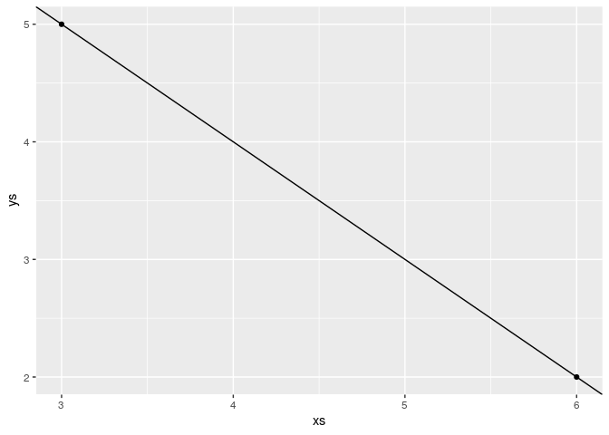
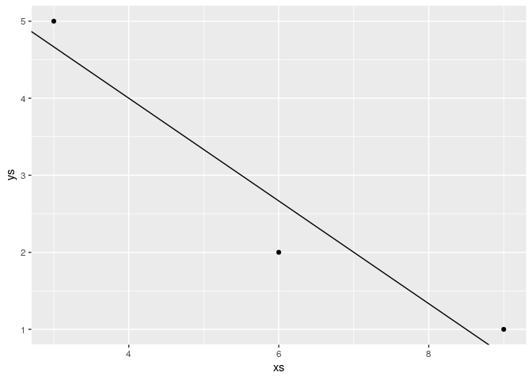
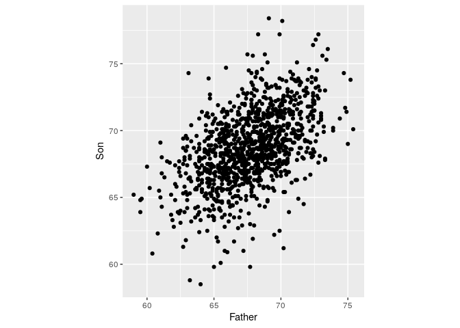
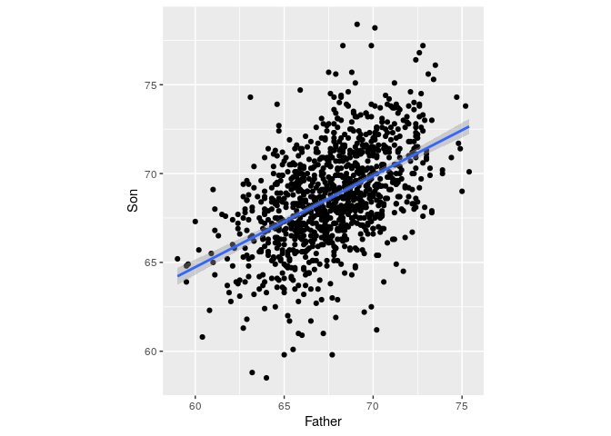

Brief overview of linear algebra
================
**Dmitry Kondrashov & Stefano Allesina**
Fundamentals of Biological Data Analysis – BIOS 26318

# Goals

  - Solving linear equations
  - Best-fit line through multiple data points
  - Concepts of linearity and vector spaces
  - Representation of vectors in multiple bases
  - Eigenvalues and eigenvectors of matrices

<!-- end list -->

``` r
library(tidyverse) # our friend the tidyverse
library(ggfortify) 
```

# Solving multivariate linear equations

Linear algebra is intimately tied to linear equations, that is, to
equations where all variables are multiplied by constant terms and added
together. Linear equations with one variable are easily solved by
division, for example:   
  
is solved by dividing both sides by 4, obtaining the unique solution
.

The situation gets more interesting when multiple variables are
involved, with multiple equations, for example:   
  

There are multiple ways to solve this, for example solving one equation
for one variable in terms of the other, then substituting it into the
second equation to obtain a one-variable problem. A more general
approach involves writing this problem in terms of a matrix  that
contains the multiplicative constants of
 and
 and a vector  that
contains the right-hand side constants:   
  
This now looks analogous to the one-variable equation above, which we
solved by dividing both sides by the multiple of
. The difficulty is that
matrix operations are more complicated than scalar multiplication and
division. Matrix multiplication is used in the equation above to
multiply all the coefficients in the matrix by their respective
variables, which involves a relatively complicated [procedure in
general](https://en.wikipedia.org/wiki/Matrix_multiplication).

The “division” equivalent is called [matrix
inversion](https://en.wikipedia.org/wiki/Invertible_matrix) and it is
even more complicated. First, we need to define the identity matrix, or
the equivalent of the number 1 for matrix multiplication. The identity
matrix is defined only for square matrices (equal number of rows and
columns), so a size  by
 idenitity matrix is
define to have all 1s on the diagonal and all zeros on the off-diagonal:
  
  
The identity matrix is special because multiplying any other matrix (of
compatible size) by it results in the same exact matrix (this is easy to
check on a couple of examples for 2 by 2 or 3 by 3 matrices):

  
  
Then for an  by
 matrix
 its inverse
 is
defined to be the matrix multiplication by which results in the identity
matrix, that is:   
  
Defining the inverse is one task, but calculating it for any given
matrix, especially of large size, is quite laborious. We will not
describe the algorithms here, but you can read about [Gauss-Jordan
elimination](https://en.wikipedia.org/wiki/Gaussian_elimination#Finding_the_inverse_of_a_matrix),
which is one classic example. One important point is that not all
matrices are invertible, and for some no inverse matrix exists,
analogous to zero for real number division. The difference is that there
are infinitely many matrices for which this is the case, called
*singular* matrices.

In the cases in which the inverse matrix exists, the linear system of
equations can be solved by multiplying both sides by the inverse matrix,
like this:   
  

*Example:* Take the linear 2 by 2 system of equations of above and solve
it using matrix inversion.The R function solve() calculates the inverse
and multiplies it by the constant vector b:

``` r
A <- matrix(c(4,-1,-3,2), nrow = 2)
b <- c(5,10)
solve(A,b)
```

    # [1] 8 9

## Fitting a line to data

One geometric application of solving multiple linear equations is to
find the coefficients of a line that passes through two points in the
2-dimensional plane (or of a plane that passes through three points in
three-dimensional space, but we won’t go there.) In that case, the
coordinates of the points are the data, and the unknown variables are
the parameters slope 
and intercept  of the
line that we want to find.

**Example:** If the data set consists of two points , (6, 2)"), then finding the best fit values of
 and
 means solving the
following two equations:

  
  

These equations have a solution for the slope and intercept, which can
be calculated in R using solve() and then plot the line with the
parameters from the solution vector beta:

``` r
xs <- c(3,6)
ys <- c(5,2)
A <- matrix(c(xs[1],xs[2],1,1), nrow = 2)
b <- c(ys[1],ys[2])
beta <- solve(A,b)
data1 <- tibble(xs,ys)
ggplot(data = data1) + aes(x=xs, y= ys) + geom_point() + geom_abline(slope=beta[1], intercept=beta[2])
```



However, a data set with two points is very small and nobody would
accept these values as reasonable estimates. Let us add one more data
point, to increase our sample size to three: , (9, 1)"). How do you find the best fit slope and
intercept?

**Bad idea:** take two points and find a line, that is the slope and the
intercept, that passes through the two. It should be clear why this is a
bad idea: we are arbitrarily ignoring some of the data, while perfectly
fitting two points. So how do we use all the data? Let us write down the
equations that a line with slope
 and intercept
 have to satisfy in
order to fit our data points:

  
  

This system has no exact solution, since there are three equations and
only two unknowns. We need to find
 and
 such that they are a
“best fit” to the data, not the perfect solution.

## Least-squares line

Let us write the equation in matrix form as follows:

  
  

Mathematically, the problem is that one cannot invert a non-square
matrix. However, there is a way of turning the matrix into a square one,
by multiplying it by its own transpose (same matrix with rows and
columns reversed):

  
  
*Exercise:* Carry out the matrix multiplications to verify that
 is a 2 by 2 matrix and  is 2 by 1 vector.

Now we can solve this equation with a square matrix  by multiplying both sides by the inverse\!
In general, for an -dimensional data set consisting of a bunch of values of
 and
, the process loooks
like this:

  
^{-1} \\mathbf{X}^{T}\\vec Y
")  
*Example:* Let us see the best-fit line for the 3-point data set above:

``` r
xs <- c(3,6,9)
ys <- c(5,2,1)
A <- matrix(c(xs[1],xs[2],xs[3],1,1,1), nrow = 3)
b <- c(ys[1],ys[2], ys[3])
beta <- solve(t(A) %*% A,t(A) %*% b)
data1 <- tibble(xs,ys)
ggplot(data = data1) + aes(x=xs, y= ys) + geom_point() + geom_abline(slope=beta[1], intercept=beta[2])
```



Let us use the classic data set of Karl Pearson’s from 1903 containing
the height of fathers and sons, which we will return to next week when
we tackle linear regression
properly:

``` r
heights <- read_tsv("http://www.randomservices.org/random/data/Pearson.txt")
pl <- ggplot(data = heights) + aes(x = Father, y = Son) + geom_point() + coord_equal()
pl
```



*Exercise:* Let’s try to find the best fit line to this data set (the
hard way) using the same process as above for the three - point data
set:

Of course, `R` can do this calculation for you with just one command:

``` r
best_beta_easy <- lm(Son ~ Father, data = heights)
best_beta_easy
```

    # 
    # Call:
    # lm(formula = Son ~ Father, data = heights)
    # 
    # Coefficients:
    # (Intercept)       Father  
    #      33.893        0.514

But it feels good to know that this is not black magic\! In fact,
plotting it on top of the data does not even require computing the
coefficients:

``` r
pl + geom_smooth(method = "lm") # lm stands for linear model
```



# Linearity and vector spaces

We have dealt with linear models in various guises, so now would be a
good time to define properly what linearity means. The word comes from
the shape of graphs of linear functions of one variable, e.g.  = ax + b"), but the algebraic meaning rests on the following two
general properties:

**Definition.** A *linear transformation* or *linear operator* is a
mapping  between two
sets of vectors with the following properties:

1.  *(scalar multiplication)*  = c L(\\vec v)"); where
     is a scalar and
     is a vector
2.  *(additive)*  = L(\\vec v_1) + L(\\vec v_2)"); where
     and 
    are vectors

Here we have two types of objects: vectors and transformations/operators
that act on those vectors. The basic example of this are vectors and
matrices, because a matrix multiplied by a vector (on the right) results
another vector, provided the number of columns in the matrix is the same
as the number of rows in the vector. This can be interpreted as the
matrix transforming the vector  into
another one: $ A v = u$.

**Example:** Let us multiply the following matrix and vector (specially
chosen to make a point):

``` r
A <- matrix(c(2, 2, 1, 3), nrow = 2)
vec1 <- c(1,-1)
vec2 <- A %*% vec1
print(vec1)
print(vec2)
```

    # [1]  1 -1
    #      [,1]
    # [1,]    1
    # [2,]   -1

We see that this particular vector
") is
unchanged when multiplied by this matrix, or we can say that the matrix
multiplication is equivalent to multiplication by 1. Here is another
such vector for the same matrix:

``` r
vec1 <- c(1,2)
vec2 <- A %*% vec1
print(vec1)
print(vec2)
```

    # [1] 1 2
    #      [,1]
    # [1,]    4
    # [2,]    8

In this case, the vector is changed, but only by multiplication by a
constant (4). Thus the geometric direction of the vector remained
unchanged.

The notion of linearity leads to the important idea of combining
different vectors:

**Definition:** A *linear combination* of
 vectors  is a weighted sum of these vectors with any real
numbers
:   
  

Linear combinations arise naturally from the notion of linearity,
combining the additive property and the scalar multiplication property.
Speaking intuitively, a linear combination of vectors produces a new
vector that is related to the original set. Linear combinations give a
simple way of generating new vectors, and thus invite the following
definition for a collection of vectors closed under linear combinations:

**Definition.** A *vector space* is a collection of vectors such that a
linear combination of any  vectors is contained in the vector space.

The most common examples are the spaces of all real-valued vectors of
dimension , which are
denoted by
. For instance,
 (pronounced “r two”) is the vector space of two
dimensional real-valued vectors such as
") and
"); similarly,
 is the vector space consisting of three dimensional
real-valued vectors such as
"). You can convince yourself, by taking linear
combinations of vectors, that these vector spaces contain all the points
in the usual Euclidean plane and three-dimensional space. The real
number line can also be thought of as the vector space
.

## Linear independence and basis vectors

How can we describe a vector space without trying to list all of its
elements? We know that one can generate an element by taking linear
combinations of vectors. It turns out that it is possible to generate
(or “span”) a vector space by taking linear combinations of a subset of
its vectors. The challenge is to find a minimal subset of subset that is
not redundant. In order to do this, we first introduce a new concept:

**Definition:** A set of vectors  is called *linearly independent* if the only linear
combination involving them that equals the zero vector is if all the
coefficients are zero. (  only if
 for all .)

In the familiar Euclidean spaces, e.g.
, linear independence has a geometric meaning: two
vectors are linearly independent if the segments from the origin to the
endpoint do not lie on the same line. But it can be shown that any set
of three vectors in the plane is linearly dependent, because there are
only two dimensions in the vector space. This brings us to the key
definition of this section:

**Definition:** A *basis* of a vector space is a linearly independent
set of vectors that generate (or span) the vector space. The number of
vectors (cardinality) in such a set is called the *dimension* of the
vector space.

A vector space generally has many possible bases, as illustrated in
figure. In the case of
, the usual (canonical) basis set is ; (0,1)\\}") which obviously generates any point on the plane
and is linearly independent. But any two linearly independent vectors
can generate any vector in the plane.

**Example:** The vector ") can be represented as a linear combination of the two
canonical vectors: +1\\times (0,1)"). Let us choose another basis
set, say ; (-1,1)\\}") (this is the canonical basis vectors rotated by
.) The
same vector can be represented by a linear combination of these two
vectors, with coefficients
 and
:  - 0.5 \\times (-1,1)"). If we call the first
basis  for canonical and
the second basis  for
different, we can write the same vector using different sets of
coordinates for each basis:   
; \\; \\vec r_D = (1.5, -0.5)
")  

## Projections and changes of basis

The representation of an arbitrary vector (point) in a vector space as a
linear combination of a given basis set is called the  of the point in
terms of the basis, which gives the coordinates for the vector in terms
of each basis vector. The decomposition of a point in terms of a
particular basis is very useful in high-dimensional spaces, where a
clever choice of a basis can allow a description of a set of points
(such as a data set) in terms of contributions of only a few basis
vectors, if the data set primarily extends only in a few dimensions.

To obtain the coefficients of the basis vectors in a decomposition of a
vector , we need to perform what is termed a *projection* of the
vector onto the basis vectors. Think of shining a light perpendicular to
the basis vector, and measuring the length of the shadow cast by the
vector  onto . If
the vectors are parallel, the shadow is equal to the length of ; if they
are orthogonal, the shadow is nonexistent. To find the length of the
shadow, use the inner product of  and
,
which as you recall corresponds to the cosine of the angle between the
two vectors multiplied by their norms: $r, v=rv() $. We do not care
about the length of the vector  we are
projecting onto, thus we divide the inner product by the square norm of
,
and then multiply the vector  by this
projection coefficient:   
 = \\frac{ \\langle \\vec r , \\vec v \\rangle  } {\\langle \\vec v , \\vec v \\rangle } \\vec v = \\frac{ \\langle \\vec r ,  \\vec v \\rangle  } {\\vert \\vec v \\vert^2} \\vec v= \\frac{  \\vert\\vec r\\vert \\cos(\\theta) } {\\vert \\vec v \\vert}\\vec v
")  

This formula gives the projection of the vector  onto
,
the result is a new vector in the direction of , with the
scalar coefficient .

**Example:** Here is how one might calculate the projection of the point
") onto
the basis set ; (-1,1)\\}"):

``` r
v1 <- c(1,1)
v2 <- c(-1,1)
u <- c(2,1)
ProjMat <- matrix(cbind(v1,v2), byrow = T, nrow = 2)
print(ProjMat)
ProjMat%*%u
```

    #      [,1] [,2]
    # [1,]    1    1
    # [2,]   -1    1
    #      [,1]
    # [1,]    3
    # [2,]   -1

This is not quite right: the projection coefficients are off by a factor
of two compared to the correct values in the example above. This is
because we have neglected to *normalize* the basis vectors, so we should
modify the script as follows:

``` r
v1 <- c(1,1)
v1 <- v1/(sum(v1^2))
v2 <- c(-1,1)
v2 <- v2/(sum(v2^2))
u <- c(2,1)
ProjMat <- matrix(cbind(v1,v2), byrow = T, nrow = 2)
print(ProjMat)
print(ProjMat%*%u)
```

    #      [,1] [,2]
    # [1,]  0.5  0.5
    # [2,] -0.5  0.5
    #      [,1]
    # [1,]  1.5
    # [2,] -0.5

This is an example of how to convert a vector/point from representation
in one basis set to another. The new basis vectors, expressed in the
original basis set, are arranged in a matrix by row, scaled by their
norm squared, and multiplied by the vector that one wants to express in
the new basis. The resulting vector contains the coordinates in the new
basis.

# Matrices as linear operators

## matrices transform vectors

In this section we will learn to characterize square matrices by finding
special numbers and vectors associated with them. At the core of this
analysis lies the concept of a matrix as an *operator* that transforms
vectors by multiplication. To be clear, in this section we take as
default that the matrices  are square, and that vectors  are column
vectors, and thus will multiply the matrix on the right: .

A matrix multiplied by a vector produces another vector, provided the
number of columns in the matrix is the same as the number of rows in the
vector. This can be interpreted as the matrix transforming the vector

into another one: $ A v = u$. The resultant vector  may or may
not resemble , but there are special vectors for which the transformation
is very simple.

**Example.** Let us multiply the following matrix and vector (specially
chosen to make a point):   
\\left(\\begin{array}{c}1 \\\\ -1 \\end{array}\\right) = \\left(\\begin{array}{c}2 -1 \\\\ 2 - 3 \\end{array}\\right) =  \\left(\\begin{array}{c} 1 \\\\ -1 \\end{array}\\right)
")  
We see that this particular vector is unchanged when multiplied by this
matrix, or we can say that the matrix multiplication is equivalent to
multiplication by 1. Here is another such vector for the same matrix:   
\\left(\\begin{array}{c}1 \\\\ 2 \\end{array}\\right) = \\left(\\begin{array}{c}2 +2 \\\\ 2 + 6 \\end{array}\\right) =  \\left(\\begin{array}{c} 4 \\\\ 8 \\end{array}\\right)
")  
In this case, the vector is changed, but only by multiplication by a
constant (4). Thus the geometric direction of the vector remained
unchanged.

Generally, a square matrix has an associated set of vectors for which
multiplication by the matrix is equivalent to multiplication by a
constant. This can be written down as a definition:

An *eigenvector* of a square matrix
 is a vector  for which
matrix multiplication by  is equivalent to multiplication by a constant. This constant

is called its *eigenvalue* of
 corresponding the the
eigenvector . The relationship is summarized in the following equation:   
  

Note that this equation combines a matrix
(), a vector () and a
scalar , and that both sides of the equation are column vectors.

The definition does not specify how many such eigenvectors and
eigenvalues can exist for a given matrix
. There are usually as
many such vectors  and
corresponding numbers

as the number of rows or columns of the square matrix
, so a 2 by 2 matrix has
two eigenvectors and two eigenvalues, a 5x5 matrix has 5 of each, etc.
One ironclad rule is that there cannot be more distinct eigenvalues than
the matrix dimension. Some matrices possess fewer eigenvalues than the
matrix dimension, those are said to have a *degenerate* set of
eigenvalues, and at least two of the eigenvectors share the same
eigenvalue.

The situation with eigenvectors is trickier. There are some matrices for
which any vector is an eigenvector, and others which have a limited set
of eigenvectors. What is difficult about counting eigenvectors is that
an eigenvector is still an eigenvector when multiplied by a constant.
You can show that for any matrix, multiplication by a constant is
commutative: $cA = Ac $, where
 is a matrix and
 is a constant. This
leads us to the important result that if  is an
eigenvector with eigenvalue
,
then any scalar multiple  is
also an eigenvector with the same eigenvalue. The following demonstrates
this algebraically:   
 = c A  \\times  \\vec v = c \\lambda \\vec v =  \\lambda (c \\vec v)")  
This shows that when the vector  is
multiplied by the matrix , it results in its being multiplied by the same number
,
so by definition it is an eigenvector. Therefore, an eigenvector  is not
unique, as any constant multiple  is
also an eigenvector. It is more useful to think not of a single
eigenvector , but of a **collection of vectors that can be interconverted
by scalar multiplication** that are all essentially the same
eigenvector. Another way to represent this, if the eigenvector is real,
is that an eigenvector as a **direction that remains unchanged by
multiplication by the matrix**, such as direction of the vector
 in figure . As
mentioned above, this is true only for real eigenvalues and
eigenvectors, since complex eigenvectors cannot be used to define a
direction in a real space.

To summarize, eigenvalues and eigenvectors of a matrix are a set of
numbers and a set of vectors (up to scalar multiple) that describe the
action of the matrix as a multiplicative operator on vectors.
“Well-behaved” square 
by  matrices have
 distinct eigenvalues
and  eigenvectors
pointing in distinct directions. In a deep sense, the collection of
eigenvectors and eigenvalues defines a matrix
, which is why an older
name for them is characteristic vectors and values.

### Calculating eigenvalues

Finding the eigenvalues and eigenvectors analytically, that is on paper,
is quite laborious even for 3 by 3 or 4 by 4 matrices and for larger
ones there is no analytical solution. In practice, the task is
outsourced to a computer, and MATLAB has a number of functions for this
purpose. Nevertheless, it is useful to go through the process in 2
dimensions in order to gain an understanding of what is involved. From
the definition of eigenvalues and eigenvectors, the condition can be
written in terms of the four elements of a 2 by 2 matrix:   
\\left(\\begin{array}{c}v_1 \\\\ v_2 \\end{array}\\right) = \\left(\\begin{array}{c}av_1 +b v_2\\\\ cv_1+ dv_2 \\end{array}\\right) = \\lambda \\left(\\begin{array}{c}v_1 \\\\ v_2 \\end{array}\\right)
")  
This is now a system of two linear algebraic equations, which we can
solve by substitution. First, let us solve for
 in the first
row, to get   
  
Then we substitute this into the second equation and get:   
v_2 = 0
")  

Since  multiplies
both terms, and is not necessarily zero, we require that its
multiplicative factor be zero. Doing a little algebra, we obtain the
following, known as the *characteristic equation* of the matrix:   
(d-\\lambda) = \\lambda^2-(a+d)\\lambda +ad-bc = 0")  
This equation can be simplified by using two quantities we defined at
the beginning of the section: the sum of the diagonal elements called
the trace , and the determinant . The quadratic equation has two solutions, dependent
solely on 
and :
  
  
This is the general expression for a 2 by 2 matrix, showing there are
two possible eigenvalues. Note that if
, the eigenvalues are real, if
, they are complex (have real and imaginary
parts), and if
, there is only one eigenvalue. This situation is
known as degenerate, because two eigenvectors share the same eigenvalue.

**Example.** Let us take the same matrix we looked at in the previous
subsection:   
")  
The trace of this matrix is  and the determinant is . Then by our formula, the eigenvalues are:   
  
These are the multiples we found in the example above, as expected. Of
course `R` has functions to calculate this instead of doing this by
hand:

``` r
A <- matrix(c(2,2, 1, 3), nrow =2)
eigs <- eigen(A)
eigs$values
eigs$vectors
```

    # [1] 4 1
    #            [,1]       [,2]
    # [1,] -0.4472136 -0.7071068
    # [2,] -0.8944272  0.7071068

**Note:** a real-valued matrix can have complex eigenvalues and
eigenvectors, but whenever it acts on a real vector, the result is still
real. This is because the complex numbers cancel each other’s imaginary
parts.
