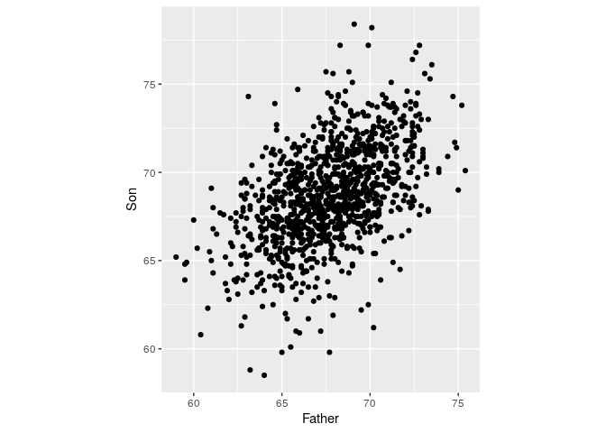

Linear models
================
**Dmitry Kondrashov & Stefano Allesina**
Fundamentals of Biological Data Analysis – BIOS 26318

# Goal

Learn how to perform linear regression, how to make sure that the
assumptions of the model are not violated, and how to interpret the
results.

Note that we need a few new libraries:

``` r
library(tidyverse)
library(readxl) # to read excel files
source("general_code/read_xls_from_url.R") # function to read excel from URL
library(lindia) # regression diagnostic in ggplot2
```

# Regression toward the mean

Francis Galton (Darwin’s half-cousin) was a biologist interested in
evolution, and one of the main proponents of eugenics (he coined the
term himself). To advance his research program, he set out to measure
several features in human populations, and started trying to explain the
variation he observed, incidentally becoming one of the founding fathers
of modern statistics.

In his “Regression towards mediocrity in hereditary stature” he showed
an interesting pattern: children of tall parents tended to be shorter
than their parents, while children of short parents tended to be taller
than their parents. He called this phenomoenon “regression toward
mediocrity” (now called regression toward \[to\] the mean).

We’re going to explore this phenomenon using Karl Pearson’s (another
founding father of statistics) data from 1903, recording the height of
fathers and
sons:

``` r
heights <- read_tsv("http://www.randomservices.org/random/data/Pearson.txt")
pl <- ggplot(data = heights) + aes(x = Father, y = Son) + geom_point() + coord_equal()
pl
```



Let’s add the 1:1 line for
comparison:

``` r
pl + geom_abline(slope = 1, intercept = 0, linetype = 2, color = "red")
```


You can see that the sons tend to be taller than their fathers. Let’s
see of how much:

``` r
mean(heights$Father)
mean(heights$Son)
# difference
mean(heights$Son) - mean(heights$Father)
```

    # [1] 67.68683
    # [1] 68.68423
    # [1] 0.9974026

So let’s add a line with an intercept of
1:

``` r
pl <- pl + geom_abline(slope = 1, intercept = 1, linetype = 2, color = "blue")
pl
```


You can see that the line does not divide the cloud of points evenly:
even though tall fathers tend to produce tall sons, and short fathers
short sons, the sons of short fathers tend to be taller than their
fathers (for example, look at the sons of fathers less than 60 inches
tall), while the sons of tall fathers tend to be shorter than their
fathers (for example, the sons of fathers taller than 75 inches).

This phenomenon is called “regression toward the mean”: when you take
two measurement on the same sample (or related samples, as here), if a
variable is extreme on its first measurement, it will tend to be closer
to the average on its second measurement; if it is extreme on its second
measurement, it will tend to have been closer to the average on its
first.

> **Regression to the mean: dangers of interpretation**

  - A city sees an unusual growth of crime in a given neighborhood, and
    they decide to patrol the neighborhood more heavily. The next year,
    crime rates are close to normal. Was this due to heavy presence of
    police?
  - A teacher sees that scolding students who’ve had a very low score in
    a test makes them perform better in the next test. (But would
    praising those with unusually high scores lead to slacking off in
    the next test?)
  - A huge problem in science: effect sizes tend to decrease through
    time. Problem of selective reporting?

This phenomemon gave the name to one of the simplest statistical models:
the linear regression.

# Finding the best fitting line: Linear Regression

How can we explain the relationship between the height of the faters and
those of their sons? One of the simplest models we can use is called a
“Linear Model”. Basically, we want to express the height of the son as
a function of the height of the father:   
  
where  is the
height of the son (**response variable**),
 is the height of
the father (**explanatory variable**),

and  are two numbers (intercept and slope of the line) that do
not vary within the population (these are the parameters we want to
fit). Finally, the term
 measures the “error” we are making for the

son. For simplicity, we assume the ")
(and 
is therefore another parameter we want to fit).

When we have multiple explanatory variables (for example, if we had
recorded also the height of the mother, whether the son was born at full
term or premature, the average caloric intake for the family, etc.), we
speak of **Multiple Linear Regression**:

  
  

## Solving a linear model — some linear algebra

In this section, we’re going to look at the mechanics of linear
regression. Suppose that for simplicity we have a single explanatory
variable, then we can write the linear model in compact form as:   
  
where:   
![
\\mathbf{Y} = \\begin{pmatrix} y\_1\\\\ y\_2\\\\ \\vdots \\\\ y\_n
\\end{pmatrix} \\;\\;\\; 
\\mathbf{X} = \\begin{pmatrix} 1 & x\_1\\\\ 1 & x\_2\\\\ \\vdots &
\\vdots \\\\ 1 & x\_n \\end{pmatrix}
\\;\\;\\; 
\\mathbf{\\beta} = \\begin{pmatrix} \\beta\_0 \\\\
\\beta\_1\\end{pmatrix} \\;\\;\\; \\mathbf{\\epsilon} = \\begin{pmatrix}
\\epsilon\_1 \\\\ \\epsilon\_2 \\\\ \\vdots \\\\ \\epsilon\_n
\\end{pmatrix}
](https://latex.codecogs.com/png.latex?%0A%5Cmathbf%7BY%7D%20%3D%20%5Cbegin%7Bpmatrix%7D%20y_1%5C%5C%20y_2%5C%5C%20%5Cvdots%20%5C%5C%20y_n%20%5Cend%7Bpmatrix%7D%20%5C%3B%5C%3B%5C%3B%20%0A%5Cmathbf%7BX%7D%20%3D%20%5Cbegin%7Bpmatrix%7D%201%20%26%20x_1%5C%5C%201%20%26%20x_2%5C%5C%20%5Cvdots%20%26%20%5Cvdots%20%5C%5C%201%20%26%20x_n%20%5Cend%7Bpmatrix%7D%0A%20%5C%3B%5C%3B%5C%3B%20%0A%5Cmathbf%7B%5Cbeta%7D%20%3D%20%5Cbegin%7Bpmatrix%7D%20%5Cbeta_0%20%5C%5C%20%5Cbeta_1%5Cend%7Bpmatrix%7D%20%5C%3B%5C%3B%5C%3B%20%5Cmathbf%7B%5Cepsilon%7D%20%3D%20%5Cbegin%7Bpmatrix%7D%20%5Cepsilon_1%20%5C%5C%20%5Cepsilon_2%20%5C%5C%20%5Cvdots%20%5C%5C%20%5Cepsilon_n%20%5Cend%7Bpmatrix%7D%0A
"
\\mathbf{Y} = \\begin{pmatrix} y_1\\\\ y_2\\\\ \\vdots \\\\ y_n \\end{pmatrix} \\;\\;\\; 
\\mathbf{X} = \\begin{pmatrix} 1 & x_1\\\\ 1 & x_2\\\\ \\vdots & \\vdots \\\\ 1 & x_n \\end{pmatrix}
 \\;\\;\\; 
\\mathbf{\\beta} = \\begin{pmatrix} \\beta_0 \\\\ \\beta_1\\end{pmatrix} \\;\\;\\; \\mathbf{\\epsilon} = \\begin{pmatrix} \\epsilon_1 \\\\ \\epsilon_2 \\\\ \\vdots \\\\ \\epsilon_n \\end{pmatrix}
")  

Solving the linear regression means finding the best-fitting
,

and 
(controlling the spread of the distribution of the
). Our goal is to find the values of
 that
minimize  (meaning that the points fall closer to the line).
Rearranging:   
^2 =  \\Vert \\mathbf{Y} - \\mathbf{X} \\mathbf{\\beta} \\Vert
")  

As such, we want to find the vector
 that
minimizes the norm . One can
prove that this is accomplished using:   
^{-1} \\mathbf{X}^T \\mathbf{Y}
")  

Where the matrix ^{-1} \\mathbf{X}^T") is
known as the (left) Moore-Penrose pseudo-inverse of
. Let’s try to do this in `R` (the “hard” way):

``` r
X <- cbind(1, heights$Father)
Y <- cbind(heights$Son)
best_beta <- solve(t(X) %*% X) %*% t(X) %*% Y
best_beta
```

    #            [,1]
    # [1,] 33.8928005
    # [2,]  0.5140059

We find that the best fitting line has an intercept of about 34 inches,
and a slope of 0.51. Of course, `R` can do this calculation for you with
just one command:

``` r
best_beta_easy <- lm(Son ~ Father, data = heights)
best_beta_easy
```

    # 
    # Call:
    # lm(formula = Son ~ Father, data = heights)
    # 
    # Coefficients:
    # (Intercept)       Father  
    #      33.893        0.514

But it feels good to know that this is not black magic\! In fact,
plotting it on top of the data does not even require computing the
coefficients:

``` r
pl + geom_smooth(method = "lm") # lm stands for linear model
```


## Minimizing the sum of squares

What we just did is called “ordinary least-squares”: we are trying to
minimize the distance from the data points to their projection on the
best-fitting line. We can compute the “predicted” heights as:   
  
Then, we’re minimizing . We call
 the
vector of **residuals**. From this, we can estimate the final parameter,
:

  
  
where  is the number of
data points, and  is the
number of parameters in
 (2 in this case); this measures the number of
**degrees of freedom**. Let’s try to compute it:

``` r
degrees_of_freedom <- length(Y) - 2
degrees_of_freedom
epsilon_hat <- X %*% best_beta - Y
sigma <- sqrt(sum(epsilon_hat^2) / degrees_of_freedom)
sigma
```

    # [1] 1076
    # [1] 2.438134

In `R`, you will find this reported as the `Residual standard error`
when you call `summary` on your model:

``` r
summary(best_beta_easy)
```

    # 
    # Call:
    # lm(formula = Son ~ Father, data = heights)
    # 
    # Residuals:
    #     Min      1Q  Median      3Q     Max 
    # -8.8910 -1.5361 -0.0092  1.6359  8.9894 
    # 
    # Coefficients:
    #             Estimate Std. Error t value Pr(>|t|)    
    # (Intercept) 33.89280    1.83289   18.49   <2e-16 ***
    # Father       0.51401    0.02706   19.00   <2e-16 ***
    # ---
    # Signif. codes:  0 '***' 0.001 '**' 0.01 '*' 0.05 '.' 0.1 ' ' 1
    # 
    # Residual standard error: 2.438 on 1076 degrees of freedom
    # Multiple R-squared:  0.2512,  Adjusted R-squared:  0.2505 
    # F-statistic: 360.9 on 1 and 1076 DF,  p-value: < 2.2e-16

Finally, the **coefficient of determination**
 is computed as:
  
^2}{\\sum_i ({y}_i - \\bar{y})^2}
")  
where  is the mean of
. If the
regression has an intercept, then the
 can vary
between 0 and 1, with values close to 1 indicating a good fit to the
data. Again, let’s compute it the hard way and then the easy way:

``` r
y_bar <- mean(Y)
R_2 <- sum((X %*% best_beta - y_bar)^2) / sum((Y - y_bar)^2)
R_2
```

    # [1] 0.251164

``` r
# look for Multiple R-squared:
summary(best_beta_easy)
```

    # 
    # Call:
    # lm(formula = Son ~ Father, data = heights)
    # 
    # Residuals:
    #     Min      1Q  Median      3Q     Max 
    # -8.8910 -1.5361 -0.0092  1.6359  8.9894 
    # 
    # Coefficients:
    #             Estimate Std. Error t value Pr(>|t|)    
    # (Intercept) 33.89280    1.83289   18.49   <2e-16 ***
    # Father       0.51401    0.02706   19.00   <2e-16 ***
    # ---
    # Signif. codes:  0 '***' 0.001 '**' 0.01 '*' 0.05 '.' 0.1 ' ' 1
    # 
    # Residual standard error: 2.438 on 1076 degrees of freedom
    # Multiple R-squared:  0.2512,  Adjusted R-squared:  0.2505 
    # F-statistic: 360.9 on 1 and 1076 DF,  p-value: < 2.2e-16

## Assumptions of linear regression

In practice, when we are performing a linear regression, we are making a
number of assumptions about the data. Here are the main ones:

  - Model structure: we assume that the process generating the data is
    linear.
  - Explanatory variable: we assume that this is measured without errors
    (\!).
  - Residuals: we assume that residuals are i.i.d. Normal.
  - Strict exogeneity: the residuals should have conditional mean of 0.

  
![
\\mathbb E\[\\epsilon\_i | x\_i\] = 0
](https://latex.codecogs.com/png.latex?%0A%5Cmathbb%20E%5B%5Cepsilon_i%20%7C%20x_i%5D%20%3D%200%0A
"
\\mathbb E[\\epsilon_i | x_i] = 0
")  

  - No linear dependence: the columns of
     should be linearly independent.
  - Homoscedasticity: the variance of the residuals is independent of
    .

  
![
\\mathbb V\[\\epsilon\_i | x\_i\] = \\sigma^2
](https://latex.codecogs.com/png.latex?%0A%5Cmathbb%20V%5B%5Cepsilon_i%20%7C%20x_i%5D%20%3D%20%20%5Csigma%5E2%0A
"
\\mathbb V[\\epsilon_i | x_i] =  \\sigma^2
")  

  - Errors are uncorrelated between observations.   
    ![
    \\mathbb E\[\\epsilon\_i \\epsilon\_j | x\] = 0 \\; \\forall j \\neq
    i
    ](https://latex.codecogs.com/png.latex?%0A%5Cmathbb%20E%5B%5Cepsilon_i%20%5Cepsilon_j%20%7C%20x%5D%20%3D%200%20%5C%3B%20%5Cforall%20j%20%5Cneq%20i%0A
    "
    \\mathbb E[\\epsilon_i \\epsilon_j | x] = 0 \\; \\forall j \\neq i
    ")  

# Linear regression in action

To perform a slightly more complicated linear regression, we take the
data from:

> Piwowar HA, Day RS, Fridsma DB (2007) [Sharing detailed research data
> is associated with increased citation
> rate](https://doi.org/10.1371/journal.pone.0000308). PLoS ONE 2(3):
> e308.

The authors set out to demonstrate that sharing data accompanying papers
increases the number of citations received by the paper.

``` r
# original url 
# https://datadryad.org/stash/dataset/doi:10.5061/dryad.j2c4g
dat <- read_csv("data/Piwowar_2011.csv") 
# rename variables for easier handling
dat <- dat %>% rename(IF = `Impact factor of journal`, 
                      NCIT = `Number of Citations in first 24 months after publication`, 
                      SHARE = `Is the microarray data publicly available`) %>% 
      select(NCIT, IF, SHARE)
```

First, let’s run a model in which the logarithm of the number of
citations + 1 is regressed against the “Impact Factor” of the journal
(which is a measure of “prestige” based on the average number of
citations per paper received):

``` r
my_model <- lm(log(NCIT + 1) ~ log(IF + 1), data = dat)
summary(my_model)
```

    # 
    # Call:
    # lm(formula = log(NCIT + 1) ~ log(IF + 1), data = dat)
    # 
    # Residuals:
    #      Min       1Q   Median       3Q      Max 
    # -1.65443 -0.44272 -0.00769  0.43414  1.62817 
    # 
    # Coefficients:
    #             Estimate Std. Error t value Pr(>|t|)    
    # (Intercept)   0.1046     0.2951   0.355    0.724    
    # log(IF + 1)   1.2920     0.1196  10.802   <2e-16 ***
    # ---
    # Signif. codes:  0 '***' 0.001 '**' 0.01 '*' 0.05 '.' 0.1 ' ' 1
    # 
    # Residual standard error: 0.6887 on 83 degrees of freedom
    # Multiple R-squared:  0.5844,  Adjusted R-squared:  0.5794 
    # F-statistic: 116.7 on 1 and 83 DF,  p-value: < 2.2e-16

You can see that the higher the impact factor, the higher the number of
citations received (unsurprisingly\!). Now let’s add another variable,
detailing whether publicly available data accompany the paper:

``` r
my_model2 <- lm(log(NCIT + 1) ~ log(IF + 1) + SHARE, data = dat)
summary(my_model2)
```

    # 
    # Call:
    # lm(formula = log(NCIT + 1) ~ log(IF + 1) + SHARE, data = dat)
    # 
    # Residuals:
    #      Min       1Q   Median       3Q      Max 
    # -1.98741 -0.43768  0.08726  0.41847  1.35634 
    # 
    # Coefficients:
    #             Estimate Std. Error t value Pr(>|t|)    
    # (Intercept)   0.4839     0.3073   1.575  0.11918    
    # log(IF + 1)   1.0215     0.1442   7.084  4.4e-10 ***
    # SHARE         0.5519     0.1802   3.062  0.00297 ** 
    # ---
    # Signif. codes:  0 '***' 0.001 '**' 0.01 '*' 0.05 '.' 0.1 ' ' 1
    # 
    # Residual standard error: 0.6564 on 82 degrees of freedom
    # Multiple R-squared:  0.627,   Adjusted R-squared:  0.6179 
    # F-statistic: 68.92 on 2 and 82 DF,  p-value: < 2.2e-16

We find that sharing data is associated with a larger number of
citations.

# A regression gone wild

Even when the fit is good, and assumptions are met, one can still end up
with a fantastic blunder. To show this, we are going to repeat a study
published in *Nature* (no less\!) by Tatem *et al*. You can find the
study [here](https://www.nature.com/articles/431525a). Briefly, the
Authors gathered data on the 100m sprint at the Olympics from 1900 to
2004, for both men and women. We can do the same:

``` r
olympics <- read_csv("data/100m_dash.csv")
```

Then, they fitted a linear regression through the points, for both men
and women. So far, so good:

``` r
ggplot(data = olympics %>% filter(Year > 1899, Year < 2005)) + 
  aes(x = Year, y = Result, colour = Gender) + 
  geom_point() + geom_smooth(method = "lm")
```


The fit is quite good:

``` r
summary(lm(Result ~ Year*Gender,
  data = olympics %>% filter(Year > 1899, Year < 2005)))
```

    # 
    # Call:
    # lm(formula = Result ~ Year * Gender, data = olympics %>% filter(Year > 
    #     1899, Year < 2005))
    # 
    # Residuals:
    #      Min       1Q   Median       3Q      Max 
    # -0.38617 -0.05428 -0.00071  0.08239  0.32174 
    # 
    # Coefficients:
    #               Estimate Std. Error t value Pr(>|t|)    
    # (Intercept)  31.808278   2.179491  14.594  < 2e-16 ***
    # Year         -0.010997   0.001116  -9.855 1.24e-11 ***
    # GenderW      10.952646   4.371678   2.505   0.0170 *  
    # Year:GenderW -0.005011   0.002228  -2.249   0.0309 *  
    # ---
    # Signif. codes:  0 '***' 0.001 '**' 0.01 '*' 0.05 '.' 0.1 ' ' 1
    # 
    # Residual standard error: 0.1707 on 35 degrees of freedom
    # Multiple R-squared:  0.9304,  Adjusted R-squared:  0.9244 
    # F-statistic: 155.9 on 3 and 35 DF,  p-value: < 2.2e-16

An  of 0.93, the
pinnacle of a good linear regression. Now however, comes the problem.
The Authors noticed that the times recorded for women are falling faster
than those for men, meaning that the gender gap is reducing. Will it
ever disappear? Just extend the regression and project forward:

``` r
ggplot(data = olympics %>% filter(Year > 1899, Year < 2005)) + 
  aes(x = Year, y = Result, colour = Gender) + 
  geom_point() + geom_smooth(method = "lm", fullrange = TRUE, se = FALSE) +
  xlim(c(1890, 2200)) + ylim(c(0, 13))
```


You can see that the lines are touching in sometimes before 2200\! Then
women will overrun men.

There are a number of things that are wrong with this result. First, by
the same logic, computers will soon go faster than the speed of light,
the number of people on planet Earth will be in the hundreds of
billions, and the price of sequencing will drop so much that we will be
paid instead of paying to get our samples sequenced…

Second, if we extend backwards, rather than forward, we would find that
Roman women would take more than a minute to run 100m (possibly, because
of the uncomfortable tunics and sandals…).

``` r
ggplot(data = olympics %>% filter(Year > 1899, Year < 2005)) + 
  aes(x = Year, y = Result, colour = Gender) + 
  geom_point() + geom_smooth(method = "lm", fullrange = TRUE, se = FALSE) +
  xlim(c(-2000, 2200)) + ylim(c(0, 75))
```


As Neil Bohr allegedly said (but this is disputed), “Prediction is very
difficult, especially about the future”. The fact is that any non-linear
curve looks quite linear if we are only considering a small range of
values on the x-axis. To prove this point, let’s add the data from 2004
to today:

``` r
ggplot(data = olympics %>% filter(Year > 1899)) + 
  aes(x = Year, y = Result, colour = Gender) + 
  geom_point() + geom_smooth(method = "lm", fullrange = TRUE, se = FALSE) +
  xlim(c(1890, 2400)) + ylim(c(0, 13))
```


You can see that the process has already slowed down: now it would take
an extra century before the “momentous sprint”.

So many things were wrong with this short paper, that *Nature* was
showered with replies. My favorite is from a Cambridge statistician (the
Authors were from Oxford, ça va sans dire); it is perfectly short and
venomous—a good candidate for the Nobel prize in Literature\!

> Sir — A. J. Tatem and colleagues calculate that women may outsprint
> men by the middle of the twenty-second century (Nature 431, 525;
> 2004). They omit to mention, however, that (according to their
> analysis) a far more interesting race should occur in about 2636, when
> times of less than zero seconds will be recorded. In the intervening
> 600 years, the authors may wish to address the obvious challenges
> raised for both time-keeping and the teaching of basic statistics. —
> Kenneth Rice

# More advanced topics

## Categorical variables in linear models

In the example above, we have built the model:   
 = \\beta_0 + \\beta_1 (\\log(\\text{IF} + 1))_i + \\beta_2 (\\text{SHARE})_i + \\epsilon_i
")  

In this case, the variable SHARE takes values of 1 or 0. As such, when
the data were not shared (SHARE = 0) the model reduces to the previous
one, in which

was absent. The coefficient

measures the increase in the log of citation count when data are shared.

The same approach can be taken whenever you have categorical values: `R`
will automatically create **dummy variables** each encoding whether the
ith data point belongs to a particular category. For example, suppose
you want to predict the height of a child based on the height of the
father, and that you also collected the gender, in three categories: `F`
for female, `M` for male, `U` for unknown. Then you could use this
information to build the model:   
}_i + \\beta_2 (\\text{gender is M})_i + \\beta_3 (\\text{gender is U})_i + \\epsilon_i
")  
where the variable `gender is M` takes value 1 when the gender is `M`
and 0 otherwise, and `gender is U` takes value 1 when the gender is
unknown and 0 otherwise. As such, when the gender is `F` both variables
will be zero, and

and  measure the increase (or decrease) in height for males and
those with unspecified gender, respectively. While `R` does this for you
automatically, understanding what is going on “under the hood” is
essential for interpreting the results.

## Interactions in linear models

Sometimes we think that our explanatory variables could “interact”. For
example, suppose you want to predict the BMI of people. What we have
available is the average caloric intake, the height, gender, and whether
they are vegetarian, vegan, or omnivores. A simple model could be:   
  
We could add the type of diet as a factor:   
  

However, suppose that we believe the type of diet to affect
differentially men and women. Then, we would like to create an
“interaction” (e.g., paleo-female, vegan-male):

  
  

where the colon signals “interaction”. In `R`, this would be coded as
`lm(BMI ~ height + calories + gender * diet)`. A simpler model is one in
which we only account for the `gender:diet` interaction, but not for the
separate effects of gender and diet:   
  
which in `R` can be coded as `lm(BMI ~ height + calories +
gender:diet)`. Finally, for some models you believe the intercept should
be 0 (note that this makes the
 statistics
uninterpretable\!). In `R`, just put `-1` at the end of the definition
of the model (e.g., `lm(BMI ~ height + calories + gender:diet - 1)`).

## Regression diagnostics

Now that we know the mechanics of linear regression, we turn to
diagnostics: how can we make sure that the model fits the data “well”?
We start by analyzing a data set assembled by Anscombe (*The American
Statistician*, 1973)

``` r
dat <- read_csv("data/Anscombe_1973.csv")
```

The file comprised four data sets. We perform a linear regression using
each data set separately:

``` r
lm(Y ~ X, data = dat %>% filter(Data_set == "Data_1"))
lm(Y ~ X, data = dat %>% filter(Data_set == "Data_2"))
lm(Y ~ X, data = dat %>% filter(Data_set == "Data_3"))
lm(Y ~ X, data = dat %>% filter(Data_set == "Data_4"))
```

    # 
    # Call:
    # lm(formula = Y ~ X, data = dat %>% filter(Data_set == "Data_1"))
    # 
    # Coefficients:
    # (Intercept)            X  
    #      3.0001       0.5001  
    # 
    # 
    # Call:
    # lm(formula = Y ~ X, data = dat %>% filter(Data_set == "Data_2"))
    # 
    # Coefficients:
    # (Intercept)            X  
    #       3.001        0.500  
    # 
    # 
    # Call:
    # lm(formula = Y ~ X, data = dat %>% filter(Data_set == "Data_3"))
    # 
    # Coefficients:
    # (Intercept)            X  
    #      3.0025       0.4997  
    # 
    # 
    # Call:
    # lm(formula = Y ~ X, data = dat %>% filter(Data_set == "Data_4"))
    # 
    # Coefficients:
    # (Intercept)            X  
    #      3.0017       0.4999

As you can see, each data set is best fit by the same line, with
intercept 3 and slope
. Plotting the data, however, shows that the situation is
more complicated:

``` r
ggplot(data = dat) + aes(x = X, y = Y, colour = Data_set) + 
  geom_point() + geom_smooth(method = "lm", se = FALSE) + 
  facet_wrap(~Data_set)
```


`Data_1` is fitted quite well; `Data_2` shows a marked nonlinearity; all
points but one in `Data_3` are on the same line, but a single
**outlier** shifts the line considerably; finally, in `Data_4` a single
point is responsible for the fitting line: all other values of `X` are
exactly the same. Inspecting the graphs, we would conclude that we can
trust our model only in the first case. When you are performing a
multiple regression, however, it is hard to see whether we’re in case 1,
or one of the other cases. `R` provides a number of diagnostic tools
which can help you decide whether the fit to the data is good.

## Plotting the residuals

The first thing you want to do is to plot the residuals as a function of
the fitted values. This plot should make it apparent whether the data
was linear or not. The package `lindia` (linear regression diagnostics)
makes it easy to produce this type of plot using
`ggplot2`:

``` r
gg_resfitted(lm(Y ~ X, data = dat %>% filter(Data_set == "Data_1"))) + geom_smooth(method = "loess")
```


What you are looking for is an approximately flat line, meaning that the
residuals are approximately normally distributed with mean zero for each
fitted value. This is not the case in the other data
sets:

``` r
gg_resfitted(lm(Y ~ X, data = dat %>% filter(Data_set == "Data_2"))) + geom_smooth(method = "loess")
```


``` r
gg_resfitted(lm(Y ~ X, data = dat %>% filter(Data_set == "Data_3"))) + geom_smooth(method = "loess")
```


``` r
gg_resfitted(lm(Y ~ X, data = dat %>% filter(Data_set == "Data_4"))) + geom_smooth(method = "loess")
```


## Q-Q Plot

We can take this further, and test whether the residuals follow a normal
distribution. In particular, we can estimate the density of the
residuals, and plot it against the density of a normal
distribution:

``` r
gg_qqplot(lm(Y ~ X, data = dat %>% filter(Data_set == "Data_1")))
```


``` r
gg_qqplot(lm(Y ~ X, data = dat %>% filter(Data_set == "Data_2")))
```


``` r
gg_qqplot(lm(Y ~ X, data = dat %>% filter(Data_set == "Data_3")))
```


``` r
gg_qqplot(lm(Y ~ X, data = dat %>% filter(Data_set == "Data_4")))
```


Here, you are looking for a good match to the 1:1 line; outliers will be
found far from the line (e.g., case 3).

## Cook’s distance

Another way to detect outliers is to compute the Cook’s distance for
every point. Briefly, this statistic measures the effect on the
regression we would obtain if we were to remove a
point.

``` r
gg_cooksd(lm(Y ~ X, data = dat %>% filter(Data_set == "Data_1")))
```


``` r
gg_cooksd(lm(Y ~ X, data = dat %>% filter(Data_set == "Data_2")))
```


``` r
gg_cooksd(lm(Y ~ X, data = dat %>% filter(Data_set == "Data_3")))
```


``` r
gg_cooksd(lm(Y ~ X, data = dat %>% filter(Data_set == "Data_4")))
```


## Leverage

Points that strongly influence the regression are said to have much
“leverage”:

``` r
gg_resleverage(lm(Y ~ X, data = dat %>% filter(Data_set == "Data_1")))
```


``` r
gg_resleverage(lm(Y ~ X, data = dat %>% filter(Data_set == "Data_2")))
```


``` r
gg_resleverage(lm(Y ~ X, data = dat %>% filter(Data_set == "Data_3")))
```


``` r
gg_resleverage(lm(Y ~ X, data = dat %>% filter(Data_set == "Data_4")))
```


## Running all diagnostics

These are but a few of the diagnostics available. To run all diagnostics
on a given model,
call

``` r
gg_diagnose(lm(Y ~ X, data = dat %>% filter(Data_set == "Data_2")))
```


# Transforming the data

Often, one needs to transform the data before running a linear
regression, in order to fulfill the assumptions. We’re going to look at
the salary of professors at the University of California to show how
this is done.

``` r
# read the data
# Original URL
dt <- read_csv("https://raw.githubusercontent.com/dailybruin/uc-salaries/master/data/uc_salaries.csv", 
               col_names = c("first_name", "last_name", "title", "a", "pay", "loc", "year", "b", "c", "d")) %>% 
      select(first_name, last_name, title, loc, pay)
# get only profs
dt <- dt %>% filter(title %in% c("PROF-AY", "ASSOC PROF-AY", "ASST PROF-AY", 
                                 "PROF-AY-B/E/E", "PROF-HCOMP", "ASST PROF-AY-B/E/E", 
                                 "ASSOC PROF-AY-B/E/E", "ASSOC PROF-HCOMP", "ASST PROF-HCOMP"))
# remove those making less than 30k (probably there only for a period)
dt <- dt %>% filter(pay > 30000)
dt
```

    # # A tibble: 4,915 x 5
    #    first_name       last_name     title           loc               pay
    #    <chr>            <chr>         <chr>           <chr>           <dbl>
    #  1 CHRISTOPHER U    ABANI         PROF-AY         Riverside     151200 
    #  2 HENRY DON ISAAC  ABARBANEL     PROF-AY         San Diego     160450.
    #  3 ADAM R           ABATE         ASST PROF-HCOMP San Francisco  85305.
    #  4 KEVORK N.        ABAZAJIAN     ASST PROF-AY    Irvine         82400.
    #  5 M. ACKBAR        ABBAS         PROF-AY         Irvine        168700.
    #  6 ABUL K           ABBAS         PROF-HCOMP      San Francisco 286824.
    #  7 LEONARD J        ABBEDUTO      PROF-HCOMP      Davis         200385.
    #  8 DON P            ABBOTT        PROF-AY         Davis         106400.
    #  9 GEOFFREY WINSTON ABBOTT        PROF-HCOMP      Irvine        125001.
    # 10 KHALED A.S.      ABDEL-GHAFFAR PROF-AY-B/E/E   Davis         120100.
    # # … with 4,905 more rows

The distribution of salaries is very skewed — it looks like a log-normal
distribution:

``` r
dt %>% ggplot() + aes(x = pay) + geom_histogram(binwidth = 10000)
```


If we set consider the log of pay, we get closer to a
normal:

``` r
dt %>% ggplot() + aes(x = log2(pay)) + geom_histogram(binwidth = 0.5)
```


We can try to explain the pay as a combination of title and location:

``` r
unscaled <- lm(pay ~ title + loc, data = dt)
summary(unscaled)
gg_diagnose(lm(pay ~ title + loc, data = dt))
```


    # 
    # Call:
    # lm(formula = pay ~ title + loc, data = dt)
    # 
    # Residuals:
    #     Min      1Q  Median      3Q     Max 
    # -149483  -25197   -1679   18305  213684 
    # 
    # Coefficients:
    #                          Estimate Std. Error t value Pr(>|t|)    
    # (Intercept)                 98397       2003  49.133  < 2e-16 ***
    # titleASSOC PROF-AY-B/E/E    46898       3402  13.786  < 2e-16 ***
    # titleASSOC PROF-HCOMP       25428       3955   6.430 1.40e-10 ***
    # titleASST PROF-AY          -15060       2370  -6.356 2.26e-10 ***
    # titleASST PROF-AY-B/E/E     17405       3949   4.407 1.07e-05 ***
    # titleASST PROF-HCOMP         5545       4800   1.155  0.24805    
    # titlePROF-AY                46095       1719  26.815  < 2e-16 ***
    # titlePROF-AY-B/E/E          73586       2283  32.233  < 2e-16 ***
    # titlePROF-HCOMP            115094       2356  48.855  < 2e-16 ***
    # locDavis                   -19101       2304  -8.291  < 2e-16 ***
    # locIrvine                  -12240       2351  -5.206 2.01e-07 ***
    # locLos Angeles               7699       2082   3.697  0.00022 ***
    # locMerced                  -20940       4484  -4.669 3.10e-06 ***
    # locRiverside               -18333       2893  -6.337 2.56e-10 ***
    # locSan Diego               -11851       2227  -5.322 1.07e-07 ***
    # locSan Francisco           -15808       3493  -4.525 6.17e-06 ***
    # locSanta Barbara           -16579       2411  -6.877 6.89e-12 ***
    # locSanta Cruz              -24973       2930  -8.523  < 2e-16 ***
    # ---
    # Signif. codes:  0 '***' 0.001 '**' 0.01 '*' 0.05 '.' 0.1 ' ' 1
    # 
    # Residual standard error: 40970 on 4897 degrees of freedom
    # Multiple R-squared:  0.5058,  Adjusted R-squared:  0.504 
    # F-statistic: 294.8 on 17 and 4897 DF,  p-value: < 2.2e-16

To note: Berkeley has been taken as the baseline location. Similarly,
`ASSOC-PROF AY` has been taken as the baseline title. The Q-Q plot shows
that this is a terrible model\! Now let’s try with the transformed data:

``` r
scaled <- lm(log2(pay) ~ title + loc, data = dt)
summary(scaled)
gg_diagnose(lm(log2(pay) ~ title + loc, data = dt))
```


    # 
    # Call:
    # lm(formula = log2(pay) ~ title + loc, data = dt)
    # 
    # Residuals:
    #      Min       1Q   Median       3Q      Max 
    # -2.23150 -0.22355  0.01801  0.25702  1.24529 
    # 
    # Coefficients:
    #                          Estimate Std. Error t value Pr(>|t|)    
    # (Intercept)              16.52889    0.02037 811.287  < 2e-16 ***
    # titleASSOC PROF-AY-B/E/E  0.52397    0.03461  15.141  < 2e-16 ***
    # titleASSOC PROF-HCOMP     0.34517    0.04023   8.579  < 2e-16 ***
    # titleASST PROF-AY        -0.29772    0.02411 -12.351  < 2e-16 ***
    # titleASST PROF-AY-B/E/E   0.18997    0.04017   4.729 2.32e-06 ***
    # titleASST PROF-HCOMP      0.06826    0.04883   1.398  0.16220    
    # titlePROF-AY              0.56942    0.01749  32.562  < 2e-16 ***
    # titlePROF-AY-B/E/E        0.81217    0.02322  34.971  < 2e-16 ***
    # titlePROF-HCOMP           1.12262    0.02397  46.841  < 2e-16 ***
    # locDavis                 -0.20826    0.02344  -8.886  < 2e-16 ***
    # locIrvine                -0.14533    0.02392  -6.075 1.33e-09 ***
    # locLos Angeles            0.06309    0.02118   2.979  0.00291 ** 
    # locMerced                -0.24781    0.04562  -5.432 5.84e-08 ***
    # locRiverside             -0.22030    0.02943  -7.485 8.43e-14 ***
    # locSan Diego             -0.14584    0.02266  -6.437 1.33e-10 ***
    # locSan Francisco         -0.11260    0.03554  -3.168  0.00154 ** 
    # locSanta Barbara         -0.20706    0.02453  -8.442  < 2e-16 ***
    # locSanta Cruz            -0.29716    0.02981  -9.969  < 2e-16 ***
    # ---
    # Signif. codes:  0 '***' 0.001 '**' 0.01 '*' 0.05 '.' 0.1 ' ' 1
    # 
    # Residual standard error: 0.4168 on 4897 degrees of freedom
    # Multiple R-squared:  0.5372,  Adjusted R-squared:  0.5356 
    # F-statistic: 334.3 on 17 and 4897 DF,  p-value: < 2.2e-16

Much better\! Remember to inspect your explanatory and response
variables. Ideally, you want the response to be normally distributed.
Sometimes one or many covariates can have a nonlinear relationship with
the response variable, and you should transform them prior to analysis.
