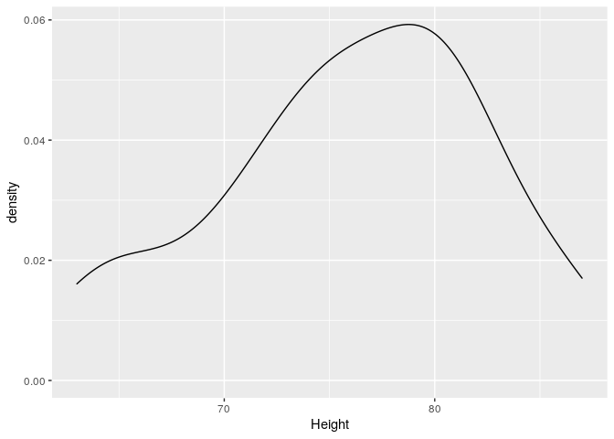
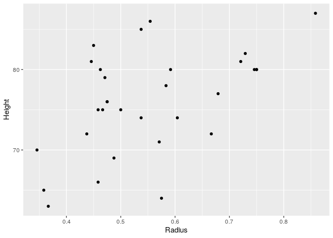
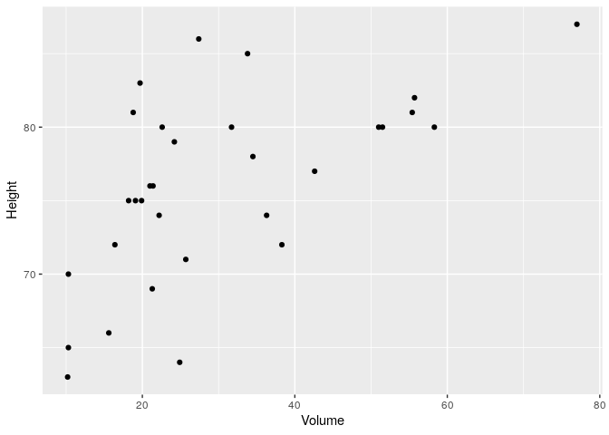
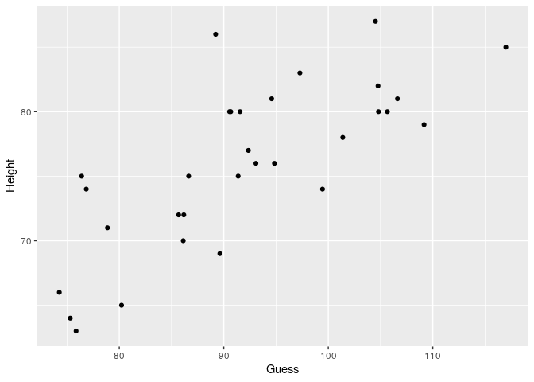
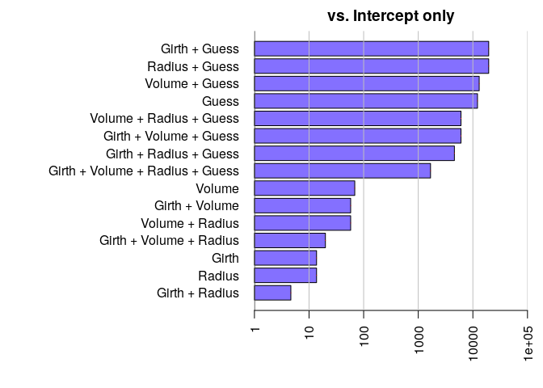
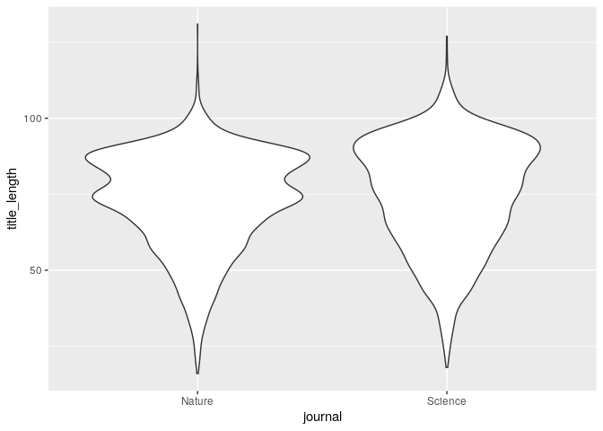
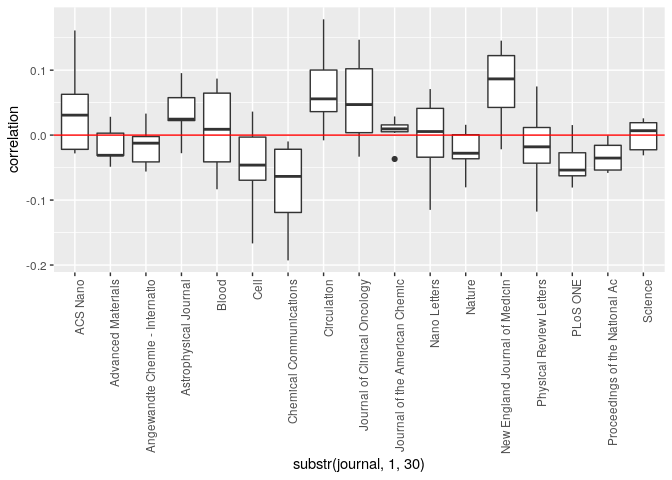
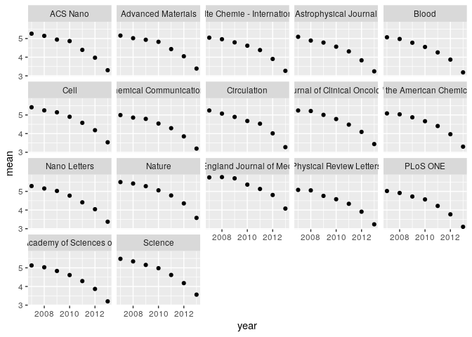
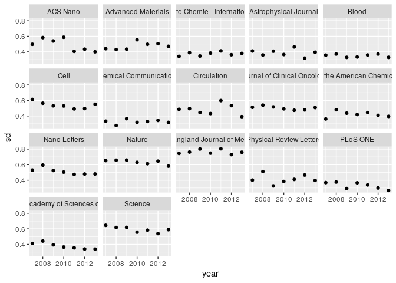

Model Selection
================
**Dmitry Kondrashov & Stefano Allesina**
Fundamentals of Biological Data Analysis – BIOS 26318

> Cchiù longa è a pinsata cchiù grossa è a minchiata
> 
> \[the longer the thought, the bigger the bullshit\]
> 
> — Sicilian proverb

# Goal

For any data you might want to fit, several competing statistical models
seem to do a fairly good job. But which model should you use then?

The goal of model selection is to provide you with a disciplined way to
choose among competing models. While there is no consensus on a single
technique to perform model selection (we will examine some of the
alternative paradigms below), all techniques are inspired by Occam’s
razor: given models of similar explanatory power, choose the simplest.

But what does “simplest” mean? Measuring a model’s “complexity” is far
from trivial, hence the different schools of thought. Some approaches
simply count the number of free parameters, and penalize models with
more parameters; others take into account how much each parameter should
be “fine-tuned” to fit the data; other approaches are based on entirely
different premises.

But why should you choose the simplest model? First, simpler models are
easier to analyze, so that for example you could make analytical headway
into the mechanics of the process you want to model; simpler models are
also considered more beautiful. Second, you want to avoid *overfitting*:
each biological data set—however carefully crafted—is noisy, and you
want to fit the signal, not the noise. If you include too much
flexibility in your model, you will get what looks like an excellent fit
for the specific data set, but you will be unable to fit other data sets
to which your model should also apply.

``` r
library(tidyverse) # our friend 
library(BayesFactor) # Bayesian model selection
```

# Problems

1.  Overfitting can lead to wrong inference. (The problem is similar to
    that of spurious correlations).
2.  Identifiability of parameters. Sometimes it is hard/impossible to
    find the best value for a set of parameters. For example, when
    parameters only appear as sums or products in the model. In general,
    it is difficult to prove that the set of parameters leading to the
    maximum likelihood is unique.
3.  Finding best estimates. For complex models, it might be difficult to
    find the best estimates for a set of parameters. For example,
    several areas of the parameter space could yield a good fit, and the
    good sets of parameters could be separated by areas with poor fit.
    Then, we might get “stuck” in a sub-optimal region of the parameters
    space.

# Approaches based on maximum-likelihoods

We start by examining methods that are based on maximum likelihoods. For
each data set and model, you find the best fitting parameters (those
maximizing the likelihood). The parameters are said to be at their
maximum-likelihood estimate.

## Likelihood function

Some notation:

 the
observed data

 the free parameter(s) of the statistical model

 \\to") the likelihood function, read “the
likelihood of  given the data”

 the maximum-likelihood estimates (m.l.e.) of the
parameters

 = \\log L(\\theta \\vert D) \\to") the
log-likelihood

 \\to") the maximum likelihood

### Discrete probability distributions

The simplest case is that of a probability distribution function that
takes discrete values. Then, the likelihood of

given the data is simply the probability of obtaining the data when
parameterizing the model with parameters
:

  
 = P(X = x_j; \\theta)")  

Finding the m.l.e. of

simply means finding the value(s) maximizing the probability of
recovering the data under the model.

### Continuous probability distributions

The definition is more complex for continuous variables (because  = 0") as there are infinitely many values…). What is
commonly done is to use the *density function* ") and considering the probability of obtaining a value
![x \\in \[x\_j, x\_j +
h\]](https://latex.codecogs.com/png.latex?x%20%5Cin%20%5Bx_j%2C%20x_j%20%2B%20h%5D
"x \\in [x_j, x_j + h]"), where
 is our observed
data point, and  is
small. Then:

  
 = \\lim_{h \\to 0^+} \\frac{1}{h} \\int_{x_j}^{x_j + h} f(x ; \\theta) dx = f(x_j ; \\theta)
")  
Note that, contrary to probabilities, density values can take values
greater than 1. As such, when the dispersion is small, one could end up
with values of likelihood greater than 1 (or positive log-likelihoods).
In fact, the likelihood function is proportional to but not necessarily
equal to the probability of generating the data given the parameters:
 \\propto P(X; \\theta)").

In many cases, maximizing the likelihood is equivalent to minimizing the
sum of square errors (residuals).

## Likelihoods for linear regression

As you remember, we have considered the normal equations:

  
  
Where the residuals have variance
. The likelihood of the parameters is simply the product of
the likelihood for each point:

  
 = \\prod_i L(\\beta_0, \\beta_1, \\sigma^2 \\vert Y_i) = \\prod_i f(Y_i; \\beta_0, \\beta_1, \\sigma^2) = 
\\prod_i \\frac{1}{\\sqrt{2 \\pi \\sigma^2}} \\exp\\left(-\\frac{(Y_i - \\beta_0 + \\beta_1 X_i)^2}{2 \\sigma^2}\\right)
")  
We want to choose the parameters such that they maximize the likelihood.
Because the logarithm is monotonic then maximizing the likelihood is
equivalent to maximizing the log-likelihood:

  
 = -\\log\\left(\\sqrt{2 \\pi \\sigma^2}\\right) -\\frac{1}{{2 \\sigma^2}} \\sum_i {(Y_i - \\beta_0 + \\beta_1 X_i)^2}
")  
Showing that by minimizing the sum of squares, we are maximizing the
likelihood.

## Likelihood-ratio tests

These approaches contrast two models by taking the ratio of the maximum
likelihoods of the sample data based on the models (i.e., when you
evaluate the likelihood by setting the parameters to their m.l.e.). The
two models are usually termed the *null* model (i.e., the “simpler”
model), and the *alternative* model. The ratio of 
tells us how many times more likely the data are under the alternative
model vs. the null model. We want to determine whether this ratio is
large enough to reject the null model and favor the alternative.

Likelihood-ratio is especially easy to perform for *nested* models.

#### Two nested models

*Nested* means that model  has parameters
, and model  has parameters
, such that  — by setting some of the parameters of
 to particular values, we recover .

For example, suppose we want to model the height of trees. We measure
the response variable (height of tree
,
) as well as the
girth (). We
actually have a data set that ships with `R` that contains exactly this
type of data:

``` r
data(trees)
head(trees)
```

    #   Girth Height Volume
    # 1   8.3     70   10.3
    # 2   8.6     65   10.3
    # 3   8.8     63   10.2
    # 4  10.5     72   16.4
    # 5  10.7     81   18.8
    # 6  10.8     83   19.7

The `Height` of these cherry trees is measured in feet; the `Girth` is
the diameter in inches, and the `Volume` is the measuring the amount of
timber in cubic feet. Let’s add a `Radius` measured in
feet:

``` r
trees$Radius <- trees$Girth / (2 * 12) # diameter to radius; inches to feet
```

Let’s look at the distribution of three
heights:

``` r
trees %>% ggplot(aes(x = Height)) + geom_density()
```



A possible simple model is one that says that all tree heights have
heights taken from a Gaussian distribution with a given mean. In the
context of linear regression, we can write the model :

  
  
where we assume that the errors ").
Now fit the model, obtaining
, and compute the maximum log-likelihood ").

In `R`, we would call:

``` r
M0 <- lm(data = trees, Height ~ 1) # only intercept
# the m.l.e. of theta_0
theta0_M0 <- M0$coefficients[1]
theta0_M0
# log likelihood
logLik(M0)
```

    # (Intercept) 
    #          76 
    # 'log Lik.' -100.8873 (df=2)

Now let’s plot the height of the trees vs. their radius:

``` r
trees %>% ggplot(aes(x = Radius, y = Height)) + 
  geom_point()
```



And compute their correlation:

``` r
cor(trees$Radius, trees$Height)
```

    # [1] 0.5192801

Given the positive correlation between radius and height, we can build a
more complex model in which the height also depends on radius
():

  
  
as for model , fit the parameters (note that
 for model  will in general be different from
 for model ), and compute ").
These two models are nested, because when setting  we recover .

In `R`:

``` r
M1 <- lm(data = trees, Height ~ Radius) # intercept and slope
theta0_M1 <- M1$coefficients[1]
theta1_M1 <- M1$coefficients[2]
# theta_0 takes a different value:
print(c(theta0_M0, theta0_M1))
# the log likelihood should improve
logLik(M1)
```

    # (Intercept) (Intercept) 
    #    76.00000    62.03131 
    # 'log Lik.' -96.01663 (df=3)

Which model should we use? You can see that adding an extra parameter
improved the likelihood somewhat.

Enter the likelihood-ratio test. We want to know whether it’s worth
using the more complex model, and to do this we need to calculate a
likelihood-ratio statistics. We’re helped by *Wilks’ theorem*: as the
sample size , the test statistics ") is asymptotically

distributed with degrees of freedom equal to the difference in the
number of parameters between  and .

While there are many caveats \[1\] this method is commonly used in
practice.

``` r
# 2 * log-likelihood ratio
lrt <- as.numeric(2 * (logLik(M1) - logLik(M0)))
print("2 log(L1 / L0)")
print(lrt)

# difference in parameters
df0 <- length(M0$coefficients)
df1 <- length(M1$coefficients)
k <- df1 - df0
print("Number of extra parameters")
print(k)

# calculate (approximate) p-value
res <- pchisq(lrt, k, lower.tail = FALSE)
print(paste("p-value using Chi^2 with", k, "degrees of freedom"))
print(round(res, 4))
```

    # [1] "2 log(L1 / L0)"
    # [1] 9.74125
    # [1] "Number of extra parameters"
    # [1] 1
    # [1] "p-value using Chi^2 with 1 degrees of freedom"
    # [1] 0.0018

In this case, the likelihood-ratio test would favor the use of the more
complex model.

  - **Pros**: Straightforward; well-studied for nested models.
  - **Cons**: Difficult to generalize to more complex cases.

#### Adding more models

The data also contains a column with the volume. Let’s take a
look:

``` r
trees %>% ggplot() + aes(x = Volume, y = Height) + geom_point()
```



And look at the correlation

``` r
cor(trees$Volume, trees$Height)
```

    # [1] 0.5982497

We can build another model:

``` r
M2 <- lm(data = trees, Height ~ Volume) # intercept and slope
```

Compute the log likelihood:

``` r
logLik(M2)
```

    # 'log Lik.' -94.02052 (df=3)

and test whether that’s better than the (nested) model 0:

``` r
# 2 * log-likelihood ratio
lrt <- as.numeric(2 * (logLik(M2) - logLik(M0)))
print("2 log(L2 / L0)")
print(lrt)

# difference in parameters
df0 <- length(M0$coefficients)
df1 <- length(M2$coefficients)
k <- df1 - df0
print("Number of extra parameters")
print(k)

# calculate (approximate) p-value
res <- pchisq(lrt, k, lower.tail = FALSE)
print(paste("p-value using Chi^2 with", k, "degrees of freedom"))
print(round(res, 4))
```

    # [1] "2 log(L2 / L0)"
    # [1] 13.73348
    # [1] "Number of extra parameters"
    # [1] 1
    # [1] "p-value using Chi^2 with 1 degrees of freedom"
    # [1] 2e-04

Also in this case, the likelihood-ratio test would favor the use of the
more complex model. But how can we contrast the two more complex models
 and ? They are not nested\!

In fact, we can even concoct another model that uses a mix of radius and
volume. If we assume that trees are cylinders, then we have , and as such "). We can test whether this is a good approximation
by creating a new
variable:

``` r
trees$Guess <- trees$Volume / trees$Radius^2 # (we can omit \pi)
```

``` r
trees %>% ggplot() + aes(x = Guess, y = Height) + geom_point()
```



``` r
cor(trees$Guess, trees$Height)
```

    # [1] 0.7537768

Pretty good\! Let’s add it to our list of models:

``` r
M3 <- lm(Height ~ Guess, data = trees)
logLik(M3)
```

    # 'log Lik.' -87.87121 (df=3)

## AIC

Of course, in most cases the models that we want to contrast need not to
be nested. Then, we can try to penalize models according to the number
of free parameters, such that more complex models (those with many free
parameters) should be associated with much better likelihoods to be
favored.

In the early 1970s, Hirotugu Akaike proposed “an information criterion”
(AIC, now known as Akaike’s Information Criterion), based, as the name
implies, on information theory. Basically, AIC is measuring
(asymptotically) the information loss when using the model in lieu of
the actual data. Philosophically, it is rooted in the idea that there is
a “true model” that generated the data, and that several possible models
can serve as its approximation. Practically, it is very easy to compute:

  
 + 2 k")  

where  is the number of
free parameters (e.g., 3 for the simplest linear regression \[intercept,
slope, variance of the residuals\]). In `R`, many models provide a way
to access their AIC score:

``` r
AIC(M0) # only intercept
AIC(M1) # use radius
AIC(M2) # use volume
AIC(M3) # use cylinder
```

    # [1] 205.7745
    # [1] 198.0333
    # [1] 194.041
    # [1] 181.7424

You can see that AIC favors the cylinder model over the others.
Typically, a difference of about 2 is considered “significant”, though
of course this really depends on the size of the data, the values of
AIC, etc.

  - **Pros**: Easy to calculate; very popular.
  - **Cons**: Sometimes it is difficult to “count” parameters; why
    should each parameter cost the same, when they have different
    effects on the likelihood?

## Other information-based criteria

The approach spearheaded by Akaike has been followed by a number of
researchers, giving rise to many similar criteria for model selection.
Without getting too much into the details, here are a few pointers:

  - Bayesian Information Criterion  + k \\log(n)") where
     is the number of
    data points. Penalizes parameters more strongly when there are much
    data.
  - Hannan–Quinn information criterion  + k \\log(\\log(n))")

## Bayesian approaches to model selection

The approaches we’ve examined before are based on “point-estimates”,
i.e., only consider the parameters at their maximum likelihood estimate.
Bayesian approaches, on the other hand, consider distributions of
parameters. As such, parameters that give high likelihoods for a
restricted range of values are deemed “more expensive” (because they are
“more important” or need to be “fine-tuned”) than those yielding about
the same likelihood for a wide range of values.

### Marginal likelihoods

A very beautiful approach is based on marginal likelihoods, i.e.,
likelihoods obtained integrating the parameters out. Unfortunately, the
calculation becomes difficult to perform by hand for complex models, but
it provides a good approach for simple models. In general, we want to
assess the “goodness” of a model. Then, using Bayes’ rule:

  
 = \\frac{P(D\\vert M) P(M)}{P(D)}
")  

Where ") is the probability of the model given the data; and
") is the
“probability of the data” (don’t worry, this need not to be
calculated), and ") is the prior (the probability that we choose the model before
seeing the data). ") is a marginal likelihood: we cannot compute this
directly, because the model requires the parameters
,
however, we can write

  
 = \\int P(D\\vert M,\\theta)P(\\theta\\vert M) d\\theta
")  

where ") is the likelihood, and ") is a distribution over the parameter values
(typically, the priors).

For example, let’s compute the marginal likelihood for the case in which
we flip a coin  times, and we obtain
 heads and
 tails. Call
 the
probability of obtaining a head, and suppose that ") is a uniform distribution. Then:

  
 = \\int_0^1 P(a,b\\vert M,\\theta) d\\theta = \\int_0^1 \\binom{a+b}{a} \\theta^{a} (1-\\theta)^{b} d\\theta  = \\frac{1}{a+b+1} = \\frac{1}{n+1}
")  

Interestingly, the marginal likelihood can be interpreted as the
expected likelihood when parameters are sampled from the prior.

### Bayes factors

Take two models, and assume that initially we have no preference
 = P(M_2)"), then:

  
}{P(M_2\\vert D)} = \\frac{P(D\\vert M_1)P(M_1)}{P(D\\vert M_2)P(M_2)} = \\frac{P(D\\vert M_1)}{P(D\\vert M_2)}
")  

The ratio is called the “Bayes factor” and provides a rigorous way to
perform model selection.

### Bayes factors in practice

In practice, Bayes Factors can be estimated from MCMC. While we’re not
going to get into this here, we can use a package that a) automatically
sets the priors for all the variables (close to the philosophy known as
“Objective Bayes”); b) performs the calculation of the Bayes Factors
for us.

Let’s build very many models. Load the data:

``` r
data(trees)
head(trees)
trees$Radius <- trees$Girth / (2 * 12)
trees$Guess <- trees$Volume / trees$Radius^2
```

    #   Girth Height Volume
    # 1   8.3     70   10.3
    # 2   8.6     65   10.3
    # 3   8.8     63   10.2
    # 4  10.5     72   16.4
    # 5  10.7     81   18.8
    # 6  10.8     83   19.7

And build the
models:

``` r
lm_all <- lm(Height ~ ., data = trees) # . means use all cols besides Height
summary(lm_all)
logLik(lm_all)
```

    # 
    # Call:
    # lm(formula = Height ~ ., data = trees)
    # 
    # Residuals:
    #     Min      1Q  Median      3Q     Max 
    # -6.7669 -2.4752 -0.2354  1.9335 10.5319 
    # 
    # Coefficients: (1 not defined because of singularities)
    #             Estimate Std. Error t value Pr(>|t|)    
    # (Intercept)  22.6671    16.2947   1.391 0.175562    
    # Girth         1.5127     1.2278   1.232 0.228543    
    # Volume       -0.2045     0.2572  -0.795 0.433505    
    # Radius            NA         NA      NA       NA    
    # Guess         0.4291     0.1034   4.152 0.000296 ***
    # ---
    # Signif. codes:  0 '***' 0.001 '**' 0.01 '*' 0.05 '.' 0.1 ' ' 1
    # 
    # Residual standard error: 4.023 on 27 degrees of freedom
    # Multiple R-squared:  0.6413,  Adjusted R-squared:  0.6014 
    # F-statistic: 16.09 on 3 and 27 DF,  p-value: 3.391e-06
    # 
    # 'log Lik.' -84.99667 (df=5)

Perform selection among all models nested into `lm_all`:

``` r
bf_analysis <- regressionBF(Height ~ ., data = trees)
plot(bf_analysis)
```



These ratios measure how many times more probable the model is compared
to that with only the intercept (assuming initially that all models are
equiprobable). Note that the Bayes Factors automatically penalize for
overly complex models (triplets/quadruplets are ranked after pairs or
even only `Guess`).

  - **Pros**: Elegant, straigthforward interpretation.
  - **Cons**: Difficult to compute for complex models; requires priors.

# Other approaches

## Minimum description length

Another completely different way to perform model selection is based on
the idea on “Minimum Description Length”, where models are seen as a way
to “compress” the data, and the model leading to the strongest
compression should be favored. While we do not cover it here, you can
read about it in [this
paper](https://www.tandfonline.com/doi/abs/10.1198/016214501753168398).

## Cross validation

One very robust method to perform model selection, often used in machine
learning, is cross-validation. The idea is simple: split the data in
three parts: a small data set for exploring; a large set for fitting; a
small set for testing (for example, 5%, 75%, 20%). You can use the first
data set to explore freely and get inspired for a good model. These data
are then discarded. You use the largest data set for accurately fitting
your model(s). Finally, you validate your model or select over competing
models using the last data set.

Because you haven’t used the test data for fitting, this should
dramatically reduce the risk of overfitting. The downside of this is
that we’re wasting precious data. There are less expensive methods for
cross validation, but if you have much data, or data is cheap, then this
has the virtue of being fairly robust.

### Exercise: Do shorter titles lead to more citations?

To test the power of cross-validation, we are going to examine a bold
claim by Letchford *et al.*, 2015: that papers with shorter titles
attract more citations than those with longer titles. We are going to
use their original data:

> Letchford A, Moat HS, Preis T (2015) [The advantage of short paper
> titles](https://doi.org/10.1098/rsos.150266). Royal Society Open
> Science 2(8): 150266.

``` r
# original URL
# https://datadryad.org/stash/dataset/doi:10.5061/dryad.hg3j0
dt <- read_csv("data/LMP2015.csv")
```

The data set reports information on the top 20000 articles for each year
from 2007 to 2013. The Author’s claim is that shorter titles lead to
more
citations:

``` r
dt %>% group_by(year) %>% summarise(correlation = cor(title_length, cites, method = "kendall"))
```

    # # A tibble: 7 x 2
    #    year correlation
    #   <dbl>       <dbl>
    # 1  2007     -0.0535
    # 2  2008     -0.0687
    # 3  2009     -0.0560
    # 4  2010     -0.0655
    # 5  2011     -0.0525
    # 6  2012     -0.0528
    # 7  2013     -0.0451

As you can see, title length is anti-correlated (using rank correlation)
with the number of citations.

There are several problems with this claim: - The authors selected
papers based on their citations. As such their claim would need to be
stated as “among top-cited papers there is a correlation”. - The
journals cover a wide array of disciplines. The title length could
reflect different publishing cultures. - Most importantly, different
journals have different requirements for title lengths. For example,
Nature requires titles to be less than 90 characters:

``` r
dt%>% filter(journal %in% c("Nature", "Science")) %>% 
  ggplot() + aes(x = journal, y = title_length) + geom_violin()
```



But then, is the effect the Authors are reporting only due to the fact
that high-profile journals mandate short titles? Let’s see whether their
claims hold water when considering specific journals:

``` r
# only consider journals with more than 1000 papers in the data set
dt <- dt %>% group_by(journal) %>% mutate(num_papers = n())
dt <- dt %>% filter(num_papers > 1000)
dt %>% group_by(year, journal) %>% 
summarise(correlation = cor(title_length, cites, method = "kendall")) %>% 
ggplot() + aes(x = substr(journal, 1, 30), y = correlation) + geom_boxplot() + 
geom_hline(yintercept = 0, colour = "red") +
theme(axis.text.x = element_text(angle = 90, hjust = 1)) # rotate labels x axis
```



It seems that in medical journals (Blood, Circulation, J Clin Oncology,
NEJM) longer titles fare better than shorter ones. In Nature and PNAS we
see a negative correlation, while Science gives no clear trend.

Let’s look at the mean and standard deviation of citations by
journal/year

``` r
dt %>% group_by(journal, year) %>% summarize(mean = mean(log(cites + 1)), sd = sd(log(cites + 1))) %>% 
  ggplot() + aes(x = year, y = mean) + geom_point() + facet_wrap(~journal)
```



``` r
dt %>% group_by(journal, year) %>% summarize(mean = mean(log(cites + 1)), sd = sd(log(cites + 1))) %>% 
  ggplot() + aes(x = year, y = sd) + geom_point() + facet_wrap(~journal)
```



#### Two models

Let’s consider two competing models.

Model1: each journal year has its mean

 \\sim \\text{journal}:\\text{year}")

Model2: the length of titles influences citations

 \\sim \\text{journal}:\\text{year} + \\text{title-length}")

We are going to fit the model using 90% of the data; we are going to use
the remaining data for cross-validation.

``` r
set.seed(4)
dt <- dt %>% mutate(logcit = log(cites + 1))
# sample 10% of the data
data_test <- dt %>% sample_frac(0.1)
data_fit  <- anti_join(dt, data_test) # get all those not in data_test
```

Now fit the models:

``` r
M1 <- lm(logcit ~ factor(year)*journal, data = data_fit)
M2 <- lm(logcit ~ factor(year)*journal + title_length, data = data_fit)
```

Now let’s try to predict out-of-fit the data that we haven’t used:

``` r
M1_predictions <- predict(M1, newdata = data_test)
SSQ_M1 <- sum((log(data_test$cites + 1) - M1_predictions)^2)
M2_predictions <- predict(M2, newdata = data_test)
SSQ_M2 <- sum((log(data_test$cites + 1) - M2_predictions)^2)
print(SSQ_M1)
print(SSQ_M2)
```

    # [1] 811.0519
    # [1] 811.0348

We do not gain anything by including the information on titles.

  - **Pros**: Easy to use; quite general; asymptotically equivalent to
    AIC.
  - **Cons**: Sensitive to how the data was split (you can average over
    multiple partitions); need much data (instability in parameter
    estimates due to “data loss”)

<!-- end list -->

1.  see Pinheiro, José C.; Bates, Douglas M. (2000), Mixed-Effects
    Models in S and S-PLUS, Springer-Verlag, pp. 82–93
