Multidimensional Scaling and Clustering
================
**Dmitry Kondrashov & Stefano Allesina**
Fundamentals of Biological Data Analysis – BIOS 26318

# Goal

Introduce Multidimensional Scaling (MDS). Given a set of “distances”
between samples, MDS attempts to arrange the samples in a
-dimensional space, such
that distances are preserved. In practice, MDS is not picky on the
notion of a distance (i.e., needs not to be a metric).

Introduce the notion of clustering, and show how a simple clustering
algorithm (k-means) work.

Let’s import some libraries:

``` r
library(reshape2) # more data massaging
library(tidyverse) # our friend the tidyverse
library(vegan) # for procrustes analysis
```

# Multidimensional Scaling (MDS)

## Mathematical approach

The input is the matrix of dissimilarities
, potentially
representing distances "). A distance function is “metric” if:

  -  \\geq 0") (non-negativity)
  -  = 0") only if  (identity)
  -  = d(x_j, x_i)") (symmetry)
  -  \\leq d(x_i, x_j) + d(x_j, x_k)") (triangle inequality)

Given a set of dissimilarities, we can therefore ask whether they are
distances, and particularly whether they represent Euclidean distances.

## Goal of MDS

Given the 
matrix , find a set of
coordinates , such that  (as close as possible).
The operator  is the Euclidean norm, measuring Euclidean
distance.

As such, if we can find a perfect solution, then the dissimilarities can
be mapped into Euclidean distances in a
-dimensional space.

## Classic MDS

Suppose that the elements of  measure Euclidean distances between
 points, each of which
has  coordinates:

  
  
We consider the centered coordinates:

  
  
And the matrix , whose coefficients are . We can write the square of the
distance between point 
and  as:

  
^2  = \\sum_k x_{ik}^2 + \\sum_k x_{jk}^2 -2 \\sum_k x_{ik} x_{jk} = B_{ii} + B_{jj} - 2 B_{ij}")  

Note that, because of the centering:

  
  

Now we compute:

  
 = \\sum_i B_{ii} + \\sum_i B_{jj} - 2 \\sum_i B_{ij} = \\text{Tr}(B) + n B_{jj} 
")  

Similarly (distances are symmetric):

  
 + n B_{ii} 
")  
And, finally:

  

")  

From these three equations, we obtain:

  
  
and

  
  

Therefore:

  
 = -\\frac{1}{2}\\left(d_{ij}^2 - \\frac{\\sum_i d_{ij}^2}{n} - \\frac{\\sum_j d_{ij}^2}{n}  + \\frac{\\sum_i \\sum_j d_{ij}^2 }{n^2} \\right)
")  

With some algebra, one can show that this is equivalent to:

  
} C")  

Where }") is the matrix of squared distances, and
 is the centering matrix
 (and  is
the matrix of all ones). Thus, we can obtain
 directly from the
distance matrix. Once we’ve done this,
 can be found by taking
the eigenvalue decomposition:

  
  

(where  is the matrix of
eigenvectors of , and
 a
diagonal matrix of the eigenvalues of
). Therefore:

  
  

## Reconstructing the map of Chicago

To test MDS, I have built a matrix expressing the distances between the
604 Divvy bikes station in Chicago.

The distances are measured in degrees of latitude/longitude. We
introduce some noise to see how robust our estimate is.

``` r
# load distance matrix 
load("data/divvy_stations_distances.RData")
# add some noise to make it more fun
# we change each distance of +/- 20%
n <- nrow(distance_matrix)
distance_matrix <- distance_matrix * 
  matrix(runif(n * n, min = 0.8, max = 1.2), n, n)
# plot distances
distance_matrix %>% reshape2::melt() %>% 
  ggplot(aes(x = Var1, y = Var2, fill = value)) + geom_tile()
```

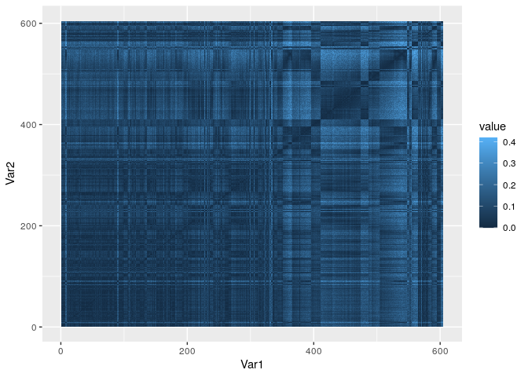

Now we perform classical MDS, and plot the coordinates we’ve recovered:

``` r
# classical MDS
mds_fit <- cmdscale(distance_matrix, k = 2) # k is the dimension of the embedding
mds_fit <- tibble(id = rownames(distance_matrix), 
                  longitude = mds_fit[,1], latitude = mds_fit[,2])
mds_fit %>% ggplot() + aes(x = latitude, y = longitude) + geom_point()
```

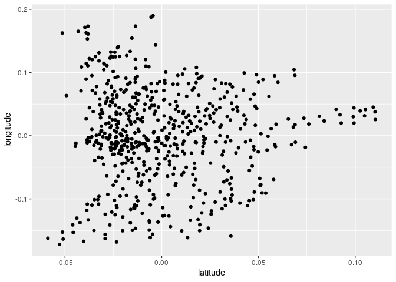

And now let’s do it the “hard way”:

``` r
D2 <- distance_matrix^2
CM <- diag(rep(1, n)) - 1 / n
B <- -(1/2) * CM %*% D2 %*% CM
eB <- eigen(B)
mds_hard <- Re(eB$vectors) %*% diag(sqrt(Re(abs(eB$values))))
ggplot(data = tibble(latitude = mds_hard[,2], longitude = mds_hard[,1])) +  
  aes(x = latitude, y = longitude) + 
  geom_point()
```

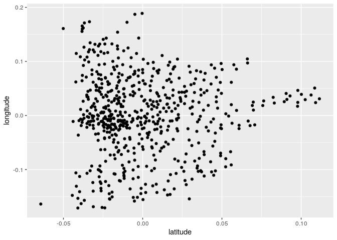

As we were saying, distances are invariant to rotation, translation and
reflection. As such, the coordinates can be rotated and centered
arbitrarily. To find the best matching rotation, we use [procrustes
analysis](https://en.wikipedia.org/wiki/Procrustes_analysis):

``` r
# this is the true location of the stations
actual_locations <- read_csv("data/divvy_stations.csv")
# aligning coordinates using Procrustes rotation and centering
procr <- procrustes(actual_locations %>% 
                      select(latitude, longitude),
                    mds_fit %>% 
                      select(latitude, longitude), 
                    scale = FALSE)
new_coord <- t(t(as.matrix(mds_fit %>% 
                             select(latitude, longitude)) %*% procr$rotation) + procr$translation[1,])
ggplot(actual_locations) + aes(x = longitude, y = latitude) + geom_point() + 
  geom_point(aes(x = new_coord[,2], y = new_coord[,1]), colour = "red", shape = 1)
```

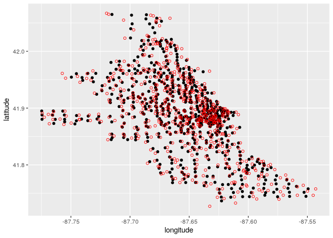

You can see that we’ve been doing really well. The largest discrepancies
are around the borders, where we have less information. To show how much
should we shift the points to recover the actual data, you can
use

``` r
plot(procr)
```

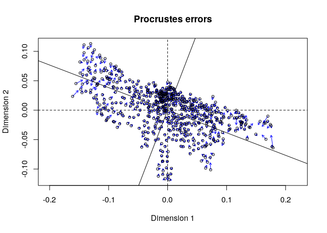

# Clustering

## Goal of clustering

Given a set of 
observations, divide them into
 disjoint sets  such that observations in the same
set are “similar” to each other and “differ” from observations in other
sets. The notion of similarity is context-dependent. Clustering (or
classification) is a very active area of research, with hundreds of
algorithms and techniques developed for different problems.

## K-means

This is a simple technique to cluster
 observations into
 clusters. The number of
clusters  has to be
specified. The input is a dimensional vector "), where , and a number of clusters
. We want to assign each
vector 
to one of  sets
, so that the
vectors (points in ) are closest to each other. Mathematically, we want to
find the assignments to sets such that the variance within each set is
minimized:

  
  
where  is the vector of the means of points in set
 (one mean for each
dimension). Equivalently:

  

")  

where  is the size of set
 and ") is the variance of the coordinates in set
.

It can be proved that this problem is in general NP-hard (i.e., finding
the best solution requires a number of operations that scales
non-polynomially with the size of the data). Fortunately, there are good
heuristics, and several `R` packages that implement different
algorithms.

The simplest algorithm starts by choosing at random (or more smartly)
 observations to serve
as initial “means” of the clusters; then:

1.  Each point is assigned to the cluster with the closest mean
2.  Means are re-computed
3.  Go back to 1 until the algorithm has converged (i.e., membership has
    not changed)

Note that the quality of the solution depends on which points are used
to intialize the means; as such, if these are chosen at random, the
algorithm will possibly converge to different solutions when different
initial conditions are chosen.

## Example

We are going to use a simple 2-d synthetic data set taken from
[here](http://cs.joensuu.fi/sipu/datasets/)

``` r
dt <- read_delim("data/s1.txt", 
                 col_names = c("x", "y"), 
                 delim = " ", 
                 trim_ws = TRUE)
ggplot(dt) + aes(x = x, y = y) + geom_point()
```

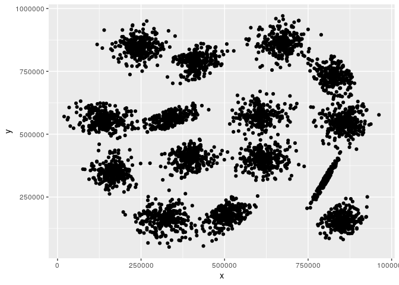

There are 15 clusters in the data. Now we’re going to try to detect them
using k-means

``` r
# with three clusters
cl <- as.factor(kmeans(dt, centers = 3)$cluster)
ggplot(dt %>% add_column(cl = cl)) + 
  aes(x = x, y = y, colour = cl) + 
  geom_point()
```

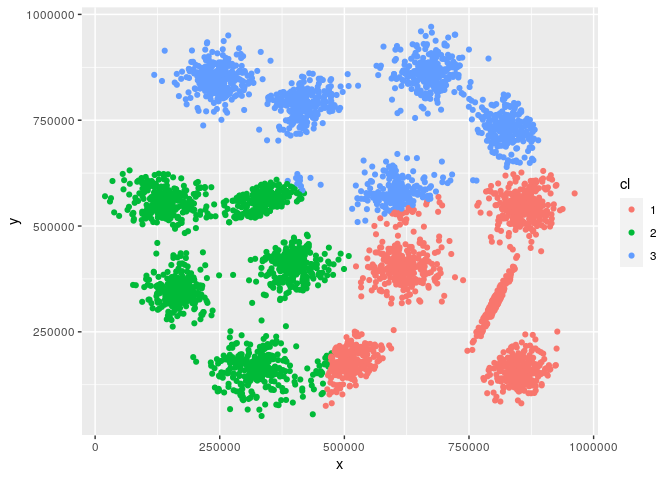

And now with 15 clusters

``` r
# with three clusters
set.seed(1) #set a random starting point
cl <- as.factor(kmeans(dt, centers = 15)$cluster)
ggplot(dt %>% add_column(cl = cl)) + 
  aes(x = x, y = y, colour = cl) + 
  geom_point()
```

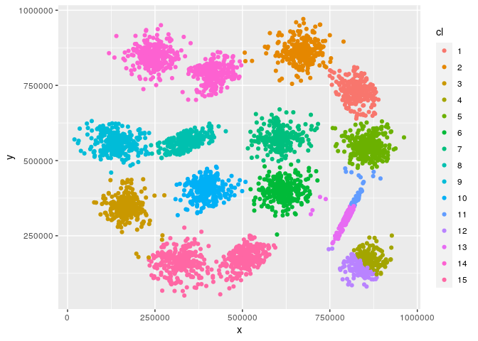

**Exercise:** Now try again but choosing a different seed: do you get
the same result? Write code that repeats the same analysis several times
and takes the best result (note that `kmeans(...)$tot.withinss` is the
total sum of squares within the clusters—i.e., the quantity you want to
minimize).

### Exercise: PCA sommelier

The file `Wine.csv` contains several measures made on 178 wines from
Piedmont, produced using three different grapes (column `Grape`, with 1
= Barolo, 2 = Grignolino, 3 = Barbera). Use the 13 measured variables
(i.e., all but `Grape`) to perform a PCA, and use k-means to cluster the
data in PC space. Can you recover the right classification of grapes?

``` r
dt <- read_csv("data/Wine.csv")
# make into a matrix for PCA
mat <- dt %>% select(-Grape) %>% as.matrix()
# perform PCA by scaling and centering all 13 variables
pca <- prcomp(mat, center = TRUE, scale. = TRUE)
# pca$x contains the coordinates
# let's see how are we doing
ggplot(cbind(dt, as_tibble(pca$x))) + 
  aes(x = PC1, y = PC2, colour = factor(Grape)) + 
  geom_point()
```

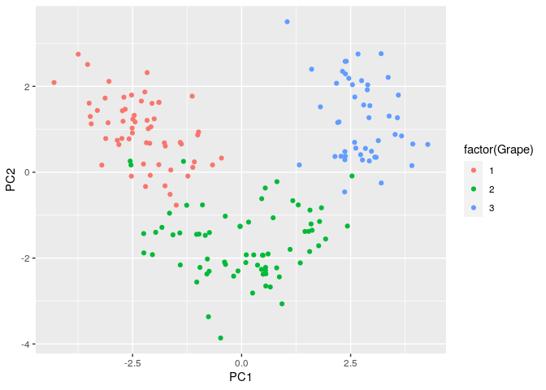

Now let’s apply k-means to divide the data into three clusters

``` r
cl <- kmeans(pca$x, centers = 3)
ggplot(dt %>% add_column(cluster = cl$cluster)) + 
  aes(x = Grape, y = cluster, colour = factor(Grape)) + 
  geom_jitter()
```

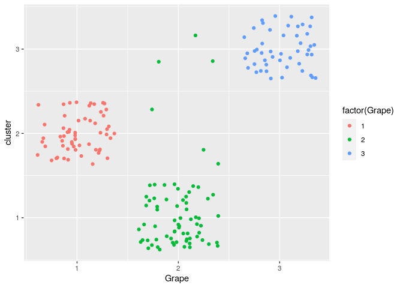

You can see that we correctly classify all the wines for grapes 1 and 3,
while some of the ones from grape 2 are misclassified.

``` r
# find convex hull for each cluster
# i.e. minimal convex polygon containing all points
hull <- pca$x %>% as_tibble() %>% 
  select(PC1, PC2) %>% 
  add_column(cluster = cl$cluster) %>% 
  group_by(cluster) %>% 
  slice(chull(PC1, PC2))

# plot the convex hulls
pl <- hull %>% ggplot(aes(x = PC1, y = PC2, group = cluster, fill = factor(cluster))) + geom_polygon(alpha = 0.5)
  
show(pl)
```

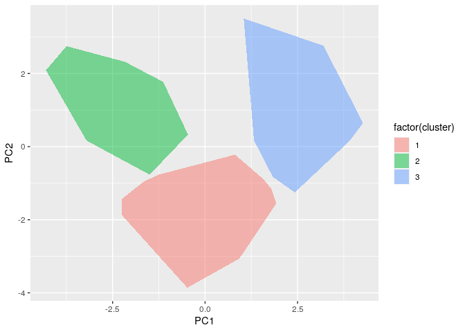

``` r
# now add the points
pl + geom_point(data = pca$x %>% as_tibble() %>% 
         select(PC1, PC2) %>% 
         add_column(Grape = dt$Grape, cluster = cl$cluster), 
  aes(x = PC1, y = PC2, colour = factor(Grape), shape = factor(Grape)))
```

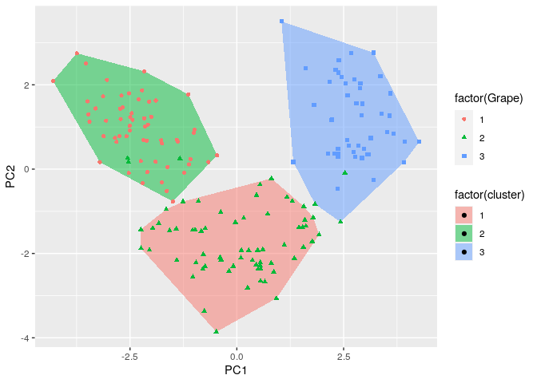

You can see that we are misclassifying the grapes that are at the border
of the cluster or nestled among the points belonging to a different
grape. But the outcome is quite good: we would have misclassified only 6
wines out of 178 (3.3%).
