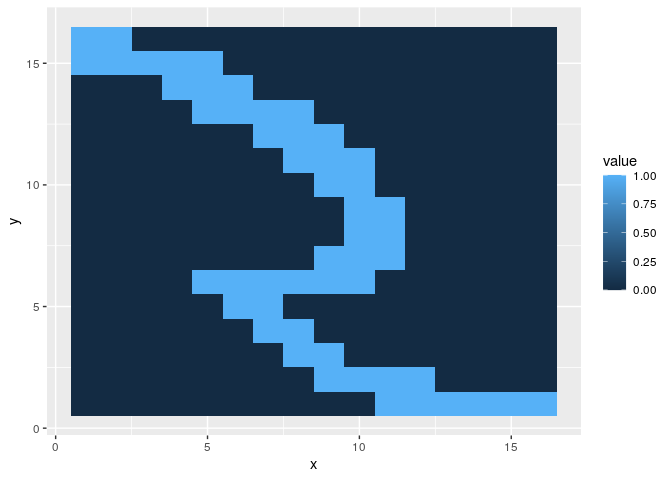

Principal component analysis
================
**Dmitry Kondrashov & Stefano Allesina**
Fundamentals of Biological Data Analysis – BIOS 26318

# Goal

Introduce Principal Component Analysis (PCA), one of the most popular
techniques to perform “dimensionality reduction” of complex data sets.
If we see the data as being points in a high-dimensional space, we can
project the data in a new sets of coordinates such that the first
coordinate has captures the largest share of the variance in the data,
the second coordinates captures the largest share of the remaining
variance and so on. In this way, we can project large-dimensional data
sets onto low-dimensional spaces and lose the least information about
the data.

Let’s import some libraries:

``` r
library(reshape2) # more data massaging
library(tidyverse) # our friend the tidyverse
library(ggfortify) # PCA plots
```

## Intuition

Let’s build some synthetic data by sampling points that are correlated:

``` r
# sample from multivariate normal distribution
my_points <- MASS::mvrnorm(n = 500,
                           mu = c(0, 0),
                           Sigma = matrix(c(1, 0.95, 0.95, 1),2,2))
colnames(my_points) <- c("x", "y")
Xtb <- as_tibble(my_points)
ggplot(Xtb) + aes(x = x, y = y) + geom_point() + coord_equal()
```


Now let’s plot the distribution of the coordinates
 and
 for the points:

``` r
ggplot(Xtb) + aes(x = x) + 
  geom_histogram(fill = "red", alpha = 0.2) + 
  geom_histogram(aes(x = y), fill = "blue", alpha = 0.2)
```


As you can see, the distributions are very similar: to guess the
location of a point, we need to know both
 and
 with high precision.

The scatterplot however shows that the
 and
 are highly correlated.
What if we try to define a new
 and
 so that the first axis
cuts the cloud of points in two, and the second is orthogonal to it?
Because the cloud of points is divided in two by the 1:1 line, let’s try
to rotate all the points of 45 degrees to the right. To rotate points in
a two dimensional space, you can multiply the coordinates by a rotation
matrix of form:

  
 & -\\sin(\\theta) \\\\
\\sin(\\theta) & \\cos(\\theta)
\\end{bmatrix}
")  
To rotate of 45 degrees to the right, choose , leading to:

  
  

``` r
# rotation matrix
P <- matrix(c(1,1,-1,1), 2, 2) / sqrt(2)
my_points2 <- my_points %*% P
colnames(my_points2) <- c("x_new", "y_new")
# now plot
Ytb <- as_tibble(my_points2)
ggplot(Ytb) + aes(x = x_new, y = y_new) + geom_point()+ coord_equal()
```


``` r
# and look at the marginal distributions
ggplot(Ytb) + aes(x = x_new) + 
  geom_histogram(fill = "red", alpha = 0.2) + 
  geom_histogram(aes(x = y_new), fill = "blue", alpha = 0.2)
```


Now, knowing only (the new) coordinate
 is sufficient to
determine the location of a point with high precision (just assume ). In
other words, our data are close to being one-dimensional.

Mathematically what we have done is casting the original data into a new
basis. We can see the change of basis as a matrix transforming the
original data matrix 
into a new data matrix :

  
  
The goal of PCA is to find the “best” matrix
 that we can use to
represent our multidimensional data set. The logic is the same applied
above: we want to choose the first vector in the basis so that it is
aligned with the direction in which the data vary the most, the second
vector to be orthogonal to the first, and oriented in the direction
where the residuals vary the most, and so on.

## PCA as eigendecomposition

We want to express how the columns of
 are co-varying.
Whenever each column of 
has mean zero, we can write the covariance matrix as :

``` r
X <- as.matrix(Xtb) # need to be a matrix, not a tibble
n <- nrow(X)
# covariance matrix using matrix multiplication 
# (only when mean of each column is zero)
(t(X) %*% X) / (n-1)
# alternatively (this subtracts the means first)
cov(X)
```

    #           x         y
    # x 0.9851063 0.9381220
    # y 0.9381220 0.9930518
    #           x         y
    # x 0.9848028 0.9375764
    # y 0.9375764 0.9920708

A covariance matrix  is
positive (semi-)definite, meaning that  for any ; the matrix is also symmetric and all the eigenvalues are real and
non-negative.

You can see above that the coefficients of
") are all about the same magnitude, meaning that
 and
 covary very strongly.
If we want each column of the transformed data
 to covary as little as
possible with the other columns, then we would like the covariance of
 to be a diagonal
matrix. But how can we make this happen? As we will see below, PCA
chooses the simplest possible solution to this problem, which is to take
 to be orthonormal:
, which implies . Notice that this is exactly what we did when we rotated
the matrix:

``` r
round(P %*% t(P), 3)
```

    #      [,1] [,2]
    # [1,]    1    0
    # [2,]    0    1

**Goal of PCA:** Find an orthonormal matrix
 such that the
covariance matrix of  is
diagonal, with . The
columns of  are called
the **principal components** of
.

We start by writing the covariance of
:

  
 = \\frac{1}{n-1} Y^t Y = \\frac{1}{n-1} P^t X^t X P = P^t \\text{Cov}(X) P
")  

Any symmetric matrix can be written as the product of three matrices:

  
  
where  is a matrix whose
columns are the (unit) eigenvectors of
, and

is a diagonal matrix whose diagonal elements are the eigenvalues of
. An important property
is that . For example:

``` r
# compute covariance matrix
A <- cov(X)
# compute eigendecomposition
eA <- eigen(A, symmetric = TRUE)
# A = Q \Lambda Q^t
Q <- eA$vectors
Lambda <- diag(eA$values)
Q %*% Lambda %*% t(Q)
A
# show that Q^-1 = Q^t
round(Q %*% t(Q), 3)
```

    #           [,1]      [,2]
    # [1,] 0.9848028 0.9375764
    # [2,] 0.9375764 0.9920708
    #           x         y
    # x 0.9848028 0.9375764
    # y 0.9375764 0.9920708
    #      [,1] [,2]
    # [1,]    1    0
    # [2,]    0    1

What happens if we choose , i.e., we
use the eigenvectors of
") as the matrix
?

  
 &= Q^t \\text{Cov}(X) Q\\\\
&= Q^t (Q \\Lambda Q^t) Q\\\\
&=(Q^{-1}Q) \\Lambda (Q^{-1} Q)\\\\
&= \\Lambda
\\end{align}
")  

As such, if we choose the matrix
 to be composed by the
eigenvectors of
"), we obtain a matrix
 in which the columns
are completely uncorrelated, and the eigenvalues of the covariance
matrix express the variance of each component.

## PCA in practice

In `R`, running a PCA couldn’t be simpler. You just need a data matrix
, and then

``` r
pca <- prcomp(X, center = TRUE, scale. = FALSE)
```

The parameters `center` controls whether means should be subtracted from
each column (as typically done in PCA); the parameter `scale.`
determines whether columns should be normalized prior to analysis: if
set to `TRUE`, each column will be divited by the corresponding standard
deviation (in practice, setting both to `TRUE` is equivalent to
performing PCA on the z-scores). Note that by scaling one implies that
all columns should be given the same weight, and this might or might not
be the desired behavior.

The object `pca` now contains a number of important variables:

``` r
str(pca)
```

    # List of 5
    #  $ sdev    : num [1:2] 1.388 0.226
    #  $ rotation: num [1:2, 1:2] -0.706 -0.708 -0.708 0.706
    #   ..- attr(*, "dimnames")=List of 2
    #   .. ..$ : chr [1:2] "x" "y"
    #   .. ..$ : chr [1:2] "PC1" "PC2"
    #  $ center  : Named num [1:2] -0.0174 -0.0313
    #   ..- attr(*, "names")= chr [1:2] "x" "y"
    #  $ scale   : logi FALSE
    #  $ x       : num [1:500, 1:2] -0.22 1.359 -0.481 1.516 0.288 ...
    #   ..- attr(*, "dimnames")=List of 2
    #   .. ..$ : NULL
    #   .. ..$ : chr [1:2] "PC1" "PC2"
    #  - attr(*, "class")= chr "prcomp"

where `rotation` is the rotation matrix
, `x` is the matrix of
transformed coordinates, and `center` and `scale` are the
transformations applied prior to PCA, and `sdev` are the square roots of
the eigenvalues of the covariance matrix of
.

## Proportion of variance explained by each component

Note that the total variance in
 and
 are the same:
) = \\frac{1}{n-1}\\sum_i \\sigma_i^2 = \\text{Tr}(\\text{Cov}(Y))").
In fact,
") and
}") have the same eigenvalues. Then, one can associate
with each principal component a “proportion of variance explained”:
. If the first few components (i.e.,
the first few eigenvalues) explain most of the variance, it means that
the data are essentially low-dimensional.

## How many components?

The observation above provides a good rule-of-thumb to decide whether it
is worth doing PCA: by looking at the distribution of the eigenvalues of
the covariance matrix, if we see a few large eigenvalues separating from
the rest, we will have a good representation in few dimensions; if, on
the other hand, all eigenvalues are close to each other, the data are
inherently multi-dimensional.

For example, random data are not represented well in few dimensions:

``` r
# Sample independent coordinates:
# the data cannot be represented well in few dimensions
n <- 5000
k <- 250
X <- matrix(rnorm(n * k), n, k)
Sigma <- cov(X)
eS <- eigen(Sigma, symmetric = TRUE, only.values = TRUE)$values 
hist(eS, breaks = 50)
```


``` r
# the distribution of the eigenvalues of random correlation matrices is called
# the Marchenko-Pastur distribution
```

Contrast this with data sampled from correlated random variables:

``` r
my_correlation <- 0.05
X <- MASS::mvrnorm(n = n,
                   mu = rep(0, k),
                   Sigma = matrix(my_correlation, k, k) + diag(rep(1-my_correlation, k)))
Sigma <- cov(X)
eS <- eigen(Sigma, symmetric = TRUE, only.values = TRUE)$values 
hist(eS, breaks = 50)
```


## Example: recognizing handwritten digits

To show the power of PCA, we are going to attempt to recognize
handwritten digits. We are going to work with the digits `0`, `1` and
`5` (which provide quite different shapes). Load the data, which is
taken from
[here](https://archive.ics.uci.edu/ml/datasets/semeion+handwritten+digit):

``` r
dt <- read_csv("data/handwritten_digits.csv")
head(dt)
```

    # # A tibble: 6 x 6
    #      id label pixel value     x     y
    #   <dbl> <dbl> <dbl> <dbl> <dbl> <dbl>
    # 1     1     0     0     0     1     1
    # 2     1     0     1     0     2     1
    # 3     1     0     2     0     3     1
    # 4     1     0     3     0     4     1
    # 5     1     0     4     0     5     1
    # 6     1     0     5     0     6     1

You can see that for each digit (`id`), we have a `label` specifying
what the truth is, and then 256 pixels (numbered 0 to 255) each one
colored (`value == 1`) or empty (`value == 0`). The `x` and `y` are the
coordinates of the pixel in a 16x16 matrix. For example:

``` r
# show some examples of zeros
dt %>% filter(id == 1) %>% ggplot(aes(x = x, y = y, fill = value)) + geom_tile() 
```


``` r
dt %>% filter(id == 2) %>% ggplot(aes(x = x, y = y, fill = value)) + geom_tile() 
```


``` r
dt %>% filter(id == 3) %>% ggplot(aes(x = x, y = y, fill = value)) + geom_tile() 
```


To perform PCA, we first have to organize the data in a matrix with 256
columns (one for each pixel), where each coefficient represents the
value for a given digit (row) and pixel (column). Using `tidyr`, we can
get this done in through a simple pipeline:

``` r
# build matrix for PCA (spread the pixels and turn into a matrix)
M <- dt %>% 
  select(-label, -x, -y) %>% # only select id, pixel, value
  spread(pixel, value) %>% # turn pixel number as column name; use value for the coefficients
  select(-id) %>% # remove id (row name)
  as.matrix() # turn into a matrix
# now this should be a matrix 
# with 482 rows (handwritten digits)
# and 256 columns (values for the pixels)
dim(M)
```

    # [1] 482 256

With the data in the right format, we can perform PCA. By setting
`center = TRUE` we make the mean of each column (pixel) zero; by setting
`scale = TRUE` we make the columns have unit variance. In other words,
we are computing z-scores for each pixel. Note that this means that we
are assuming that each pixel is equally important for the PCA.

``` r
pca <- prcomp(M, center = TRUE, scale = TRUE)
```

Now the object `pca` contains a matrix `x` with the new coordinates for
the data (with columns labeled `PC1`, `PC2`, etc.). We can use these
columns to build a tibble for plotting:

``` r
# build a tibble to show results
to_plot <- dt %>% select(id, label) %>% distinct() %>% cbind(pca$x)
show(ggplot(to_plot) + aes(x = PC1, y = PC2, colour = factor(label)) + geom_point())
```


The package `ggfortify` helps building nice PCA graphs that are
compatible with `ggplot2`. For example:

``` r
# just take id and label for each digit
# also turn label into character for better plotting
dt_labels <- dt %>% 
  select(id, label) %>% 
  distinct() %>% 
  mutate(label = as.character(label))
autoplot(pca, data = dt_labels, colour = "label")
```


You can use the row `id` to check which points are
misclassified:

``` r
autoplot(pca, data = dt_labels, colour = "label", label = TRUE, shape = FALSE)
```


For example, `id` 328 is supposedly a “5” but get misclassified as a
“1”:

``` r
dt %>% filter(id == 328) %>% ggplot(aes(x = x, y = y, fill = value)) + geom_tile() 
```


This does not look like a “5” (nor as a “1”\!). No wonder the PCA got
confused on this point.

Finally, let’s look at the eigenvalues of the correlation matrix of:

``` r
Ms <- scale(M, center = TRUE, scale = TRUE)
ev <- eigen(t(Ms) %*% Ms, symmetric = TRUE, only.values = TRUE)$values
ggplot(tibble(ev = ev)) + aes(x = ev) + geom_histogram(bins = 50) + scale_y_sqrt()
```


``` r
# variance explained by first few PCs
ev[1:5] / sum(ev)
```

    # [1] 0.15005849 0.08088836 0.06682484 0.04597502 0.03628592

You can see that only the first 4-5 PCs are going to give us much
information, and that the first component alone (out of 256) explains
15% of the variance.
