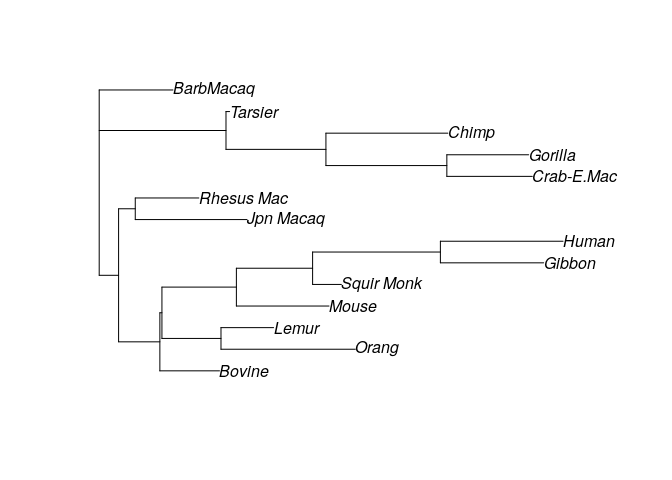
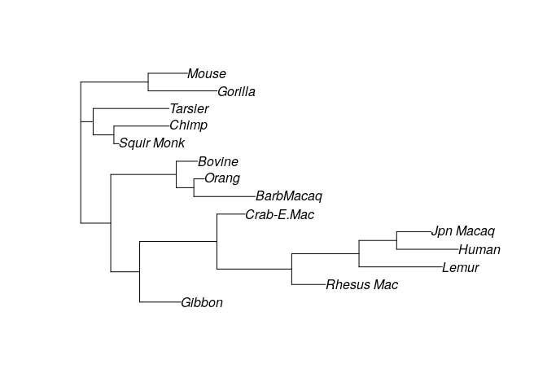
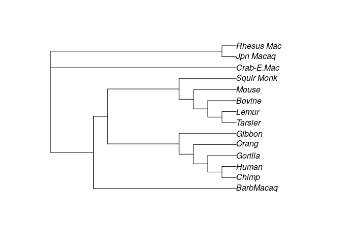
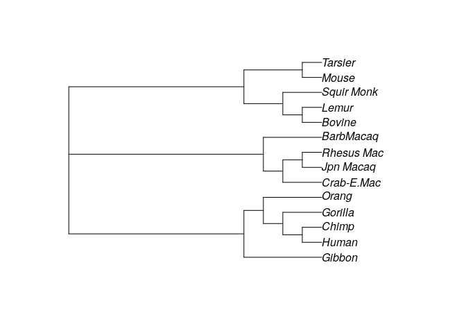
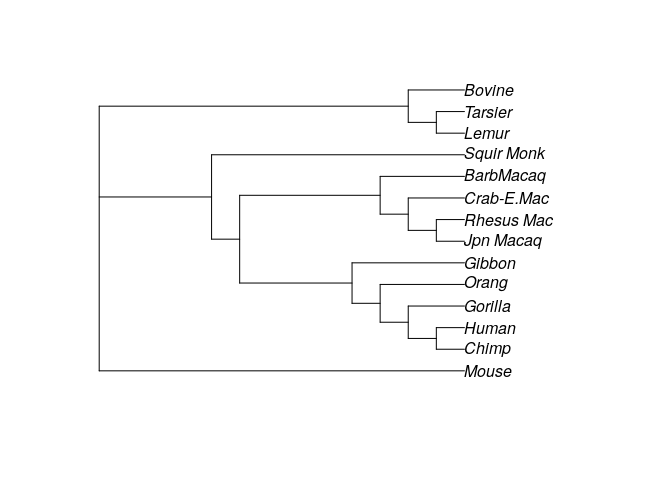
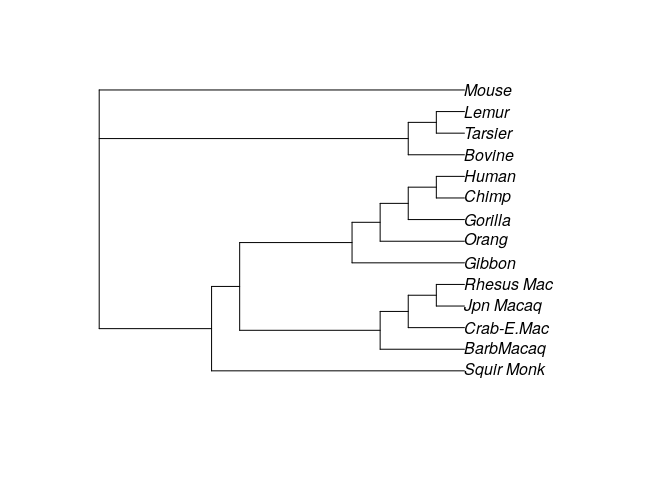
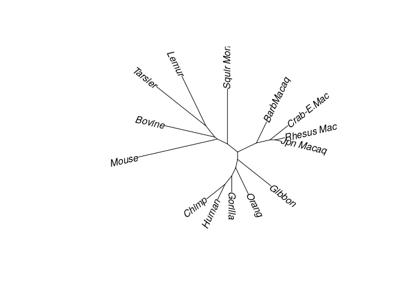
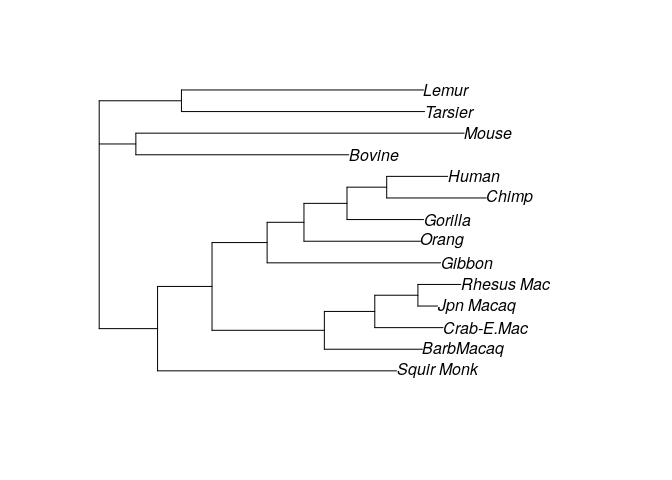

Building phylogeneric trees
================
**Dmitry Kondrashov & Stefano Allesina**
Fundamentals of Biological Data Analysis – BIOS 26318

# Goal

Let’s import some libraries:

``` r
library(ape) # most important library for phylogeny
library(phangorn) # tree reconstruction
```

# Introduction


Since Darwin’s “I think” biologists have been constructing trees
connecting species to their common ancestors. The goal of this brief
tutorial is to introduce some of the basic terminology, and illustrate
the most common approaches to building trees.

This tutorial is based on the freely available book [The Mathematics of
Phylogenetics](https://jarhodesuaf.github.io/PhyloBook.pdf), by Allman
and Rhodes.

## Input

The input is assumed to be a series of **sequences**, one for each
**taxon**. For simplicity, we deal with DNA sequences, and assume that
the taxa are different species. However, the methods introduced here can
be extended to other types of sequences (e.g., amino acids, RNA,
morphological features) and taxa (e.g., individuals of the same species,
or even cells from the same individual). We assume the DNA sequences to
be **orthologous** (i.e., to have descended from a common ancestral
sequence) and to have been **aligned** (i.e., having many of the bases
matching across the sequences for all the taxa).

DNA is composed of four nucleotides or **bases**: adenine (`A`), guanine
(`G`), cytosine (`C`), and thymine (`T`). `A` and `G` are both purines,
`C` and `T` are pyrimidines. When DNA is copied, small errors
(**mutations**) can be introduced: we speak of **substitutions** when a
base is changed, **deletions** when one or more consecutive bases are
not copied, and **insertions** when new bases are introduced in the
sequence. For this tutorial, we will concentrate on substitutions, which
are believed to be the most common type of mutations. We distinguish
between **transition** (from a purine to the other purine, or from
pyrimidine to pyrimidine) and **transversion** (from one type to the
other). Many models assume that transitions are more frequent than
transversions (due to smaller changes in chemical stability of DNA).

| Taxon | Sequence             |
| ----: | :------------------- |
| Tax 1 | ATT**G**CAA**TG**GCA |
| Tax 2 | ATT**G**CAA**TA**GCA |
| Tax 3 | ATT**A**CAA**CG**GCA |
| Tax 4 | ATT**A**CAA**CA**GCA |

## Representing trees

A graph is a collection of vertices
() and edges
(). We consider simple,
undirected graph for most of the tutorial; simple means that self loops
are not allowed and that each two nodes can be connected by one edge at
most; undirected that we do not distinguish between  and
. A graph is **connected** if there is a way to go from any
node to any other following its edges. A **cycle** is a closed path
connecting a node to itself. A **tree** is a connected graph that
contains no cycles.

We distinguish between **rooted** and **unrooted** trees: the root is a
particular vertex from which all other taxa descend (the MRCA, most
recent common ancestor of all taxa). Note that by placing the root in
different places, we can obtain dramatically different-looking trees:


Typically, we can only observe the **tips** or **leaves** of the tree
(the extant species); their common ancestors are the **internal nodes**
of the tree, which have to be inferred.

An unrooted tree with  leaves
contains exactly  nodes, and  edges. A
rooted tree has one extra node () and one extra
edge (). There are very many trees one can form with
 leaves: we can count
!!") rooted trees (where the double factorial becomes ")).

We can add a “length” to each edge, measuring how much change has
accumulated between the two vertices. In case of “molecular clock”
trees, we assume lengths to be measuring time, and all leaves have the
same distance (computed summing the lengths along the branches) from the
root. Trees in which all leaves have the same distance from the root are
called **ultrametric**.


Mathematically, if we do not make an assumption of a “molecular clock”
(i.e., that mutations are neutral and occurr at a predictable rate), we
cannot identify the root of a tree without using extra information.
Typically, what is done is to also align sequence(s) stemming from an
**outgroup**, i.e., a taxon that is believed to be distantly related to
the taxa we want to connect in our tree. Then, the root will connect the
outgroup taxon with the rest of the tree.

Many of the methods for tree reconstruction are based on unrooted,
unweighted trees, and a root and lengths can be determined once one has
chosen a topology for the tree.

A simple way to represent a tree is provided by the **Newick notation**:
the string `(((a, b), c), (d, e))` represents a tree in which two nodes
enclosed by parentheses are connected to a common ancestor (internal
node). Note that the notation cannot readily discriminate among
identical trees (e.g., `((d, e), (c, (b, a)))`) so that spotting two
identical trees is difficult to do by eye.

# Building trees from sequence data

Provided with a set of orthologous, aligned sequences, we want to build
a tree explaining the observed mutations. All methods to build trees
from sequences are based on Occam’s razor: given alternative histories
for the evolution of the sequences, take the “simplest” as the most
probable.

## Maximum Parsimony

Going back to our example:

| Taxon | Sequence             |
| ----: | :------------------- |
| Tax 1 | ATT**G**CAA**TG**GCA |
| Tax 2 | ATT**G**CAA**TA**GCA |
| Tax 3 | ATT**A**CAA**CG**GCA |
| Tax 4 | ATT**A**CAA**CA**GCA |

we could think of the tree , (3, 4))") that would be consistent with the changes in
position 4 and 8; the changes in position 9, however, would require a
further mutation for each branch. We can count the number of changes in
the sequences required for each tree, and maximum parsimony can be
summarized as “The best tree to infer from data is the one requiring the
fewest changes”.

We can propose a tree, and for each edge connecting nodes "), we
can count the number of changes required to go from
 to
. We can then sum all
the changes (called the **parsimony score**) and choose the tree with
the minimum score.


Computing the minimum score for a given tree and sequences for the
leaves is called the “small parsimony problem” while computing the
minimum parsimony over all trees is the “large parsimony problem”. The
small problem can be solved efficiently (e.g., using the Fitch-Hartigan
algorithm). The large problem is computationally very difficult.

### Example: primates

``` r
# read alignement primates
fdir <- system.file("extdata/trees", package = "phangorn")
primates <- read.phyDat(file.path(fdir, "primates.dna"), format = "interleaved")
primates$Human
```

    #   [1] 1 2 2 2 2 1 2 4 2 1 2 2 2 1 4 1 2 1 1 1 2 1 1 2 1 2 2 1 2 4 2 4 2 2 2 2 4
    #  [38] 1 1 4 4 1 2 1 1 4 4 4 1 1 2 2 4 2 2 2 1 2 2 4 4 2 1 3 1 1 2 4 3 1 1 2 3 2
    #  [75] 2 1 1 4 2 4 2 1 4 1 1 2 2 1 1 2 1 2 1 2 2 2 2 1 4 2 1 1 1 3 2 1 2 2 2 2 4
    # [112] 2 2 1 1 2 1 2 1 2 2 2 3 2 1 2 1 2 2 4 2 2 1 2 2 2 2 2 2 4 2 3 4 2 4 1 2 3
    # [149] 2 4 4 1 2 2 1 2 3 4 2 4 2 2 2 4 2 2 2 4 2 4 2 1 2 1 2 2 4 4 1 2 4 2 1 2 2
    # [186] 4 4 2 4 2 2 2 1 1 1 2 3 1 2 4 4 2 3 2 1 2 2 1 2 1 1 2 3 2 2 1 2

Now let’s build a random tree and compute parsimony:

``` r
set.seed(0)
# generate random tree
my_tree <- rtree(14, rooted = FALSE, tip.label = names(primates))
plot(my_tree)
```



We can compute the parsimony score for the tree:

``` r
parsimony(my_tree, primates)
```

    # [1] 921

Meaning that to recover the observed sequences from the ancestral one,
we need to assume 921 changes have occurred. Clearly, this doesn’t seem
to be an especially promising tree (for example, Humans and Chimpanzees
are quite far, while we know that they should be close). Let’s try with
another random tree:

``` r
# try with another one
my_tree2 <- rtree(14, rooted = FALSE, tip.label = names(primates))
plot(my_tree2)
```



``` r
parsimony(my_tree2, primates)
```

    # [1] 935

Which is even worse\! We can try to “tweak” the structure of the tree to
reduce the parsimony score by calling `optim.parsimony`. For example:

``` r
# try to find a good tree
optim_tree <- optim.parsimony(my_tree, primates)
plot(optim_tree)
```



    # Final p-score 746 after  19 nni operations

Trying with the other random tree:

``` r
optim_tree2 <- optim.parsimony(my_tree2, primates)
plot(optim_tree2)
```



    # Final p-score 751 after  23 nni operations

This shows that the starting tree matters. In fact, we do not find
especially good soltuions even after calling `optim.parsimony`. Now we
are going to try again but with a starting tree based on distances
(explained below).

``` r
# compute distances
dm <- dist.ml(primates)
# build tree using distances
treeNJ <- NJ(dm)
treeUPGMA <- upgma(dm)
parsimony(treeNJ, primates)
optim_tree3 <- optim.parsimony(treeNJ, primates)
plot(optim_tree3)
```



``` r
parsimony(treeUPGMA, primates)
optim_tree4 <- optim.parsimony(treeUPGMA, primates)
plot(optim_tree4)
```



    # [1] 746
    # Final p-score 746 after  0 nni operations 
    # [1] 751
    # Final p-score 746 after  1 nni operations

### `#ParsimonyGate`

Maximum parsimony is often used, but has several problems (in fact, no
method is perfect, and each has strengths and limitations). For example,
there typically exist several trees with the same score.

The journal *Cladistics* published an editorial in February 2016 stating
that “Phylogenetic data sets submitted to this journal should be
analysed using parsimony. If alternative methods give different results
and the author prefers an unparsimonious topology, he or she is welcome
to present that result, but should be prepared to defend it on
**philosophical** grounds” (emphasis mine). The mention of phylosophy to
justify scientific results led to a twitter storm, ignited by Jonathan
Eisen (for an entertaining account, see
[here](https://www.wired.com/2016/02/twitter-nerd-fight-reveals-a-long-bizarre-scientific-feud/)).

## Distance Methods

A second class of methods is based on measuring “dissimilarity” (or
“distance”) between sequences. The idea is then to preferentially
connect with a common ancestors species that are “close”. This is
similar to what we’ve done with MDS, and the basic notion of distance is
the same. We start by computing a matrix of dissimilarities (or
distances), and then use an algorithm to build a tree.

A simple method to build a tree given the dissimilarity matrix is called
*unweighted pair-group method with arithmetic means* (**UPGMA**). The
idea is very simple: we start by joining the two leaves that have the
smallest distance. We then remove the leaves and add a new node that is
the average between the two leaves. We then repeat the same operation
until we have built the tree.


Note that the UPGMA builds trees with branch lengths and assumes that
the data are produced by a molecular clock. Because this condition is
often violated, we need to choose another algorithm whenever we suspect
the dissimilarities are not stemming from an ultrametric tree. In
practice, the “Neighbor Joining” algorithm (**NJ**) is often used.

The algorithm is based on the so-called four-point condition: given four
taxa  (which might include repetitions), in a metric tree we
have

  
 + \\delta(c, d) \\leq \\max\\{\\delta(a, c) + \\delta(b, d), \\delta(a, d) + \\delta(b, c)\\}
")  
This inequality is used to choose with two leaves to join, and the
process is repeated as in UPGMA. Despite being more complex, NJ is often
used in practice to produce a good starting tree. Note that NJ builds an
unrooted
tree.

``` r
plot(treeNJ, type = "unrooted", lab4ut = "axial")
```



## Likelihood based methods

The goal of likelihood-based methods is to compute a probability of
having observed a given set of sequences given a tree. To do so, we
often make a strong **assumption of independence**: each site behaves
independently, and the bases are taken from the same distribution
(i.i.d.).

Because of this assumption, we do not care of the exact sequence, only
of the number of bases of each kind. For example, we can assume that the
**root distribution vector** is

  

")  

with elements summing to one.

Now we can model the probability that a base in the root will mutate to
another base by substitution along an edge
. We can use a
**transition matrix** (or **Markov matrix**):

  
  

with nonnegative entries and rows summing to one. This matrix encodes
the probability that a base in the ancestor was substituted in the
descendant along edge .
But how can we compute the matrix for a given edge?

Clearly, each edge could give rise to its own Markov matrix, making it
difficult to infer a tree from sequences. Instead, we can link all the
matrices along all edges by making them all a function of a matrix of
rates and the length of the edge. The solution is to build a matrix of
rates  (with rows
summing to zero, and off-diagonal elements that are positive). The
elements of the matrix 
describe the instantaneous rate of substitution. We then want to model
the time elapsed along one edge. We solve the differential equation:

  
}{dt} = p(t) Q
")  

Because it is a linear system of ODEs:

  
 = p(0) e^{Qt} = p(0) S e^{\\Lambda t} S^-1 
")  

where  is the matrix of
eigenvectors, and

the diagonal matrix of eigenvalues of
.

When we have an edge 
with corresponding time , we choose  = e^{Qt_e}") to be the matrix projecting the proportion of
bases in the ancestor to the number of bases in the descendent. In
practice, out of computational convenience, often we choose
 with a very special
structure.

#### Jukes-Cantor Model

This is the simplest model for base substitution. It assumes that in the
ancestral sequence, all bases occurr with the same probability:

  

")  
and that each base is substituted by any other with equal rates:

  
  
As such, the total rate at which a specific base is substituted (by any
of the other three) is
.
With some calculation, we find that:

  
  
and

  
  

and as such:

  
 = e^{Qt} = S e^{\\Lambda t} S^{-1} = \\begin{pmatrix}
1- a(t) & a(t) / 3 & a(t) / 3 & a(t) / 3 \\\\
a(t) / 3 & 1 -a(t) &  a(t) / 3 & a(t) / 3 \\\\
a(t) / 3 & a(t) / 3 &  1 -a(t) &  a(t) / 3 \\\\
a(t) / 3 & a(t) / 3 &   a(t) / 3 & 1-a(t)
\\end{pmatrix}
")  

where  = \\frac{3}{4}\\left(1 - e^{-\\frac{4}{3} \\alpha t}\\right)").
Clearly, the larger the 
or the , the more substitutions we expect to occurr. Note however
that the model encodes a stable base distribution at all vertices of the
tree:  = p_\\rho").

### Other models

Other models use a larger number of parameters, attempting to model
mutations more precisely. For example, the **Kimura 2-parameter model**
uses the matrix:

  
  

Which can be treated in the same way as above, leading to a 2-parameter
").

### Maximum likelihood

Armed with the definitions above, we now want to fit a length of an edge
stemming from the root. We have sequences
 and
, and we build the
matrix  whose elements

counts the number of bases that were of type
 in the ancestral state,
and  in the descendant.

For example:

  
  
  
  

Then the matrix  (the
order is always `AGCT`) becomes:

  
  

We want to know what is the maximum likelihood estimate for the time
between  and
 given a model.

For example, if we choose the Jukes-Cantor model, we have that we assume
"), and the probabilities of observing a
given transition would be:

  
 = \\text{diag}(p_0) M(t) = \\begin{pmatrix}
(1- a(t)) / 4  & a(t) / 12 & a(t) / 12 & a(t) / 12 \\\\
a(t) / 12 & (1 -a(t)) / 4 &  a(t) / 12 & a(t) / 12 \\\\
a(t) / 12 & a(t) / 12 &  (1 -a(t))/4 &  a(t) / 12 \\\\
a(t) / 12 & a(t) / 12 &   a(t) / 12 & (1-a(t)) / 4 
\\end{pmatrix}
")  

The likelihood of a given edge length,
 would be:

  
 = \\prod_{i,j} p_{ij}^{n_{ij}}
")  

Taking the log-likelihood:

  
 = \\sum_{i,j} {n_{ij} \\log p_{ij}} = \\log(a / 12) \\sum_{j\\neq i} n_{ij} + \\log((1-a) / 4) \\sum_i n_{ii}
")  

Taking the derivative with respect to
, setting it to zero,
and massaging the equation we obtain:

  
 = \\frac{\\sum_{j\\neq i} n_{ij}}{\\sum_{j, i} n_{ij}}
")  

For example, for the matrix above  = 5/9"). Because  = 3/4 (1 - e^{(-t 4/3)})"), we get , setting the maximul likelihood estimate for
the length of the branch.

Using this method, we can find the maximum likelihood estimate for all
the branches of a tree. We can then propose a tree, and then compute the
product of all likelihoods. Given that there are many possible trees, we
need a smart way to explore the space. The algorithm by Felsenstein
(1981, *Evolutionary trees from DNA sequences: a maximum likelihood
approach*) was the first to allow an efficient search of the space of
trees, and the first to propose the method above to find optimal branch
lengths.

Compute using a Jukes-Cantor model:

``` r
# compute likelihoods
test_NJ <- pml(treeUPGMA, data=primates, model = "JC")
print(test_NJ)
```

    # 
    #  loglikelihood: -3079.976 
    # 
    # unconstrained loglikelihood: -1230.335 
    # 
    # Rate matrix:
    #   a c g t
    # a 0 1 1 1
    # c 1 0 1 1
    # g 1 1 0 1
    # t 1 1 1 0
    # 
    # Base frequencies:  
    # 0.25 0.25 0.25 0.25

Try optimizing by allowing changes in topology:

``` r
fitJC <- optim.pml(test_NJ, data=primates,
                    rearrangement = "NNI")
print(fitJC)
plot(fitJC)
```



    # optimize edge weights:  -3079.976 --> -3070.765 
    # optimize edge weights:  -3070.765 --> -3070.764 
    # optimize topology:  -3070.764 --> -3068.417 
    # optimize topology:  -3068.417 --> -3068.295 
    # optimize topology:  -3068.295 --> -3068.295 
    # 2 
    # optimize edge weights:  -3068.295 --> -3068.295 
    # optimize topology:  -3068.295 --> -3068.295 
    # 0 
    # optimize edge weights:  -3068.295 --> -3068.295 
    # 
    #  loglikelihood: -3068.295 
    # 
    # unconstrained loglikelihood: -1230.335 
    # 
    # Rate matrix:
    #   a c g t
    # a 0 1 1 1
    # c 1 0 1 1
    # g 1 1 0 1
    # t 1 1 1 0
    # 
    # Base frequencies:  
    # 0.25 0.25 0.25 0.25

### Bayesian methods

These methods can be extended to include priors. We can use a flat prior
for the ancestral sequence, for the base substitution model, and over
the space of possible trees and, via MCMC, construct the posterior
distribution for all the parameters. The hope is to find strong support
(i.e., posterior probability close to one) for a single tree;
alternatively, many trees with high posterior can be summarized in a
consensus tree.
