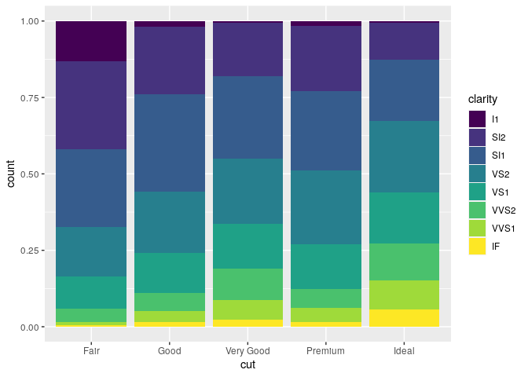
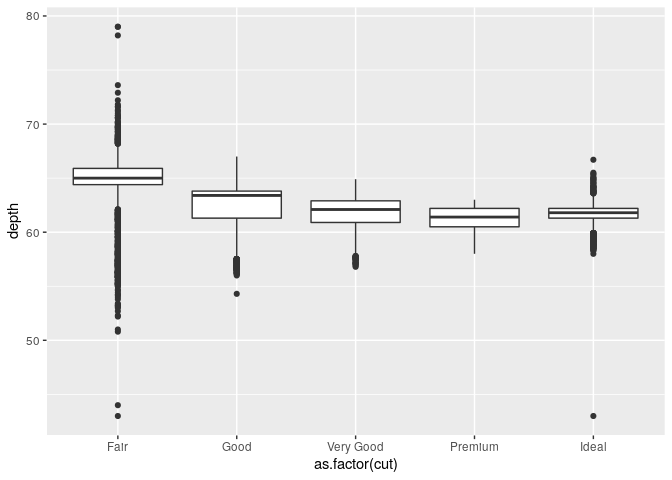
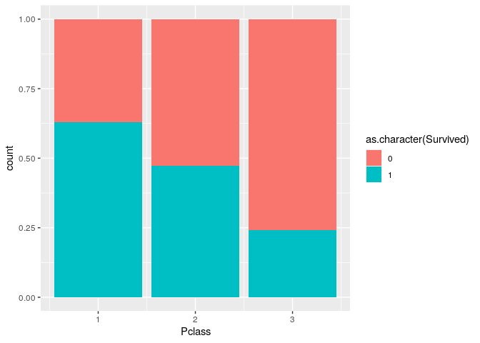

Review of probability
================
**Dmitry Kondrashov & Stefano Allesina**
Fundamentals of Biological Data Analysis – BIOS 26318

# Goals of the course

  - Learn how to use R for working with biological data
  - Become familiar with probability theory and the assumptions of
    popular models
  - Encounter and learn how to avoid common statistical mistakes
  - Apply what you have learned to your own data set

Course outline by week:

1.  Review of probability, basic data visualization with `ggplot2`
2.  Probability distributions, data wrangling with `dplyr`
3.  Summary of linear algebra, hypothesis testing
4.  Likelihood and modeling, linear regression
5.  ANOVA, Generalized linear models
6.  Model selection, time series modeling
7.  Principal component analysis, clustering
8.  Student presentations
9.  Student presentations
10. Student presentations

# Fundamentals of probability

## Sample spaces and random variables

No observation or measurement in our world is perfectly reproducible, no
matter how carefully planned and executed. The level of uncertainly
varies, but randomness always finds a way to creep into a data set.
Where does the “random” factor come from? From the classical physics
perspective, as articulated by Laplace, most natural phenomena are
theoretically deterministic for an omniscient being with an unlimited
computational power. Quantum mechanical phenomena are (theoretically)
truly random, but the randomness is not observable on the scales of
biology or social science. The lack of predictability in the data we
work with is usually due either to its intrinsic complexity (e.g.,
biomolecular systems, prediction of animal behavior), which essentially
makes it impossible to know every detail of the system, or to some
external source of noise (e.g., measurement error, weather affecting
food availability) that is outside of our control.

In probability terminology, a *random experiment* produces *outcomes*
and the collection of all outcomes of an experiment is called its
*sample space*.

**Example:** The specifics of the experiment can affect the degree of
uncertainty in the outcome; the same measurement may be random or not,
depending on context. For example, measuring the height of a person
should be deterministic, if one measures the height of the same person
within a short amount of time. So unless you’re interested in studying
the error in
[stadiometer](https://www.quickmedical.com/measure/stadiometer.html)
results, you probably won’t consider this a random experiment. However,
measuring the heights of different people is a random experiment, where
the source of randomness is primarily due to the selection of people for
your study, called *sampling error*, rather than due to the measurement
noise of any one person.

The measurement of interest from a random experiment is called a *random
variable*. Sometimes the measurement is simply the outcome, but usually
it reports some aspect of the outcome and so several outcomes can have
the same value of the random variable. The random variable can then be
seen as condensing the sample space into a smaller range of values.
Random variables can be *numeric* or *categorical*, with the difference
that categorical variables cannot be assigned meaningful numbers. For
instance, one may report an individual by phenotype (e.g., white or
purple flowers), or having a nucleotide A, T, G, C in a particular
position, and although one could assign numbers to these categories
(e.g., 1, 2, 3, 4) they could not be used in sensical way—one can
compare and do arithmetic with numbers, but A is not less than T and A +
T does not equal G. Thus there are different tools for describing and
working with numeric and categorical random variables.

**Example:** In a DNA sequence a codon triplet represents a specific
amino acid, but there is redundancy (several triplets may code for the
same amino acid). One may think of a coding DNA sequence as an outcome,
but the amino acid (sequence or single one) as a random variable.
Extending this framework, one may think of genotype as an outcome, but a
phenotype (e.g., eye color) as a random variable—although this is not
correct for any phenotype that is not strictly determined by the
genotype, because then there are other factors (e.g., environmental or
epigenetic) that influence the value of the random variable besides the
outcome (genotype).

**Exercise:** In the diamonds dataset in `dplyr`, identify numeric and
categorical variables, and specify whether numeric variables are
discrete and continuous.

``` r
library(tidyverse)
str(diamonds) # print out the variables in the data frame (tibble) diamonds
```

    # tibble [53,940 × 10] (S3: tbl_df/tbl/data.frame)
    #  $ carat  : num [1:53940] 0.23 0.21 0.23 0.29 0.31 0.24 0.24 0.26 0.22 0.23 ...
    #  $ cut    : Ord.factor w/ 5 levels "Fair"<"Good"<..: 5 4 2 4 2 3 3 3 1 3 ...
    #  $ color  : Ord.factor w/ 7 levels "D"<"E"<"F"<"G"<..: 2 2 2 6 7 7 6 5 2 5 ...
    #  $ clarity: Ord.factor w/ 8 levels "I1"<"SI2"<"SI1"<..: 2 3 5 4 2 6 7 3 4 5 ...
    #  $ depth  : num [1:53940] 61.5 59.8 56.9 62.4 63.3 62.8 62.3 61.9 65.1 59.4 ...
    #  $ table  : num [1:53940] 55 61 65 58 58 57 57 55 61 61 ...
    #  $ price  : int [1:53940] 326 326 327 334 335 336 336 337 337 338 ...
    #  $ x      : num [1:53940] 3.95 3.89 4.05 4.2 4.34 3.94 3.95 4.07 3.87 4 ...
    #  $ y      : num [1:53940] 3.98 3.84 4.07 4.23 4.35 3.96 3.98 4.11 3.78 4.05 ...
    #  $ z      : num [1:53940] 2.43 2.31 2.31 2.63 2.75 2.48 2.47 2.53 2.49 2.39 ...

## Probability axioms

An outcome in sample space can be assigned a *probability* depending on
its frequency of occurrence out of many trials, each is a number between
0 and 1. Combinations of outcomes (*events*) can be assigned
probabilities by building them out of individual outcomes. These
probabilities have a few rules, called the *axioms of probability*,
expressed using set theory notation.

1.  The total probability of all outcomes in sample space is 1.
     = 1")

2.  The probability of nothing (empty set) is 0.  = 0")

3.  The probability of an event made up of the union of two events is
    the sum of the two probabilities minus the probability of the
    overlap (intersection.)  = P(A) + P(B) - P(A \\cap B)")

**Example:** Let’s assign a probability to every possible three-letter
codon. There are 
codons, so if one assumes that each one has equal probability, then they
they all equal  (by axiom 1.) The probability of a codon having A as the first
letter is 1/4, and so is the probability of A as the second letter.
Axiom 3 allows us to calculate the probability of A in either the first
or the second letter:

  
 =  P(AXX) + P(XAX) - P(AAX) = 1/4 + 1/4 - 1/16 = 7/16")  

## Probability distributions

The probability of each value of a random variable can be calculated
from the probability of the event that corresponds to each value of the
random variable. The collection of the probabilities of all of the
values of the random variable is called the *probability distribution
function* of the random variable, more formally the *mass function* for
a discrete random variable or the *density function* for a continuous
random variable.

For a discrete random variable (let’s call it
) with a probability
mass function , the
probability of  taking
the value of  can be
written either as
") or
"), as long
as it’s clear that  is
the probability distriution function of
. The one ironclad rule
of probability is that all values of the mass function have to add up to
1. To state this mathematically, if all the possible values of
 can be written as
 (there may be finitely or infinitely many of them, as
long as it’s a countable infinity), this sum has to be equal to 1:   
 = 1 ")  

A continuous random variable (let’s call it
) with a probability
density function  is a
bit more complicated. The continous part means that the random variable
has uncountably many values, even if the range is finite (for example,
there are uncountably many real numbers between 0 and 1). Thus, the
probability of any single value must be vanishingly small (zero),
otherwise it would be impossible to add up (integrate) all of the values
and get a finite result (let alone 1). We can only measure the
probability of a range of values of
 and it is defined by
the integral of the density function overal that range:

  
 = \\int_a ^b g(y) dy ")  

The total probability over the entire range of
 has to be 1, but it’s
similarly calculated by integration instead of summation
( represents the range
of values of ):

  
 dy = 1")  

**Example:** As codons (DNA triplets) code for amino acids, we can
consider the genetic code a random variable on the sample space.
Assuming all codons have equal probabilities, the probability of each
amino acid is the number of triplets that code for it divided by 64. For
example, the probabilities of leucine and arginine are , the probability of threonine is  and the probabilities of methionine and tryptophan are
. This
defines a probability distribution function of the random variable of
the genetic code. Note that the sum of all the probabilites of amino
acids has to be 1. Of course there is no inherent reason why each
triplet should be equally probable, so a different probability structure
on the sample space would result in a different probability distribution
(mass) function.

## Measures of center: medians and means

The standard measures described here are applicable only numeric random
variables. Some measures of center and spread for categorical variables
exist as well.

The *median* of a random variable is the value which is in the middle of
the distribution, specifically, that the probability of the random
variable being no greater than that value is 0.5.

The *mean* or *expectation* of a random variable is the center of mass
of the probability distribution. Specifically, it is defined for a mass
function to be:

  
 = \\sum_i a_i\\, f(a_i)")  

And for a density function it is defined using the integral:   
 =  \\int_R y\\, g(y) dy ")  

**Example:** The data set diamonds contains many variables, and the
factors (categorical variables) cannot be described using means and
medians, but can be plotted by counts (we will learn about `ggplot2`
soon):

``` r
ggplot(data = diamonds) +
  aes(x = cut, fill = clarity) + 
  geom_bar(position = "fill")
```



One can plot and measure the mean and median of the numeric variables
like depth, with separate box plots for different cut
qualities:

``` r
ggplot(data = diamonds) + aes(x = as.factor(cut), y=depth) + geom_boxplot()
```



``` r
diamonds %>% group_by(cut) %>% summarise(mean = mean(depth))
diamonds %>% group_by(cut) %>% summarise(median = median(depth))
```

    # # A tibble: 5 x 2
    #   cut        mean
    #   <ord>     <dbl>
    # 1 Fair       64.0
    # 2 Good       62.4
    # 3 Very Good  61.8
    # 4 Premium    61.3
    # 5 Ideal      61.7
    # # A tibble: 5 x 2
    #   cut       median
    #   <ord>      <dbl>
    # 1 Fair        65  
    # 2 Good        63.4
    # 3 Very Good   62.1
    # 4 Premium     61.4
    # 5 Ideal       61.8

Comment on how the descriptive statistics correspond to the box plots.

## Measures of spread: quartiles and variances

All random variables have spread in their values. The simplest way to
describe it is by stating its range (the interval between the minimum
and maximum values) and the quartiles (the medians of the two halves of
the distribution).

A more standard measure of the spread of a distribution is the variance,
defined as the expected value of the squared differences from the mean:

  
![\\text{Var}(X) = E \[X - E(X)\]^2 = \\sum\_i (a\_i- E(X))^2
f(a\_i)](https://latex.codecogs.com/png.latex?%5Ctext%7BVar%7D%28X%29%20%3D%20E%20%5BX%20-%20E%28X%29%5D%5E2%20%3D%20%5Csum_i%20%28a_i-%20E%28X%29%29%5E2%20f%28a_i%29
"\\text{Var}(X) = E [X - E(X)]^2 = \\sum_i (a_i- E(X))^2 f(a_i)")  

And for a density function it is defined using the integral:   
![\\text{Var}(Y) = E\[ Y - E(Y)\]^2 = \\int\_R (y-E(Y))^2 g(y) dy
](https://latex.codecogs.com/png.latex?%5Ctext%7BVar%7D%28Y%29%20%3D%20%20E%5B%20Y%20-%20E%28Y%29%5D%5E2%20%3D%20%5Cint_R%20%28y-E%28Y%29%29%5E2%20g%28y%29%20dy%20
"\\text{Var}(Y) =  E[ Y - E(Y)]^2 = \\int_R (y-E(Y))^2 g(y) dy ")  

Variances have squared units so they are not directly comparable to the
values of the random variable. Taking the square root of the variance
converts it into the same units and is called the standard deviation of
the distribution:   
}")  
**Example:** Let’s go back to data set diamonds and the numeric variable
depth plotted for different cut
qualities

``` r
ggplot(data = diamonds) + aes(x = as.factor(cut), y=depth) + geom_boxplot()
```


``` r
diamonds %>% group_by(cut) %>% summarise(var = var(depth))
diamonds %>% group_by(cut) %>% summarise(first_quart = quantile(depth,0.25))
diamonds %>% group_by(cut) %>% summarise(third_quart = quantile(depth,0.75))
```

    # # A tibble: 5 x 2
    #   cut          var
    #   <ord>      <dbl>
    # 1 Fair      13.3  
    # 2 Good       4.71 
    # 3 Very Good  1.90 
    # 4 Premium    1.34 
    # 5 Ideal      0.516
    # # A tibble: 5 x 2
    #   cut       first_quart
    #   <ord>           <dbl>
    # 1 Fair             64.4
    # 2 Good             61.3
    # 3 Very Good        60.9
    # 4 Premium          60.5
    # 5 Ideal            61.3
    # # A tibble: 5 x 2
    #   cut       third_quart
    #   <ord>           <dbl>
    # 1 Fair             65.9
    # 2 Good             63.8
    # 3 Very Good        62.9
    # 4 Premium          62.2
    # 5 Ideal            62.2

Comment on how the descriptive statistics of spread correspond to the
box plots.

# Data as samples from distributions: statistics

In scientific practice, we collect data from one or more random
variables, called a *sample*, and then try to make sense of it. One of
the basic goals is statistical inference: using the data set to describe
the *population* distribution from which the sample was drawn. Data sets
can be plotted as *histograms* and the frequency/fraction of each value
should be an approximation of the underlying probability distribution.
In addition, descriptive statistics of the sample data (means,
variances, medians, etc.) can be used to estimate the true parameters
such as the mean and the variance of the population distribution.

Some of the fundamental questions about the population include:

1.  What type of distribution is it?

2.  Estimate the parameters of that distribution.

3.  Test a hypothesis, e.g., whether two samples were drawn from the
    same distribution.

4.  Describe and test a relationship between two or more variables.

## Law of large numbers

First, the sample has to be *unbiased*, that is, no outcomes should be
systematically over- or under-represented. But even an unbiased sample
will differ from the population due to the inherent randomness of
selection (sampling error). The **law of large numbers** states that as
the *sample size* increases, the mean of the sample converges to the
true mean of the population. Formally, for a set of
 indepdenent,
identically distributed random variables (the sample)
 the sample mean
 converges to the mean of the distribution
:

  
  

## Central Limit Theorem

That is nice to know, but doesn’t say exactly how large a sample is
needed to estimate, for example, the mean of the population to a given
precision. For that, we have the **Central Limit Theorem**, which states
that the distribution of sample means (from samples of independent,
identically distributed random variables) as sample size increases,
approaches the normal (Gaussian) distribution with mean equal to the
population mean and standard deviation equal to the standard deviation
of the population divided by the square root of the sample size.
Formally, it states that for a set of
 indepdenent,
identically distributed random variables (the sample)
 with distribution mean
 and variance
, the probability density function of the sample mean
 converges for large sample size
 to the normal
distribution:

  
 \\to N(\\mu, \\sigma^2/n)
")  

where ) stands for the normal distribution with mean
 and variance
. One extremely useful consequence of this theorem is that
the variance of the sample mean is reciprocally related to the sample
size . More precicely,
it allows the calculation of *confidence intervals* by using the normal
distribution to generate an interval around the observed sample mean in
which the true mean  lies with a given likelihood.

This is an amazing result because it applies to any distribution, so it
allows for the estimation of means for any situation, as long as the
condition of independent, identically disributed variables in the sample
is satisfied (the identical distributed condition can actually be
relaxed). There are other central limit theorems that apply to other
situations, including cases where the random variables in the sample are
not independent (e.g., Markov models). The bottom line is that an
unbiased sample contains a reflection of the true population, but it is
always distorted by uncertainty. Larger sample sizes decrease the
uncertainty but are more difficult and expensive to obtain.

**Discussion:** Suggest examples of biological data sets which are not
made up of independent identically distributed random variables.

# Over to the students

1.  Introduce your own data set

2.  Describe the variables and observations and data types

3.  State the questions you would like to address using the data

# In-class exploration: misleading means

Use the library titanic and combine the data sets for all passangers and
crew into the following tibble:

``` r
library(titanic)
titanic_total <- bind_rows(titanic_test, titanic_train)
str(titanic_total)
ggplot(data = titanic_train) +
  aes(x = Pclass, fill = as.character(Survived)) + 
  geom_bar(position="fill") 
```



    # 'data.frame': 1309 obs. of  12 variables:
    #  $ PassengerId: int  892 893 894 895 896 897 898 899 900 901 ...
    #  $ Pclass     : int  3 3 2 3 3 3 3 2 3 3 ...
    #  $ Name       : chr  "Kelly, Mr. James" "Wilkes, Mrs. James (Ellen Needs)" "Myles, Mr. Thomas Francis" "Wirz, Mr. Albert" ...
    #  $ Sex        : chr  "male" "female" "male" "male" ...
    #  $ Age        : num  34.5 47 62 27 22 14 30 26 18 21 ...
    #  $ SibSp      : int  0 1 0 0 1 0 0 1 0 2 ...
    #  $ Parch      : int  0 0 0 0 1 0 0 1 0 0 ...
    #  $ Ticket     : chr  "330911" "363272" "240276" "315154" ...
    #  $ Fare       : num  7.83 7 9.69 8.66 12.29 ...
    #  $ Cabin      : chr  "" "" "" "" ...
    #  $ Embarked   : chr  "Q" "S" "Q" "S" ...
    #  $ Survived   : int  NA NA NA NA NA NA NA NA NA NA ...

  - Calculate the probability of survival for passengers by class (1, 2,
    3, and crew).
  - Calculate the survival probability by sex.
  - Compare the survival rates of men and women separately by class. Do
    you observe anything unexpected? How would you explain the apparent
    disagreement between the survival rates?

# References

  - [Laplace’s views on probability and
    determinism](https://www.bayesianspectacles.org/laplaces-demon/)
  - [Simpson’s
    paradox](https://medium.com/@nikhilborkar/the-simpsons-paradox-and-where-to-find-them-cfcec6c2d8b3)
  - [Central Limit Theorem in
    R](https://medium.com/@ODSC/exploring-the-central-limit-theorem-in-r-e2a2f7091606)
  - [Exploration of the Central Limit
    Theorem](https://genomicsclass.github.io/book/pages/clt_in_practice.html)
