Time series: modeling and forecasting
================
**Dmitry Kondrashov & Stefano Allesina**
Fundamentals of Biological Data Analysis – BIOS 26318

``` r
library(tidyverse) # this loads both dplyr and tidyr, along with other packages
library(fpp2) # time series forecasting
library(lubridate)
library(GGally)
```

> Prediction is difficult, especially about the future.
> 
> — Niels Bohr (apocryphally)

## Goals:

  - Use current tools for handling and visualizing time series
  - Calculate auto- and cross-correlations of time series
  - Decompose time series into components
  - Use linear regression methods for fitting and forecasting

## Time series format and plotting

A time series is a special data set where each observation has an
associated time measurement. There is a special R structure for storing
and operating on time series, called `ts`, as illustrated here:

``` r
births <- scan("http://robjhyndman.com/tsdldata/data/nybirths.dat")
birthstimeseries <- ts(births, frequency=12, start=c(1946,1))
birthstimeseries
```

    #         Jan    Feb    Mar    Apr    May    Jun    Jul    Aug    Sep    Oct
    # 1946 26.663 23.598 26.931 24.740 25.806 24.364 24.477 23.901 23.175 23.227
    # 1947 21.439 21.089 23.709 21.669 21.752 20.761 23.479 23.824 23.105 23.110
    # 1948 21.937 20.035 23.590 21.672 22.222 22.123 23.950 23.504 22.238 23.142
    # 1949 21.548 20.000 22.424 20.615 21.761 22.874 24.104 23.748 23.262 22.907
    # 1950 22.604 20.894 24.677 23.673 25.320 23.583 24.671 24.454 24.122 24.252
    # 1951 23.287 23.049 25.076 24.037 24.430 24.667 26.451 25.618 25.014 25.110
    # 1952 23.798 22.270 24.775 22.646 23.988 24.737 26.276 25.816 25.210 25.199
    # 1953 24.364 22.644 25.565 24.062 25.431 24.635 27.009 26.606 26.268 26.462
    # 1954 24.657 23.304 26.982 26.199 27.210 26.122 26.706 26.878 26.152 26.379
    # 1955 24.990 24.239 26.721 23.475 24.767 26.219 28.361 28.599 27.914 27.784
    # 1956 26.217 24.218 27.914 26.975 28.527 27.139 28.982 28.169 28.056 29.136
    # 1957 26.589 24.848 27.543 26.896 28.878 27.390 28.065 28.141 29.048 28.484
    # 1958 27.132 24.924 28.963 26.589 27.931 28.009 29.229 28.759 28.405 27.945
    # 1959 26.076 25.286 27.660 25.951 26.398 25.565 28.865 30.000 29.261 29.012
    #         Nov    Dec
    # 1946 21.672 21.870
    # 1947 21.759 22.073
    # 1948 21.059 21.573
    # 1949 21.519 22.025
    # 1950 22.084 22.991
    # 1951 22.964 23.981
    # 1952 23.162 24.707
    # 1953 25.246 25.180
    # 1954 24.712 25.688
    # 1955 25.693 26.881
    # 1956 26.291 26.987
    # 1957 26.634 27.735
    # 1958 25.912 26.619
    # 1959 26.992 27.897

This reads in a data set of number of births per month in New York City
from 1946 to 1958 (it’s not clear what the units are - mabe thousands of
births?) To create the time series, we had to give the function the
`frequency`, or the number of time points in a year, and the starting
value as a vector assigned to `start=c(1946, 1)`, the first element is
the year and the second the month.

Here are two different time series, of diabetic drug sales in Australia
(in millions of AUS dollaors), also with monthly frequency, and of
Boston marathon winning times, with yearly frequency:

``` r
a10

marathon
```

    #            Jan       Feb       Mar       Apr       May       Jun       Jul
    # 1991                                                              3.526591
    # 1992  5.088335  2.814520  2.985811  3.204780  3.127578  3.270523  3.737851
    # 1993  6.192068  3.450857  3.772307  3.734303  3.905399  4.049687  4.315566
    # 1994  6.731473  3.841278  4.394076  4.075341  4.540645  4.645615  4.752607
    # 1995  6.749484  4.216067  4.949349  4.823045  5.194754  5.170787  5.256742
    # 1996  8.329452  5.069796  5.262557  5.597126  6.110296  5.689161  6.486849
    # 1997  8.524471  5.277918  5.714303  6.214529  6.411929  6.667716  7.050831
    # 1998  8.798513  5.918261  6.534493  6.675736  7.064201  7.383381  7.813496
    # 1999 10.391416  6.421535  8.062619  7.297739  7.936916  8.165323  8.717420
    # 2000 12.511462  7.457199  8.591191  8.474000  9.386803  9.560399 10.834295
    # 2001 14.497581  8.049275 10.312891  9.753358 10.850382  9.961719 11.443601
    # 2002 16.300269  9.053485 10.002449 10.788750 12.106705 10.954101 12.844566
    # 2003 16.828350  9.800215 10.816994 10.654223 12.512323 12.161210 12.998046
    # 2004 18.003768 11.938030 12.997900 12.882645 13.943447 13.989472 15.339097
    # 2005 20.778723 12.154552 13.402392 14.459239 14.795102 15.705248 15.829550
    # 2006 23.486694 12.536987 15.467018 14.233539 17.783058 16.291602 16.980282
    # 2007 28.038383 16.763869 19.792754 16.427305 21.000742 20.681002 21.834890
    # 2008 29.665356 21.654285 18.264945 23.107677 22.912510 19.431740          
    #            Aug       Sep       Oct       Nov       Dec
    # 1991  3.180891  3.252221  3.611003  3.565869  4.306371
    # 1992  3.558776  3.777202  3.924490  4.386531  5.810549
    # 1993  4.562185  4.608662  4.667851  5.093841  7.179962
    # 1994  5.350605  5.204455  5.301651  5.773742  6.204593
    # 1995  5.855277  5.490729  6.115293  6.088473  7.416598
    # 1996  6.300569  6.467476  6.828629  6.649078  8.606937
    # 1997  6.704919  7.250988  7.819733  7.398101 10.096233
    # 1998  7.431892  8.275117  8.260441  8.596156 10.558939
    # 1999  9.070964  9.177113  9.251887  9.933136 11.532974
    # 2000 10.643751  9.908162 11.710041 11.340151 12.079132
    # 2001 11.659239 10.647060 12.652134 13.674466 12.965735
    # 2002 12.196500 12.854748 13.542004 13.287640 15.134918
    # 2003 12.517276 13.268658 14.733622 13.669382 16.503966
    # 2004 15.370764 16.142005 16.685754 17.636728 18.869325
    # 2005 17.554701 18.100864 17.496668 19.347265 20.031291
    # 2006 18.612189 16.623343 21.430241 23.575517 23.334206
    # 2007 23.930204 22.930357 23.263340 25.250030 25.806090
    # 2008                                                  
    # Time Series:
    # Start = 1897 
    # End = 2016 
    # Frequency = 1 
    #   [1] 175.1667 162.0000 174.6333 159.7333 149.3833 163.2000 161.4833 158.0667
    #   [9] 158.4167 165.7500 144.4000 145.7167 173.6000 148.8667 141.6500 141.3000
    #  [17] 145.2333 145.2333 151.6833 147.2667 148.6167 149.8833 149.2167 149.5167
    #  [25] 138.9500 138.1667 143.7833 149.6667 153.0000 145.6667 160.3667 157.1167
    #  [33] 153.1333 154.8000 166.7500 153.6000 151.0167 152.8833 152.1167 153.6667
    #  [41] 153.3333 155.5667 148.8500 148.4667 150.6333 146.8500 148.4167 151.8333
    #  [49] 150.6667 149.4500 145.6500 151.0333 151.8333 152.6500 147.7500 151.8833
    #  [57] 138.8500 140.6500 138.3667 134.2333 140.0833 145.9000 142.7000 140.9000
    #  [65] 143.6500 143.8000 138.9667 139.9833 136.5500 137.1833 135.7500 142.2833
    #  [73] 133.8167 130.5000 138.7500 135.6500 136.0500 133.6500 129.9167 140.3167
    #  [81] 134.7667 130.2167 129.4500 132.1833 129.4333 128.8667 129.0000 130.5667
    #  [89] 134.0833 127.8500 131.8333 128.7167 129.1000 128.3167 131.1000 128.2333
    #  [97] 129.5500 127.2500 129.3667 129.2500 130.5667 127.5667 129.8667 129.7833
    # [105] 129.7167 129.0333 130.1833 130.6167 131.7333 127.2333 134.2167 127.7500
    # [113] 128.7000 125.8667 123.0333 132.6667 130.3667 128.6167 129.2833 132.7333

### Visualizing the data

The most straighforward way of visualizing time series is using a time
plot, which can be created using `autoplot`:

``` r
autoplot(birthstimeseries) +
  ggtitle("Number of births in NYC") +
  ylab("Births (thousands") +
  xlab("Year")
```

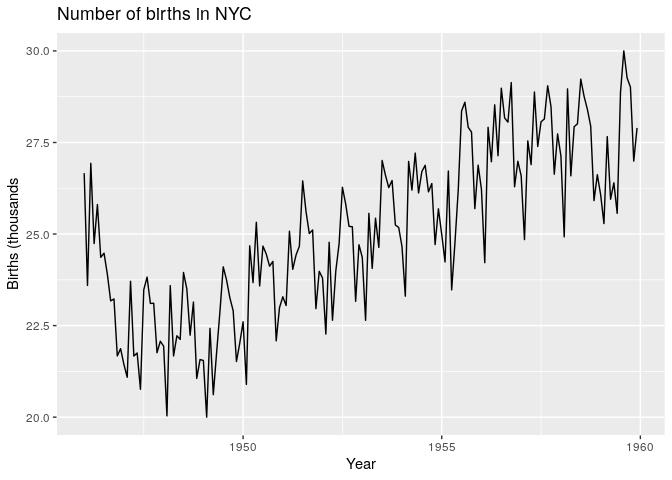

``` r
autoplot(a10) +
  ggtitle("Antidiabetic drug sales") +
  ylab("AUS$ (million)") +
  xlab("Year")
```

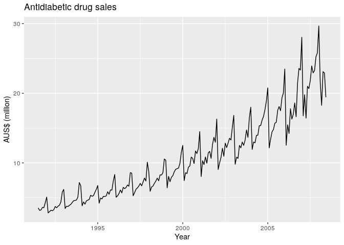

``` r
autoplot(marathon) +
  ggtitle("Boston marathon winning times") +
  ylab("Time (minutes)") +
  xlab("Year")
```

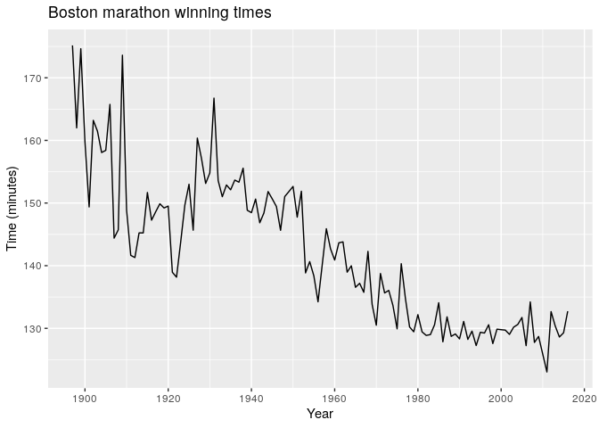

### Trends, seasonality, and cyclicity

Time series of course illustrate changes over time, and frequently we
want to describe and account for these changes. In forrecasting, there
are three types of systematic patters that have their own terminology
(taken from \[1\])

>   - **Trend** A trend exists when there is a long-term increase or
>     decrease in the data. It does not have to be linear. Sometimes we
>     will refer to a trend as “changing direction”, when it might go
>     from an increasing trend to a decreasing trend. There is a trend
>     in the antidiabetic drug sales data.
> 
>   - **Seasonal** A seasonal pattern occurs when a time series is
>     affected by seasonal factors such as the time of the year or the
>     day of the week. Seasonality is always of a fixed and known
>     frequency. The monthly sales of antidiabetic drugs above shows
>     seasonality which is induced partly by the change in the cost of
>     the drugs at the end of the calendar year.
> 
>   - **Cyclic** A cycle occurs when the data exhibit rises and falls
>     that are not of a fixed frequency. These fluctuations are usually
>     due to economic conditions, and are often related to the “business
>     cycle”. The duration of these fluctuations is usually at least 2
>     years.

## Correlations of time series: cross-, auto-, and lag plot

### Visualizing correlation between different variables

The following data set contains the number of visitors (visitor nights)
on a quarterly basis for five regions of New South Wales, Australia:

``` r
autoplot(visnights[,1:5], facets=TRUE) +
  ylab("Number of visitor nights each quarter (millions)")
```

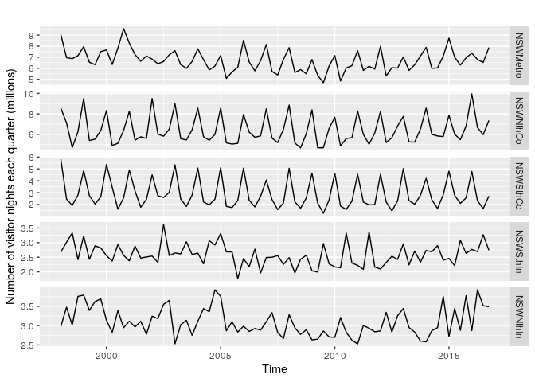

One simple question is whether different variables are related to each
other. One simple way is to calculate the Pearson correlation between
different time series, called the *cross-correlation* (where  stands for
the mean of X and
")
stands for the variance of ):

  
 = \\frac{\\sum_t (\\bar X - X_t)(\\bar Y - Y_t)}{\\sqrt{Var(X)Var(Y)}}
")  

In a data set with multiple variables it can be handy to examine the
correlations between all pairs between them. Here’s a convenient
function for that:

``` r
head(visnights)
GGally::ggpairs(as.data.frame(visnights[,1:5]))
```

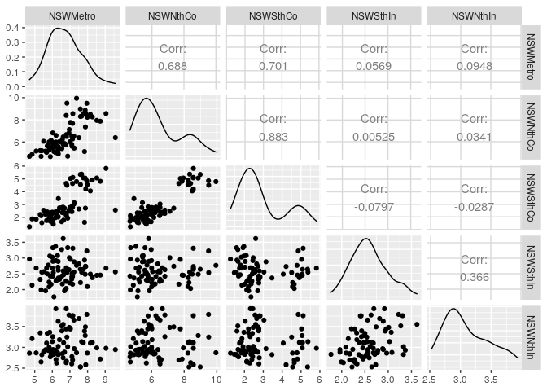

    #         NSWMetro NSWNthCo NSWSthCo NSWSthIn NSWNthIn  QLDMetro QLDCntrl
    # 1998 Q1 9.047095 8.565678 5.818029 2.679538 2.977507 12.106052 2.748374
    # 1998 Q2 6.962126 7.124468 2.466437 3.010732 3.477703  7.786687 4.040915
    # 1998 Q3 6.871963 4.716893 1.928053 3.328869 3.014770 11.380024 5.343964
    # 1998 Q4 7.147293 6.269299 2.797556 2.417772 3.757972  9.311460 4.260419
    # 1999 Q1 7.956923 9.493901 4.853681 3.224285 3.790760 12.671942 4.186113
    # 1999 Q2 6.542243 5.401201 2.759843 2.428489 3.395284  9.582965 4.237806
    #         QLDNthCo SAUMetro SAUCoast  SAUInner VICMetro  VICWstCo VICEstCo
    # 1998 Q1 2.137234 2.881372 2.591997 0.8948773 7.490382 2.4420048 3.381972
    # 1998 Q2 2.269596 2.124736 1.375780 0.9792509 5.198178 0.9605047 1.827940
    # 1998 Q3 4.890227 2.284870 1.079542 0.9803289 5.244217 0.7559744 1.351952
    # 1998 Q4 2.621548 1.785889 1.497664 1.5094343 6.274246 1.2716040 1.493415
    # 1999 Q1 2.483203 2.293873 2.247684 0.9635227 9.187422 2.3850583 2.896929
    # 1999 Q2 3.377830 2.197418 1.672802 0.9968803 4.992303 1.3288638 1.547901
    #         VICInner WAUMetro WAUCoast  WAUInner OTHMetro OTHNoMet
    # 1998 Q1 5.326655 3.075779 3.066555 0.6949954 3.437924 2.073469
    # 1998 Q2 4.441119 2.154929 3.334405 0.5576796 2.677081 1.787939
    # 1998 Q3 3.815645 2.787286 4.365844 1.0061844 3.793743 2.345021
    # 1998 Q4 3.859567 2.752910 4.521996 1.1725514 3.304231 1.943689
    # 1999 Q1 4.588755 3.519564 3.579347 0.3981829 3.510819 2.165838
    # 1999 Q2 4.070401 3.160430 3.408533 0.5960182 2.871867 1.803940

### Autocorrelation

A time series can be correlated against itself shifted in time by some
set amount, also called *lagged*. We can plot the lagged correlations
for different visitor

``` r
visnights[,1]
visnights_smaller <- window(visnights[,2], start=2000, end = 2010)
gglagplot(visnights_smaller) 
```

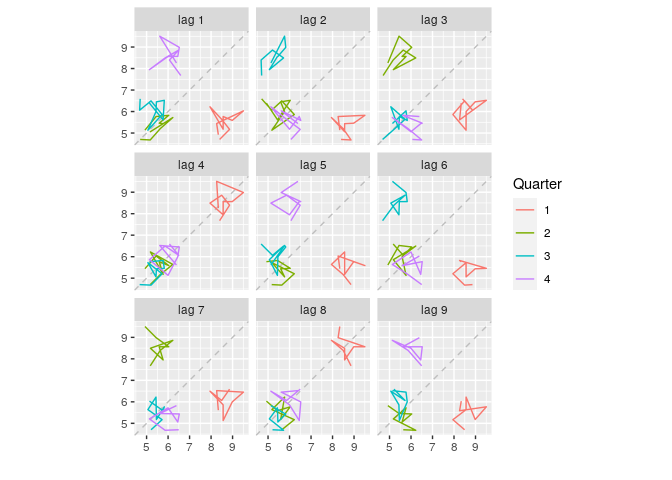

    #          Qtr1     Qtr2     Qtr3     Qtr4
    # 1998 9.047095 6.962126 6.871963 7.147293
    # 1999 7.956923 6.542243 6.330364 7.509212
    # 2000 7.662491 6.341802 7.827301 9.579562
    # 2001 8.270488 7.240427 6.640490 7.111875
    # 2002 6.827826 6.404992 6.615760 7.226376
    # 2003 7.589058 6.334527 5.996748 6.612846
    # 2004 7.758267 6.778836 5.854452 6.200214
    # 2005 7.163830 5.082204 5.673551 6.089906
    # 2006 8.525916 6.569684 5.771059 6.692897
    # 2007 8.158658 5.710082 5.402543 6.803494
    # 2008 7.866269 5.616704 5.886764 5.506298
    # 2009 6.787225 5.361317 4.699350 6.208784
    # 2010 7.148262 4.850217 6.029490 6.238903
    # 2011 7.597468 5.815930 6.183239 5.929030
    # 2012 7.986931 5.307871 6.054112 6.023897
    # 2013 7.028480 5.813450 6.322841 7.101691
    # 2014 7.897316 5.997468 6.033533 7.103398
    # 2015 8.725132 6.995875 6.294490 6.945476
    # 2016 7.373757 6.792234 6.530568 7.878277

Here the colors indicate the quarter of the variable on the vertical
axis, compared with the shifted (lagged variable on the horizontal axis,
and the lines connect points in chronological order. The relationship is
strongly positive at lags 4 and 8, reflecting the strong seasonality in
the data.

This suggests that there is a strong similarity between the time series
and itself, shifted by certain time values. This is described by the
*autocorrelation*, which is defined as a function of the lag
:

  
 = \\frac{\\sum_{t=k}^T (\\bar X - X_t)(\\bar X - X_{t-k})}{Var(X)}
")  
This can be calculated and plotted for our example of the visitation
nights in New South
Wales:

``` r
ggAcf(visnights_smaller)
```

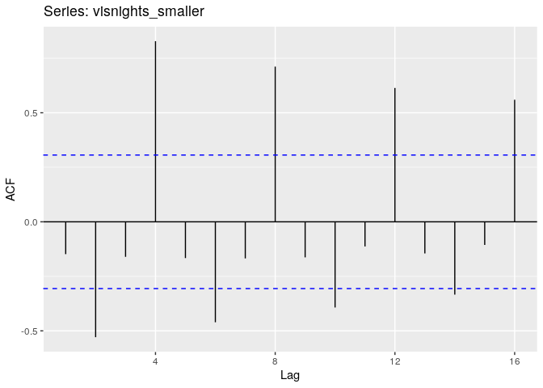

Notice the periodicity in the autocorrelation, which indicated
periodicity in the time series. Let’s similarly calculate the
autocorrelation of the drug sales
data:

``` r
ggAcf(a10)
```

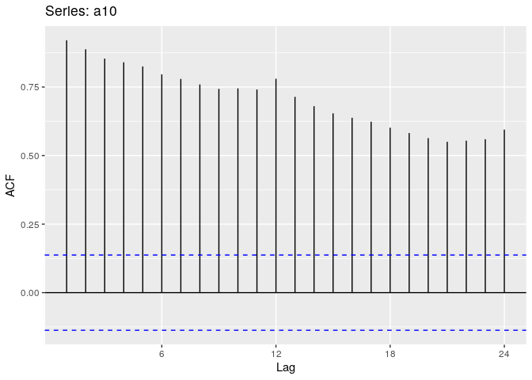

Notice how different this *correlogram* is - there are no zero values of
autcorrelation, only slow decay with some small periodic components.

Autocorrelation measures the *memory* of a signal - for example, pure
white noise is uncorrelated with itself even a moment later, and thus
has no memory. As such, it is very useful as a measure of a trend in the
data - if the time series has slowly decaying, positive autocorrelation,
that indicates a pronounced trend, while periodicity indicates
seasonality in the data.

**Exercise:** Use the lag and autocorrelation analysis to describe the
patterns in the time series of births in NYC and in the Boston marathon
winning
times.

``` r
gglagplot(marathon)
```

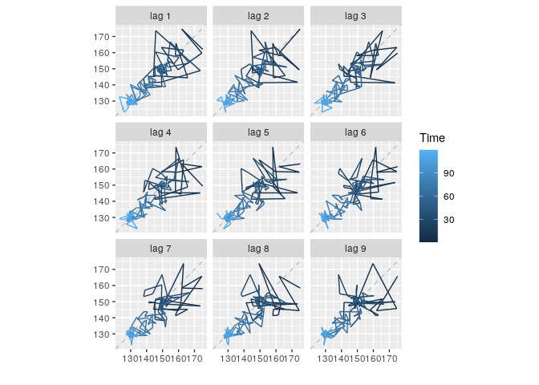

``` r
ggAcf(marathon)
```

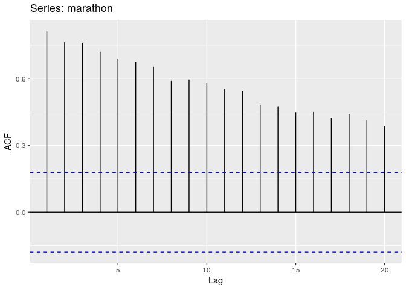

``` r
gglagplot(birthstimeseries)
```

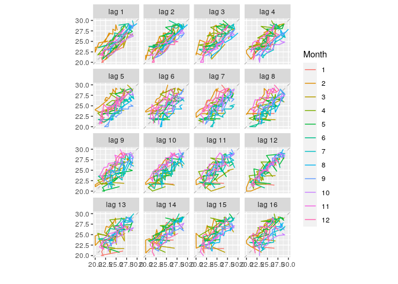

``` r
ggAcf(birthstimeseries)
```

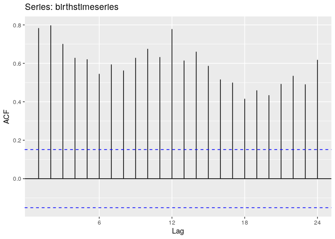

## Decomposition of time series

There are two main types of decompositions of time series: additive and
multiplicative. Let us call
 the time series
data,  the trend
(non-periodic component),
 the seasonal
part (periodic component), and
 the remainder.

  
  
  
  

One simple way of removing seasonality and estimating the trend is using
the *moving average*, that is using
 points before and
 points after each point
to calculate the trend:   
  

Here  is called the
*order* of the moving average and is defined as . There is a useful function ma() that calculates these
averages and allows them to be plotted.

``` r
m <- 12
s_name <- paste("MA-", m)
autoplot(a10, series = "data") +
  autolayer(ma(a10, m), series = "MA") +
  xlab("Year") + ylab("AUS $ (millions)") +
  ggtitle("Anti-diabetic drug sales") 
```

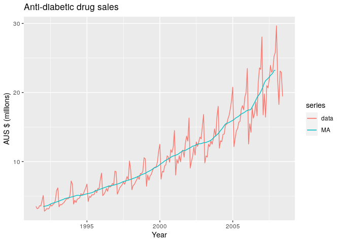

**Exercise:** Change the moving average window and see if you can make
seasonality vanish\!

An even order of periodicity requires an asymmetric averaging window, so
to create an symmetric average, one can repeat the moving average of
order two on the already-averaged data.

### Classic decomposition:

Additive decomposition \[1\]:

1.  If m is an even number, compute the trend-cycle component
     using a
    2×m-MA. If m is an odd number, compute the trend-cycle component
     using an m-MA.
2.  Calculate the detrended series: 
3.  To estimate the seasonal component for each season, average the
    detrended values for that season. For example, with monthly data,
    the seasonal component for March is the average of all the detrended
    March values in the data. These seasonal component values are then
    adjusted to ensure that they add to zero. The seasonal component is
    obtained by stringing together these monthly values, and then
    replicating the sequence for each year of data. This gives .
4.  The remainder component is calculated by subtracting the estimated
    seasonal and trend-cycle components: $ R\_t = X\_t - T\_t - S\_t$

<!-- end list -->

``` r
a10 %>% decompose(type="additive") %>%
  autoplot() + xlab("Year") +
  ggtitle("Classical additive decomposition
    of the antidiabetic drug sales data")
```

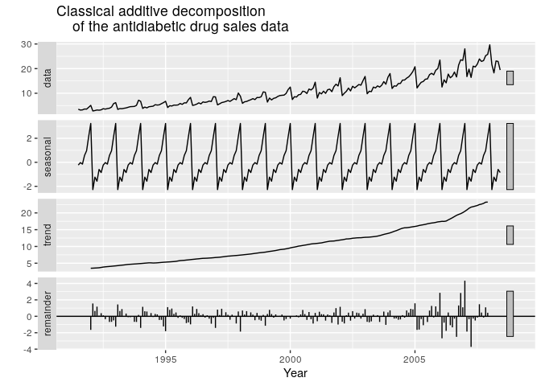

This simple classical decomposition has numerous flaws, so better, more
modern methods are preferred. In particular, it assumes a constant
seasonal term, it tends to over-estimate the variation in the trend, it
misses data for the first few and last few data points, and can be
sensitive to outliers.

### STL decomposition

A more robust method is called the STL decomposition (Seasonal and Trend
decomposition using Loess). To summarize its advantanges \[1\]:

  - STL can handle any type of seasonality, not only monthly and
    quarterly data.
  - The seasonal component is allowed to change over time, and the rate
    of change can be controlled by the user.
  - The smoothness of the trend-cycle can also be controlled by the
    user.
  - It can be robust to outliers (i.e., the user can specify a robust
    decomposition), so that occasional unusual observations will not
    affect the estimates of the trend-cycle and seasonal components.
    They will, however, affect the remainder component.

<!-- end list -->

``` r
a10 %>%  stl(t.window=13, s.window="periodic", robust=TRUE) %>%
  autoplot()
```

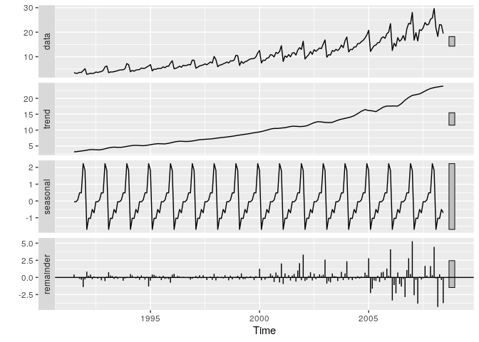

**Exercise:** Apply the two decomposition methods to the Boston marathon
and to births in NYC time series.

## Regression methods

Let us analyze the data set of US quarterly economic data, specifically,
the percent change in consumption, income, production, savigs, and
unemployment.

``` r
head(uschange)
autoplot(uschange[,c("Consumption","Income")]) +
  ylab("% change") + xlab("Year")
```

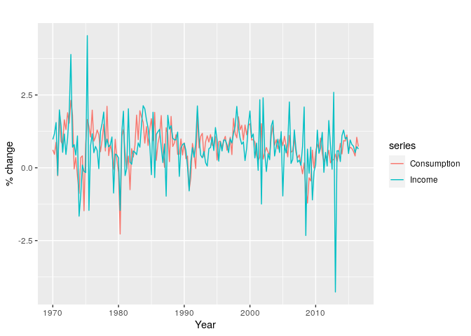

    #         Consumption     Income Production   Savings Unemployment
    # 1970 Q1   0.6159862  0.9722610 -2.4527003 4.8103115          0.9
    # 1970 Q2   0.4603757  1.1690847 -0.5515251 7.2879923          0.5
    # 1970 Q3   0.8767914  1.5532705 -0.3587079 7.2890131          0.5
    # 1970 Q4  -0.2742451 -0.2552724 -2.1854549 0.9852296          0.7
    # 1971 Q1   1.8973708  1.9871536  1.9097341 3.6577706         -0.1
    # 1971 Q2   0.9119929  1.4473342  0.9015358 6.0513418         -0.1

``` r
uschange %>%
  as.data.frame() %>%
  ggplot(aes(x=Income, y=Consumption)) +
    ylab("Consumption (quarterly % change)") +
    xlab("Income (quarterly % change)") +
    geom_point() +
    geom_smooth(method="lm", se=FALSE)
```

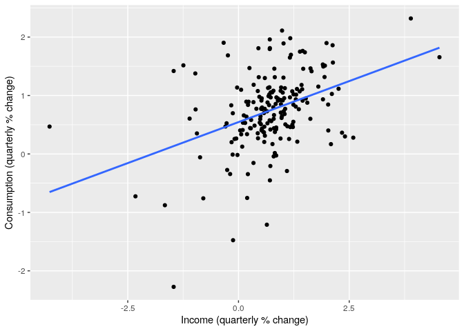

``` r
uschange %>%
  as.data.frame() %>%
  GGally::ggpairs()
```

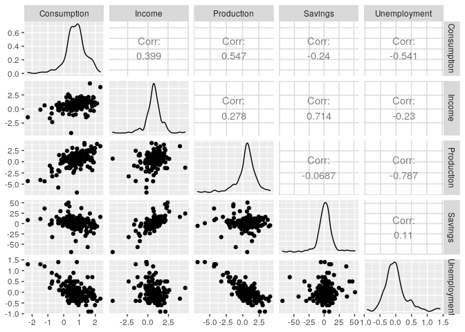

Let us use four variables as predictors of consumption to calculate a
multiple linear regression model using the function tslm():

``` r
fit.consMR <- tslm(
  Consumption ~ Income + Production + Unemployment + Savings,
  data=uschange)
summary(fit.consMR)
```

    # 
    # Call:
    # tslm(formula = Consumption ~ Income + Production + Unemployment + 
    #     Savings, data = uschange)
    # 
    # Residuals:
    #      Min       1Q   Median       3Q      Max 
    # -0.88296 -0.17638 -0.03679  0.15251  1.20553 
    # 
    # Coefficients:
    #              Estimate Std. Error t value Pr(>|t|)    
    # (Intercept)   0.26729    0.03721   7.184 1.68e-11 ***
    # Income        0.71449    0.04219  16.934  < 2e-16 ***
    # Production    0.04589    0.02588   1.773   0.0778 .  
    # Unemployment -0.20477    0.10550  -1.941   0.0538 .  
    # Savings      -0.04527    0.00278 -16.287  < 2e-16 ***
    # ---
    # Signif. codes:  0 '***' 0.001 '**' 0.01 '*' 0.05 '.' 0.1 ' ' 1
    # 
    # Residual standard error: 0.3286 on 182 degrees of freedom
    # Multiple R-squared:  0.754,   Adjusted R-squared:  0.7486 
    # F-statistic: 139.5 on 4 and 182 DF,  p-value: < 2.2e-16

We can produce a plot of the predicted values together with the observed
data on consumption:

``` r
autoplot(uschange[,'Consumption'], series="Data") +
  autolayer(fitted(fit.consMR), series="Fitted") +
  xlab("Year") + ylab("") +
  ggtitle("Percent change in US consumption expenditure") +
  guides(colour=guide_legend(title=" "))
```

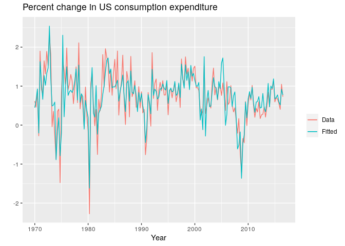

It is useful to check the residuals of the regression
model:

``` r
checkresiduals(fit.consMR)
```

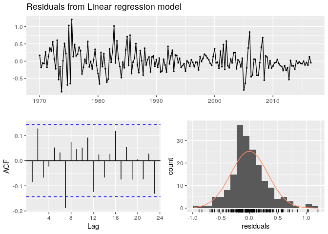

    # 
    #   Breusch-Godfrey test for serial correlation of order up to 8
    # 
    # data:  Residuals from Linear regression model
    # LM test = 14.874, df = 8, p-value = 0.06163

### The perennial warning: beware of spurious correlations\!

These two data sets, on Australian air passengers and rice production in
Guinea, have a very strong positive correlation:

``` r
aussies <- window(ausair, end=2011)
fit <- tslm(aussies ~ guinearice)
summary(fit)
```

    # 
    # Call:
    # tslm(formula = aussies ~ guinearice)
    # 
    # Residuals:
    #     Min      1Q  Median      3Q     Max 
    # -5.9448 -1.8917 -0.3272  1.8620 10.4210 
    # 
    # Coefficients:
    #             Estimate Std. Error t value Pr(>|t|)    
    # (Intercept)   -7.493      1.203  -6.229 2.25e-07 ***
    # guinearice    40.288      1.337  30.135  < 2e-16 ***
    # ---
    # Signif. codes:  0 '***' 0.001 '**' 0.01 '*' 0.05 '.' 0.1 ' ' 1
    # 
    # Residual standard error: 3.239 on 40 degrees of freedom
    # Multiple R-squared:  0.9578,  Adjusted R-squared:  0.9568 
    # F-statistic: 908.1 on 1 and 40 DF,  p-value: < 2.2e-16

However, notice that the residuals indicate a strong trend, which
violates the assumptions of linear
regression.

``` r
checkresiduals(fit)
```

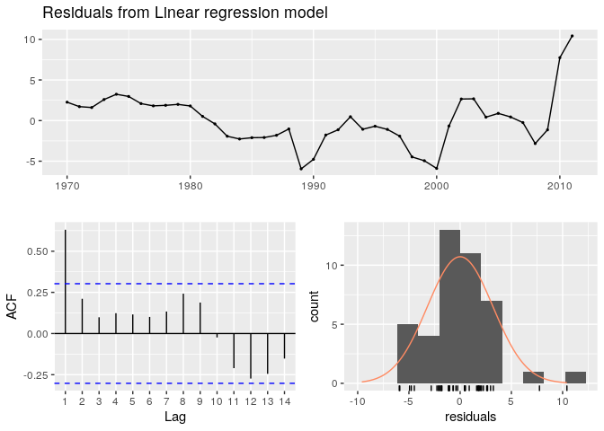

    # 
    #   Breusch-Godfrey test for serial correlation of order up to 8
    # 
    # data:  Residuals from Linear regression model
    # LM test = 28.813, df = 8, p-value = 0.000342

There are a number of fun examples of spurious time series correlations
in reference \[5\].

### Forecasting using linear regression

One can distringuish between true forecasting, termed *ex-ante* (from
before) prediction, in which we truly try to predict the unknown future,
and *ex-post* forecasts, in which the true values both of the predictors
and the response variable are known. The latter is still useful for
validating models and for comparing different methods.

The library `forecast` contains tools to make calculating predicted
values in time series simple. One can use the model to forecast the
values in the future, based on different *scenarios*. For example, we
may want to investigate the prediction for an economic upturn and a
downturn:

``` r
fit.consBest <- tslm(
  Consumption ~ Income + Savings + Unemployment,
  data = uschange)

h <- 4
newdata <- data.frame(
    Income = c(1, 1, 1, 1),
    Savings = c(0.5, 0.5, 0.5, 0.5),
    Unemployment = c(0, 0, 0, 0))
fcast.up <- forecast::forecast(fit.consBest, newdata = newdata)
newdata <- data.frame(
    Income = rep(-1, h),
    Savings = rep(-0.5, h),
    Unemployment = rep(0, h))
fcast.down <- forecast::forecast(fit.consBest, newdata = newdata)
```

``` r
# This script does not work for some reason!
autoplot(uschange[, 1]) +
  ylab("% change in US consumption") +
  autolayer(fcast.up, PI = TRUE, series = "increase")  +
  autolayer(fcast.down, PI = TRUE, series = "decrease") +
  guides(colour = guide_legend(title = "Scenario"))
```

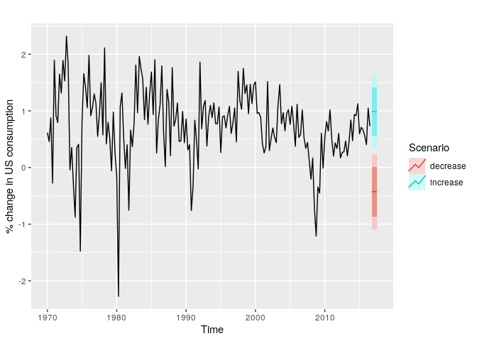

## References and further reading:

1.  Rob J Hyndman and George Athanasopoulos. [**Forecasting: Principles
    and Practice**](https://otexts.com/fpp2/)
2.  Jonathan Cryer and Kung-Sik Chan [**Time Series Analysis with
    Applications in
    R**](https://mybiostats.files.wordpress.com/2015/03/time-series-analysis-with-applications-in-r-cryer-and-chan.pdf)
3.  [Cross-validation in
    forecasting](https://www.r-bloggers.com/time-series-forecast-cross-validation-by-ellis2013nz/)
4.  [Time series nested
    cross-validation](https://towardsdatascience.com/time-series-nested-cross-validation-76adba623eb9)
5.  [Spurious
    correlations](https://www.tylervigen.com/spurious-correlations)
