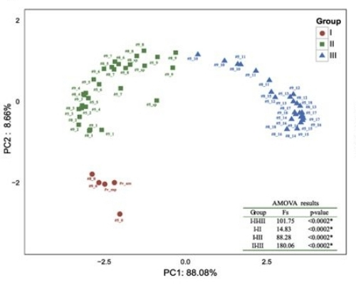
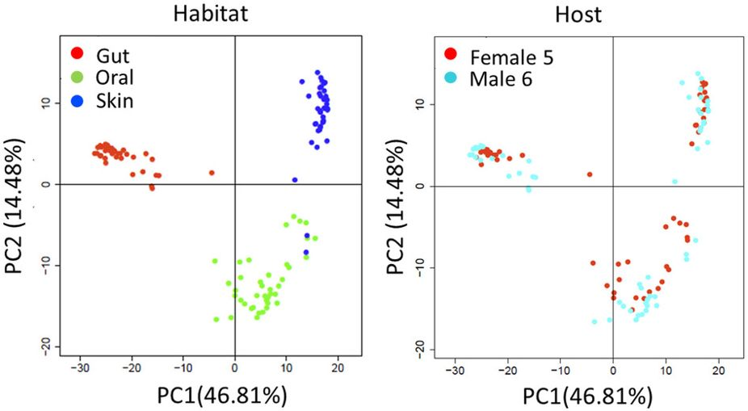
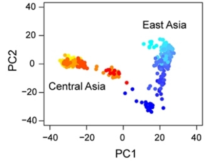
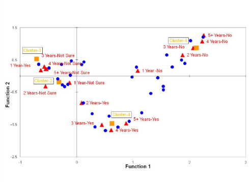
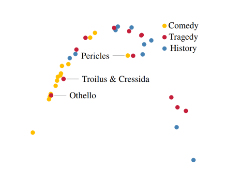

```{r setup, include=FALSE}
knitr::opts_chunk$set(echo = TRUE,
                      fig.align = "center")
```

```{r, include = FALSE}
library(tidyverse)
library(ggfortify)
library(Matrix)
```


# Introduction: Horseshoes everywhere

We've seen PCA produce biplots (plot of two PCs) with linear patterns and "clustered" patterns. If you start doing PCA on real datasets, you will soon encounter another pattern: "horseshoes" (or "arches"). These are a general phenomenon; they show up in all kinds of data.



<br>



<br>



<br>



<br>



<br>

# Understanding the horseshoe

How should we interpret this phenomenon? It turns out that horseshoes are generated by **linear gradients** "filtered" through variables with a **unimodal response**. For concreteness, imagine that we generate data by sampling plant communities along an altitudinal gradient (e.g. up a mountain-side). As a first approximation, we suppose that each species appears at some point, becomes more and more abundant up to its optimal altitude, and then declines again before dropping out of the dataset at its altitudinal maximum. In this example, the data are structured by a linear gradient -- increasing altitude. However, the variables we measure -- species abundances -- are non-linearly related, both to this gradient and to each other. 

We can generate data of this kind to get a better sense of what's going on.

In our simple model let's assume sites are placed at regular elevational intervals up a mountain-side. We will assume that elevation is the **only** factor driving species abundances, so in theory this simple gradient can explain all of the pattern in the data.

```{r}

m <- 50 # number of sites (evenly spaced) 
n <- 500 # number of species

sites <- (1:m)
elevations <- 100 * sites

# Plot elevation by site (linear gradient)
ggplot(data.frame(cbind(sites, elevations))) + 
  aes(x = sites, y = elevations) + 
  geom_point()

```

We'll assume that species exhibit a Gaussian respone to altitude: Their abundance is peaked around an optimum elevation, with some tolerance around this.

```{r}

# A rough biogeographic model: Gaussian distributions with uniformly chosen optima

species.optimum <- runif(n = n, min = min(elevations), max = max(elevations)) # uniformly sample altitudinal optima
species.tolerance <- rep(1000, n) # species "tolerances" (standard deviations)
species.maxabun <- runif(n = n, min = 1, max = 10000) # "amplitude" of species abundances

# Plot an example species response to altitude
example.species <- cbind(elevations, abundance = species.maxabun[1] * dnorm(elevations, species.optimum[1], species.tolerance[1]))

ggplot(data.frame(example.species)) + 
  aes(x = elevations, y = abundance) + 
  geom_point() + 
  geom_vline(xintercept = species.optimum[1])

```

Now let's sample the community at each site...

```{r}

observations <- data.frame() # our empty field notebook

for (i in 1:m){
  
  # simulate a hike up the mountain-side -- at each site, we record the species abundances
  
  new.row <- species.maxabun * dnorm(x = elevations[i], mean = species.optimum, sd = species.tolerance)
  observations <- rbind(observations, new.row)
}

data <- cbind(sites, elevations, observations) # process the data a bit
colnames(data) <- c("site", "elevation", (1:n))
data.tidy <- gather(data, key = species, value = density, -c(site, elevation))

# Plot some of the "geographic" pattern
data.tidy %>% filter(species %in% sample(1:n, size = 10)) %>% # randomly select only a few species for clarity
  ggplot() + 
  aes(x = site, y = density, group = species, fill = species, colour = species) + 
  geom_area(position = "identity", alpha = 0.2, size = 1)

```

...and then perform PCA on our data.

```{r}

just.data <- data[, -c(1,2)] # use only the species abundances for PCA

pca.out <- prcomp(just.data)
autoplot(pca.out, data = data, colour = "elevation") # PCA biplot, colored by elevation of the site

pca.out <- prcomp(just.data, scale = TRUE) # Just for fun, let's see what happens when we scale
autoplot(pca.out, data = data, colour = "elevation")

```
Notice that the first two PCAs (out of 500!) capture the gradient very well. This might be somewhat surprising since the data have lots of nonlinearities. PCA is not guaranteed to do anything nice to these data. However, it is true that the gradient manifests in a nonlinear way. It is not obvious how to "extract" or "learn" this gradient, especially when the dataset is noisy.

We find similar results when dealing with presence/absence data:

```{r}

threshold.mat <- 0.1 * matrix(apply(just.data, 2, max), nrow = m, ncol = n, byrow = TRUE) # matrix of thresholds
presence.absence <- (just.data > threshold.mat) * 1 # ``binarize'' data

# If we examine the (sorted) presence/absence data, we can see that species inhabit "intervals" along the gradient
presence.absence <- presence.absence[, order(species.optimum)] 
image(Matrix(presence.absence))

pca.out <- prcomp(presence.absence, scale = TRUE)
autoplot(pca.out, data = data, colour = "elevation")

```

## Non-linearity may not be obvious

Even though we know the species responses to altitude are nonlinear, and that they are simple functions of elevation, these facts may not be obvious when we can only plot them against one another (e.g. when we don't know the gradient).

```{r}

noisy.spps <- data[, sample(1:n, 5)] + matrix(rnorm(5 * m, 0, 0.1), nrow = m) # some random species

pairs(cbind(elevation = data[, 2], noisy.spps)) # Sidenote: "pairs" can be a useful function for exploratory analysis 
```

## Horseshoes vs. Arches

Sometimes people distinguish between "horseshoes" and "arches", based on whether or not the ends of the curve pull toward each other. This phenomenon is somewhat independent from the main story. It is an example of an edge effect, due in part to the fact that the we are missing species with optima outside the range we sampled.

```{r}

middle.50.percent <- ((m / 4):((3 * m) / 4)) # take only sites from the middle of our gradient
random.50.percent <- sample(1:m, m/2) # take an equal number of sites selected at random

pca.out <- prcomp(just.data[middle.50.percent, ])
autoplot(pca.out, data = data[middle.50.percent, ], colour = "elevation")

pca.out <- prcomp(just.data[random.50.percent, ])
autoplot(pca.out, data = data[random.50.percent, ], colour = "elevation")

```

# Sinusoidal PCs

These curved patterns emerge in the biplot because the principal components of this dataset behave sinusoidally, with respect to the elevational gradient. There are some fascinating mathematical results that relate the eigendecomposition of matrices that are structured like the covariance matrix of our data (these are called *Toeplitz matrices*) to a procedure called the *discrete cosine transform (DCT)*. Those details are beyond the scope of this exploration, but you can read more here: https://www.nature.com/articles/ng.139. One cool connection is that PCA on our data ends up being closely related to JPEG image compression!

Here, we'll content ourselves with checking that the PCs really do look sinusoidal.

```{r}

pca.out <- prcomp(just.data)

# order the variables (species) by optimal elevation
sorted.PCs <- pca.out$rotation[order(species.optimum), 1:4]
tidy.PCs <- gather(data.frame(sorted.PCs))
PCs <- cbind(tidy.PCs, spp = rep(1:500, 4), abundance = species.maxabun[order(species.optimum)])

# plot the first few PCs vs species (these are often called "loadings")
ggplot(PCs) + 
  aes(x = spp, y = value, color = abundance) + # color points by species abundance (we see a clear effect of not scaling)
  geom_point() + 
  facet_grid(. ~ key)

```

```{r}

# Scaled version

pca.out <- prcomp(just.data, scale = TRUE)

sorted.PCs <- pca.out$rotation[order(species.optimum), 1:4]
tidy.PCs <- gather(data.frame(sorted.PCs))
PCs <- cbind(tidy.PCs, spp = rep(1:500, 4), abundance = species.maxabun[order(species.optimum)])

ggplot(PCs) + 
  aes(x = spp, y = value, color = abundance) + 
  geom_point() + 
  facet_grid(. ~ key)

```

There is also a nice intuitive interpretation of these patterns, by thinking about the PCs as weightings of the variables (i.e. as the coefficients in linear combination). The first PC gives positive weights to high-altitude species, negative weights to low-altitude species, and very little weight at all to species in the middle. In some sense, it seems to be "picking out"" species that respond to altitude more linearly. The second PC gives positive weights to species in the middle of the gradient and negative weights to the species at the edges. And so on...

# Lessons from the horseshoe

1. PCA is not magic 
2. However, PCA interpretation can require some careful thinking
3. Simple (even linear) underlying patterns can "present" in complex ways (this can lead to overinterpretation -- e.g. of spatial data in genetics)
4. PCA horseshoes often point to one-dimensional gradients structuring the data
5. Even when PCA (and other methods) fails, it can fail informatively (if we're looking closely)