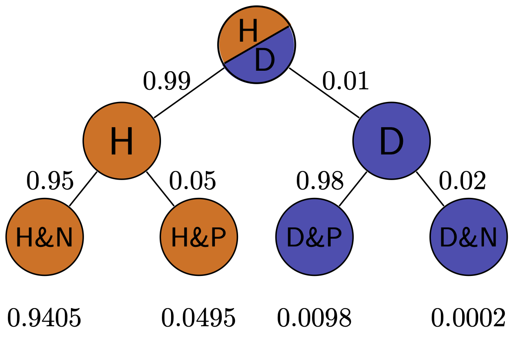

```{r knitr, echo=FALSE}
knitr::opts_chunk$set(
  eval      = TRUE,
  comment   = "#",
  results   = "hold",
  message = FALSE,
  warning = FALSE,
  # collapse  = TRUE,
  fig.align = "center")
```


# Likelihood and estimation

## Likelihood vs. probability

In everyday English, probability and likelihood are synonymous. In probability and statistics, however, the two are distinct, although related, concepts. The definition of likelihood is based on the notion of conditional probability that we defined in week 2, applied to a data set and a particular probability model $M$:

$$ 
L(M \ \ \vert \ \ D) = P(D \ \ \vert \ \ M)
$$
The model is based on a set of assumptions that allow us to calculate probabilities of outcomes of a random experiment, typically a random variable with a well-defined probability distribution function. 


**Example.** $M$ may represent the binomial random variable, based on the assumptions that the data are strings of $n$ independent binary outcomes with a set probability $p$ of "success." We then have the following formula for the probability of obtaining $k$ succcesses:

$$ 
P(k ; n , p) =  {n \choose k} p^k (1-p)^{n-k}
$$
Suppose we think we have a fair coin and we flip it ten times and obtain 4 heads and 6 tails. Then the likelihood of our model (a binomial random variable with $p=0.5$ with $n=10$) based on our data ($k=4$) is:

$$
L(p=0.5, n=10 \ \vert \ k=4 ) = P(k =4 \ \vert \ n=10 , p=0.5) = {10 \choose 4} 0.5^4 (0.5)^{6}
$$

To calculate this precisely, it is easiest to use the R function dbinom():

```{r}
print(dbinom(4,10,0.5))
```
So the likelihood of this data set being produced by a fair coin is about 20.5%. 

This certainly looks like a probability  - in fact we calculated it from a probability distribution function, so why do we call it a likelihood? There are two fundamental differences between the two, one mostly abstract, the other more grounded.

First, a model (or model parameters) is not a random variable, because it comes from an assumption we made in our heads, not from an outcome of a random process. This may seem to be an abstract, almost philosophical distinction, but how would you go about assigning probabilities to all the models one can come up with? Would they vary from person to person, because one may prefer to use the binomial random variablem, and another prefers Poisson? You see how this can get dicey if we think of these in terms of the traditional "frequency of outcomes" framework of probability.

Second, and more quantitatively relevant, is that likelihoods do not satisfy the fundamental axiom of probability: they do not add up to one. Remember that probabilities were defined on a sample space of all outcomes of a random experiment. Likelihoods apply to models or their parameters, and there are usually uncountably many models - in fact it's not possible to even describe all the possible models in vague terms! Even if we agree that we're evaluating only one type of model, e.g. the binomial random variable, the likelihood parameter $p$ does not work like a probability, because there is a non-zero likelihood for any value $p$ (technically, the coin could have any degree of unfairness!) so adding up all of the likelihoods will results in infinity.


## Maximizing likelihood

One of the most common applications of likelihood is to find the model or model parameters that give the highest likelihood based on the data, and call those the best statistical estimate. Here are the symbols we will use in this discussion:

* $D$: the observed data
* $\theta$: the free parameter(s) of the statistical model
* $L(\theta \ \vert \ D)$: the likelihood function, read "the likelihood of $\theta$ given the data"
* $\hat{\theta}$: the maximum-likelihood estimates (m.l.e.) of the parameters

### Discrete probability distributions

The simplest case is that of a probability distribution function that takes discrete values. Then, the likelihood of $\theta$ given the data is simply the probability of obtaining the data when parameterizing the model with parameters $\theta$:

$$L(\theta \ \vert \ D) = P(X = D \ \vert \ \theta)$$

Finding the m.l.e. of $\theta$ simply means finding the value(s) maximizing the probability of obtaining the given data under the model. In cases when this likelihood function has a simple algebraic form, we can find the maximum value using the classic method of taking its derivative and setting it to zero.

**Example.** Let's go back to the binomial example. Based on the data set of 4 heads out of 10 coin tosses, what is the maximum likelihood estimate of the probability of a head $p$? The range of values of $p$ is between 0 and 1, and since we have a functional expression for $P(k=4 ; n=10, p)$ (see above) we can plot it using the dbinom() function:

```{r}
library(tidyverse)
n <- 10
k <- 4
pl <- ggplot(data = data.frame(x = 0, y = 0)) + xlim(c(0,1))
like_fun <- function(p) {
  lik <- dbinom(k, n, p)
  return(lik)
}
pl <- pl + stat_function(fun = like_fun) + 
  xlab('probability of success (p)') + 
  ylab('likelihood') +
  geom_vline(xintercept = 0.4, linetype='dotted', color = 'red')
show(pl)
```

It's probably not surprising that the maximum of the likelihood function occurs at $p=0.4$, that is the observed fraction of heads! Using the magic of derivatives, we can show that for a data set with $k$ success out of $n$ trials, the maximum likelihood value of $p$ is $\hat p = k/n$:

$$ 
L(p  \ \vert \ n, k) = {n \choose k} p^k (1-p)^{n-k} \\
L'(p | n, k ) = {n \choose k}\left [ kp^{k-1}(1-p)^{n-k} - (n-k) (1-p)^{n-k-1}p^k \right] ={n \choose k} p^{k-1} (1-p)^{n-k-1} \left [ k(1-p) - (n-k)p \right] = 0 \\
k(1-p) = (n-k)p \\
\hat p = k/n
$$


### Continuous probability distributions

The definition is more complex for continuous variables (because $P(X = x; \theta) = 0$ as there are infinitely many values...). What is commonly done is to use the *density function* $f(x; \theta)$ and considering the probability of obtaining a value $x \in [x_j, x_j + h]$, where $x_j$ is our observed data point, and $h$ is small. Then:

$$
L(\theta \ \vert \ x_j) = \lim_{h \to 0^+} \frac{1}{h} \int_{x_j}^{x_j + h} f(x ; \theta) dx = f(x_j ; \theta)
$$

Note that, contrary to probabilities, density values can take values greater than 1. As such, when the dispersion is small, one could end up with values of likelihood greater than 1 (or positive log-likelihoods). In fact, the likelihood function is proportional to but not necessarily equal to the probability of generating the data given the parameters: $L(\theta\vert X) \propto P(X; \theta)$.

Most classical statistical estimations are based on maximizing a likelihood function. For example, linear regression estimates of slope and intercept are based on minimizing the sum of squares, or more generally, the $\chi$-squared statistic. This amounts to maximizing the likelihood of the underlying model, which is based on the assumptions of normally distributed independent residuals.

# Bayesian thinking

We will formalize the process of incorporation of prior knowledge into probabilistic inference by going back to the notion of conditional probability introduced in week 2. First, if you multiply both sides of the definition by $P(B)$, then we obtain the probability of the intersection of events $A$ and $B$:
$$P(A \cap B) = P(A \ \vert \ B) P(B); \;  P(A \cap B) = P(B \ \vert \ A) P(A) $$
Second, we can partition a sample space into two complementary sets, $A$ and $\bar A$, and then the set of $B$ can be partitioned into two parts, that intersect with $A$ and $\bar A$, respectively, so that the probability of $B$ is
$$P(B) = P(A \cap B) + P( \bar A\cap B)$$

The two formulas together lead to a very important result called the *law of total probability*:
$$
P(B) =  P(B \ \vert \ A) P(A) + P(B \ \vert \ \bar A)P(\bar A)
$$

It may not be clear at first glance why this is useful: after all, we replaced something simple ($P(B)$) with something much more complex on the right hand side. You will see how this formula enables us to calculate quantities that are not otherwise accessible. 

**Example:** Suppose we know that the probability of a patient having a disease is 1% (called the prevalence of the disease in a population), and the sensitivity and specificity of the test are both 80%. What is the probability of obtaining a negative test result for a randomly selected patient? Let us call $P(H) = 0.99$ the probability of a healthy patient and $P(D) = 0.01$ the probability of a diseased patient. Then:
$$ P(Neg) =  P(Neg  \ \vert \  H) P(H) + P(Neg  \ \vert \  D)P(D)  = $$
$$ = 0.8 \times 0.99 + 0.2 \times 0.01 = 0.794$$

## Bayes' formula
Take the first formula in this section, which expresses the probability $P(A \cap B)$ in two different ways.  Since the expressions are equal, we can combine them into one equation, and by dividing both sides by $P(B)$, we obtain what's known as *Bayes' formula*:
$$ P(A \ \vert \ B) = \frac{P(B \ \vert \ A) P(A)}{P(B) }$$

Another version of Bayes' formula  re-writes the denominator using the Law of total probability above:
$$
P(A \ \vert \ B) = \frac{P(B \ \vert \ A)P(A)}{P(B \ \vert \ A) P(A) + P(B \ \vert \ \bar A)P( \bar A)}
$$

Bayes' formula gives us the probability of $A$ given $B$ from probabilities of $B$ given $A$ and given $-A$, and the prior (baseline) probability of $P(A)$. This is enormously useful when it is easy to calculate the conditionals one way and not the other. Among its many applications, it computes the effect of a test result with given sensitivity and specificity (conditional probabilities) on the probability of the hypothesis being true.


## Positive predictive value

In reality, a doctor doesn't have the true information about the patient's health,  but rather the information from the test and hopefully some information about the population where she is working.  Let us assume we know the rate of false positives $P(Pos \ \vert \ H$) and the rate of false negatives $P(Neg  \ \vert \  D)$, as well as the prevalence of the disease in the whole population $P(D)$. Then we can use Bayes' formula to answer the practical question, if the test result is positive, what is the probability the patient is actually sick? This is called the *positive predictive value* of a test. The deep Bayesian fact is that one cannot make inferences about the health of the patient after the test without some prior knowledge, specifically the prevalence of the disease in the population:
$$ P(D  \ \vert \  Pos) =  \frac{P(Pos \ \vert \ D)P(D)}{P(Pos \ \vert \ D) P(D) + P(Pos  \ \vert \  H)P(H)}$$

**Example.** Suppose the test has a 0.01 probability of both false positive and false negatives, and the overall prevalence of the disease in the population 0.02. You may be surprised that from an epidemiological perspective, a positive result is far from definitive:
$$ P(D  \ \vert \  Pos)  = \frac{0.99 \times 0.02}{0.99 \times 0.02 + 0.01 \times 0.98} = 0.67 $$
This is because the disease is so rare, that even though the test is quite accurate, there are going to be a lot of false positives (about 1/3 of the time) since 98% of the patients are healthy.

We can also calculate the probability of a patient who tests negative of actually being healthy, which is called the  *negative predictive value*. In this example, it is far more definitive:
$$ P(H  \ \vert \  Neg)  = \frac{P(Neg \ \vert \ H)P(H)}{P(Neg \ \vert \ H) P(H) + P(Neg  \ \vert \  D)P(D)} = $$
$$ = \frac{0.99 \times 0.98}{0.99 \times 0.98 + 0.01 \times 0.02} =  0.9998$$
This is again because this disease is quite rare in this population, so a negative test result is almost guaranteed to be correct. In another population, where disease is more prevalent, this may not be the case.





**Exercise:** Simulate medical testing by rolling dice for a rare disease (1/6 prevalence) and a common disease (1/2 prevalence), with both sensitivity and specificity of 5/6. Compare the positive predictive values for the two cases.

## Reproducibility of studies


In 2005 John Ioannidis published a paper entitled ["Why most published research findings are false"](https://journals.plos.org/plosmedicine/article?id=10.1371/journal.pmed.0020124). The paper, as you can see by its title, was intended to be provocative, but it is based solidly on the classic formula of Bayes. The motivation for the paper came from the observation that too often in modern science, big, splashy studies that were published could not be reproduced or verified by other researchers. What could be behind this epidemic of questionable scientific work?

The problem as described by Ioannidis and many others, in a nutshell, is that unthinking use of traditional hypothesis testing leads to a high probability of false positive results being published. The paper outlines several ways in which this can occur.

Too often, a hypothesis is tested and if the resultant p-value is less than some arbitrary threshold (very often 0.05, an absurdly high number), then the results are published. However, if one is testing a hypothesis with low prior probability, a positive hypothesis test result is very likely a false positive. Very often, modern biomedical research involves digging through a large amount of information, like an entire human genome, in search for associations between different genes and a phenotype, like a disease. It is a priori unlikely that any specific gene is linked to a given phenotype, because most genes have very specific functions, and are expressed quite selectively, only at specific times or in specific types of cells. However, publishing such studies results in splashy headlines ("Scientists find a gene linked to autism!") and so a lot of false positive results are reported, only to be refuted later, in much less publicized studies.

Ioannidis performed basic calculations of the probability that a published study is true (that is, that a positive reported result is a true positive), and how it is affected by pre-study (prior) probability, number of conducted studies on the same hypothesis, and the level of bias. His prediction is that for fairly typical scenario (e.g. pre-study probability of 10%, ten groups working simultaneously, and a reasonable amount of bias) the probability that a published result is correct is less than 50%. He then followed up with another paper [2] that investigated 49 top-cited medical research publications over a decade, and looked at whether follow-up studies could replicate the results, and found that a very significant fraction of their findings could not be replicated or were found to have weaker effects by subsequent investigations.

# Bayesian inference

As an alternative to frequentist and maximum likelihood approaches to modeling biological data, Bayesian statistics has seen an impressive growth in recent years, due to the improved computational power. 

At the heart of Bayesian inference is an application of Bayes' theorem: take a model with parameters $\theta$, and some data $D$. Bayes' theorem gives us a disciplined way to "update" our belief in the distribution of $\theta$ once we've seen the data $D$:

$$
P(\theta \ \vert \ D) = \frac{P(D \ \vert \ \theta) P(\theta)}{P(D)}
$$
where:

- $P(\theta \ \vert \ D)$ is the **posterior distribution** of $\theta$, i.e., our updated belief in the values of $\theta$.
- $P(D \ \vert \ \theta)$ is the **likelihood function**: $P(DX \ \vert \ \theta) = L(\theta \ \vert \ D)$.
- $P(\theta)$ is the **prior distribution**, i.e. our belief on the distribution of $\theta$ before seeing the data.
- $P(D)$ is caled the **evidence**: $P(D) = \int P(D \ \vert \ \theta) d \theta$ (in practice, this need not to be calculated).

### Example: capture-recapture

There is a well-estabilished method in population ecology of estimating the size of a population by repeatedly capturing and tagging a number of individuals and later repeating the experiment to see how many are recaptured. Suppose that $n$ were captured initially and $k$ were recaptured later. We assume that the probability $p$ of recapturing an individual is the same for all individuals. Then our likelihood function is once again, based on the binomial distribution.

$$
L(p \ \vert \ k, n) = \binom{n}{k}p^k (1-p)^{n-k}
$$
and our maximum likelihood estimate is $\hat{p} = k /n$. This allows for estimation of the total population size to be $P = n_2/\hat p$, where $n_2$ is the total number of individuals captured in the second experiment. There are more sophisticated estimators, but this one is reasonable for large enough populations.

Let us plot the likelihood as a function of $p$ for the case in which $n = 100$ and $k = 33$

```{r}
library(tidyverse)
n <- 100
m <- 33
pl <- ggplot(data = data.frame(x = 0, y = 0)) + xlim(c(0,1))
likelihood_function <- function(p) {
  lik <- choose(n, m) * p^m * (1-p)^(n - m)
  # divide by the evidence to make into density function
  return(lik * (n + 1))
}
pl <- pl + stat_function(fun = likelihood_function)
show(pl)
```

Now we choose a prior. For convenience, we choose a Beta distribution, $P(p) = \text{Beta}(\alpha, \beta) = \frac{p^{\alpha - 1} (1-p)^{\beta - 1}}{B(\alpha, \beta)}$, where $B(\alpha, \beta)$ is the Beta function, $B(\alpha, \beta) = \int_0^1 t^{\alpha -1} (1-t)^{\beta - 1} dt$.

Therefore:

$$
P(p \ \ \vert \ \ m,n) \propto L(p \ \ \vert \ \ m,n) P(p) = \left(\binom{n}{m} p^m (1-p)^{n-m} \right) \left( \frac{p^{\alpha - 1} (1-p)^{\beta - 1}}{B(\alpha, \beta)} \right) \propto p^{m+\alpha -1} (1-p)^{n-m + \beta -1} \propto \text{Beta}(m + \alpha, \beta + m - n)
$$

We can explore the effect of choosing a prior on the posterior. Suppose that in the past we have seen probabilities close to 50%. Then we could choose a prior $\text{Beta}(10,10)$ (this is what is called a "strong" or "informative" prior). Let's see what happens to the posterior:

```{r}
# a strong prior
alpha <- 10
beta <- 10
prior_function <- function(p) dbeta(p, alpha, beta)
posterior_function <- function(p) dbeta(p, alpha + m, beta + n - m)
pl + stat_function(fun = prior_function, colour = "blue") + 
  stat_function(fun = posterior_function, colour = "red")
```

You can see that the posterior "mediates" between the prior and the likelihood curve. When we use a weak prior, then our posterior will be closer to the likelihood function:

```{r}
# a weak prior
alpha <- 1/2
beta <- 1/2
pl + stat_function(fun = prior_function, colour = "blue") + 
  stat_function(fun = posterior_function, colour = "red")
```

The fact that the posterior depends on the prior is the most controversial aspect of Bayesian inference. Different schools of thought treat this feature differently (e.g., "Subjective Bayes" interprets priors as beliefs before seeing the data; "Empirical Bayes" relies on previous experiments or on the data themselves to derive the prior; "Objective Bayes" tries to derive the least-informative prior given the data). In practice, the larger the data, the cleaner the signal, the lesser the influence of the prior on the resulting posterior.

### MCMC

The type of calculation performed above is feasible only for very simple models, and for appropriately chosen priors (called "conjugate priors"). For more complex models, we rely on simulations. In particular, one can use Markov-Chain Monte Carlo (MCMC) to sample from the posterior distribution of complex models. Very briefly, one builds a Markov-Chain in which the states represent sets of parameters; parameters are sampled from the prior, and the probability of moving to one state to another is proportional to the difference in their likelihood. When the MC converges, then one obtains the posterior distribution of the parameters. 


Bayesian inference is used for many compex problems, including phylogenetic tree builiding [5].

# Reading:

1. [Maximum likelihood estimation from scratch](https://www.r-bloggers.com/maximum-likelihood-estimation-from-scratch/)

2. [Phylogenetic Analysis by Maximum Likelihood](https://academic.oup.com/mbe/article/24/8/1586/1103731)

3. [Why most published scientific studies are false](https://journals.plos.org/plosmedicine/article?id=10.1371/journal.pmed.0020124)

4. [Contradicted and Initially Stronger Effects in Highly Cited Clinical Research]( https://jamanetwork.com/journals/jama/fullarticle/201218)

5. [MrBayes](http://nbisweden.github.io/MrBayes/)

6. [Quick and Dirty Tree Building in R](https://www.molecularecologist.com/2016/02/quick-and-dirty-tree-building-in-r/)

7. [Mark and Recapture](https://en.wikipedia.org/wiki/Mark_and_recapture)

